# 预计算大气散射：从 Bruneton 推导到 GNXEngine 实践

把相机从地面拉到轨道，天空会从覆盖整个视野的蓝色穹顶，收缩成地球边缘的一圈薄光。同一时刻，远处地形的对比度也在改变：表面光沿途衰减，大气又把别处的光散射进视线。蓝天、日落和空气透视背后，其实是同一个光传输问题。

我在 [GNXEngine](https://github.com/zhouxuguang/GNXEngine) 中实现了预计算大气散射，并在独立 demo 和 [GNXMapEngine 三维地球](https://github.com/zhouxuguang/GNXMapEngine)中接入。两者分别维护在独立仓库：GNXEngine 提供大气核心 shader、预计算调度和组件接口，GNXMapEngine 将这些能力接入三维地球场景。

独立场景便于观察太阳、球体照明和散射阶数的变化；地球场景则把问题推进到大尺度坐标、空间相机、椭球地表和深度合成。下面这张轨道视角，就是预计算大气散射在 GNXMapEngine 中的输出。

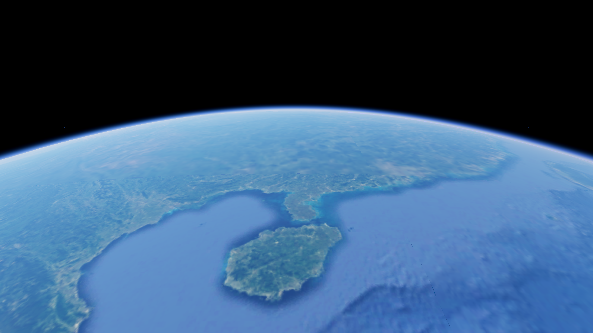

*GNXMapEngine 三维地球的轨道视角，使用 GNXEngine 的 `LegacyPrecomputed`、五阶散射、曝光 5。大气边缘与地表空气透视由同一套传输模型计算，完整参数和其他视角见第 11 章。*

实时渲染的难点在于，每个像素沿视线积分一次还不够。一个散射点收到的光来自所有方向，这些光又可能经历过更早的散射。直接在每帧求解这样的嵌套积分，成本很快就会超过实时预算。

Bruneton 与 Neyret 的方法把高成本计算搬到了预计算阶段：利用球形大气的对称性，将不同位置、观察方向和太阳方向下的结果存进查找表。运行时通过少量纹理查询取回整条路径的贡献，再利用积分的分段性质得到有限距离空气透视。固定大气参数后，相机移动和太阳转向都变成对已有数据的查询。

这篇文章以 2008 年论文 **Precomputed Atmospheric Scattering** 为起点，以 Bruneton 的[新版 `functions.glsl` 核心函数文档](https://ebruneton.github.io/precomputed_atmospheric_scattering/atmosphere/functions.glsl.html)为算法依据，并穿插 GNXEngine 的 HLSL/C++ 实现。原论文帮助理解光路分解与预计算思路，新实现给出臭氧、太阳圆盘、纹理映射和运行时接口的具体定义。

沿着一条观察射线，整个方法可以串成一条链：**先求沿途衰减，再求各点产生的散射，把连续积分编码进 LUT，逐阶补齐间接光，最后与真实场景合成。** 三类查找表分别承担不同的工作：

| 查找表 | 保存什么 | 运行时解决什么问题 |
|---|---|---|
| 透射率 | 沿大气路径保留下来的光的比例 | 表面和太阳送到相机的光会衰减多少 |
| 散射 | 沿视线积累的大气光，按相函数约定编码 | 天空颜色与有限距离空气透视 |
| 辐照度 | 水平面收到的间接天空光 | 地面照明与预计算中的地面反射反馈 |

第 1—4 章从物理量和光路建立积分，第 5—7 章解释 LUT 与逐阶预计算，第 8—10 章把查询结果接到颜色管线和三维地球，第 11—13 章讨论效果、调试与工程取舍。原论文的逐图、逐式阅读对照放在附录，便于遇到记号差异时查阅。下文统一使用米作为长度单位，图中的高度按需要换算为千米。

## 1. 从一个像素看到的光开始

天空像素和地面照明经常都用 `float3` 保存，却代表两种不同的量。先把“某个方向有多亮”和“一个面总共收到多少光”分开，后面的相函数、角积分和 HDR 合成才有统一的含义。

### 1.1 辐亮度与辐照度承担不同角色

辐亮度描述“从一个方向看到多亮”，辐照度描述“一个表面总共接收到多少光”。天空像素输出前者，地面漫反射需要后者。对波长 $\lambda$，设 $\Phi_\lambda$ 为单位波长间隔的辐射通量，则光谱辐亮度定义为

$$
L_\lambda=\frac{\mathrm d^2\Phi_\lambda}{\mathrm dA\,\cos\theta\,\mathrm d\Omega}.
\tag{1}
$$

这里 $\mathrm dA$ 是接收面积，$\theta$ 是接收面法线与入射方向的夹角，$\mathrm d\Omega$ 是立体角。本文以 nm 表示光谱间隔，所以 $L_\lambda$ 的单位是 $\mathrm{W\,m^{-2}\,sr^{-1}\,nm^{-1}}$。面积的投影因子是 $\cos\theta$，不能将辐亮度理解成普通 RGB 强度。

设 $\boldsymbol n$ 是表面单位法线，$\boldsymbol\omega_i$ 从表面指向来光方向。表面光谱辐照度为

$$
E_\lambda(\boldsymbol x,\boldsymbol n)
=\int_{\boldsymbol n\cdot\boldsymbol\omega_i>0}
L_\lambda(\boldsymbol x,\boldsymbol\omega_i)
(\boldsymbol n\cdot\boldsymbol\omega_i)\,\mathrm d\Omega_i,
\qquad
\mathrm d\Omega_i=\sin\theta_i\,\mathrm d\theta_i\,\mathrm d\phi_i.
\tag{2}
$$

$E_\lambda$ 的单位是 $\mathrm{W\,m^{-2}\,nm^{-1}}$，$\theta_i$、$\phi_i$ 分别为天顶角和方位角。这个半球积分后面就是间接辐照度 Pass 的工作。立体角以 sr 标记，积分整个球面得到 $4\pi\,\mathrm{sr}$。

式（1）可以先读成一个小光束的通量关系：$\mathrm d^2\Phi_\lambda=L_\lambda\cos\theta\,\mathrm dA\,\mathrm d\Omega$。对于固定的接收面积 $\mathrm dA$，面越倾斜时它在光束垂直截面上的投影越小，所以需要面积投影因子；来光占据的方向范围越大，总通量也越大。辐亮度把这两种因素除去，描述方向本身的光场。相机的一个像素主要查询某个方向的辐亮度，而地面的照明要将整个可见半球相加。

例如，上半球所有方向都有同一辐亮度 $L_\lambda$，式（2）给出 $E_\lambda=2\pi L_\lambda\int_0^{\pi/2}\cos\theta\sin\theta\,\mathrm d\theta=\pi L_\lambda$。这个结果不是 $2\pi L_\lambda$：接近水平入射的光虽然属于上半球，对水平面贡献的投影却很小。后面 Lambert 反射再乘 $a_g/\pi$，在这一均匀天空例子中得到 $a_gL_\lambda$，可用作单位和余弦因子的检查。

本文约定 $\boldsymbol\omega$ 从观察点指向场景，$\boldsymbol s$ 从散射点指向太阳。到达观察点的光实际沿 $-\boldsymbol\omega$ 传播，来自太阳的光沿 $-\boldsymbol s$ 传播。因此单次散射的夹角余弦仍为 $(-\boldsymbol s)\cdot(-\boldsymbol\omega)=\boldsymbol s\cdot\boldsymbol\omega$。阅读采用其他“入射方向”约定的相函数时，必须先核对这两个方向。

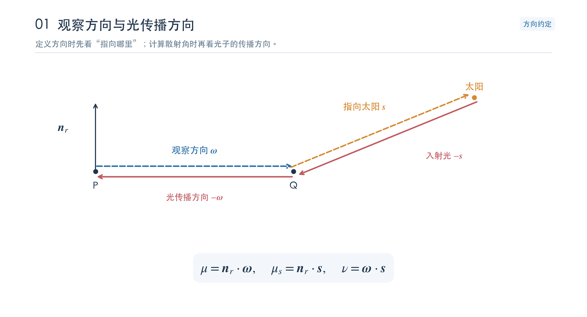

*图 1：本文和 LUT 使用的方向约定。太阳在视线方向上时 $\nu\approx1$，对应气溶胶的前向散射峰。*

读图 1 时要区分“用于查询的箭头”和“光实际移动的箭头”。从相机画向散射点的 $\boldsymbol\omega$ 是观察射线，散射光却从该点返回相机。朝向太阳的 $\boldsymbol s$ 用来描述来光方向，太阳光也沿反方向到达粒子。因此看向太阳附近时，两束光的实际传播方向接近，属于前向散射；背向太阳观察天空时更接近后向散射。这里的“前向”由散射前后的传播方向决定，不能仅根据屏幕上箭头朝左还是朝右判断。

### 1.2 统一符号表

| 符号 | 含义 | 单位或范围 |
|---|---|---|
| $O,\boldsymbol x,P,Q$ | 星球中心、位置向量、观察点、路径采样点 | 位置为 m |
| $r_b,r_t$ | 球形地表半径、大气顶半径 | m，$r_t>r_b$ |
| $r=\lVert\boldsymbol x\rVert,\ h=r-r_b$ | 径向距离、球形模型高度 | m |
| $d$ | 沿单位观察方向的路径距离 | m，$d\ge0$ |
| $\boldsymbol n_r=\boldsymbol x/r$ | 局部径向天顶 | 单位向量 |
| $\mu=\boldsymbol n_r\cdot\boldsymbol\omega$ | 观察方向天顶余弦 | $[-1,1]$ |
| $\mu_s=\boldsymbol n_r\cdot\boldsymbol s$ | 太阳方向天顶余弦 | $[-1,1]$ |
| $\nu=\boldsymbol\omega\cdot\boldsymbol s$ | 观察方向与太阳方向夹角余弦 | $[-1,1]$，还受几何约束 |
| $L_\lambda,E_\lambda$ | 光谱辐亮度、光谱辐照度 | 见式（1）、（2） |
| $T_\lambda,\tau_\lambda$ | 透射率、光学厚度 | 无量纲 |
| $\beta_i^s,\beta_i^a,\beta_i^e$ | 组分 $i$ 的散射、吸收、消光系数 | $\mathrm{m^{-1}}$，$\beta_i^e=\beta_i^s+\beta_i^a$ |
| $D_R,D_M,D_O$ | Rayleigh、气溶胶、臭氧归一化密度 | 无量纲 |
| $H_R,H_M$ | 分子、气溶胶密度标高 | m |
| $p_R,p_M$ | Rayleigh、气溶胶相函数 | $\mathrm{sr^{-1}}$ |
| $g$ | Cornette–Shanks 相函数形状参数 | $(-1,1)$ |
| $E_{\odot,\lambda},\alpha_s$ | 大气顶太阳法向辐照度、太阳角半径 | $\mathrm{W\,m^{-2}\,nm^{-1}}$、rad |
| $a_g$ | 预计算模型的平均地表漫反射率 | 无量纲，通常 $[0,1]$ |
| $H,\rho$ | 球面几何辅助长度，见式（21） | m，与密度 $D_i$ 区分 |
| $C_R,C_M$ | 去掉相函数的单次散射结果 | $\mathrm{W\,m^{-2}\,nm^{-1}}$ |
| $\mathcal C_\lambda,\mathcal S_\lambda$ | 累计散射存储量、恢复相函数后的累计路径辐亮度，见式（57） | 分别与 $C_R$、$L_\lambda$ 同单位 |
| $I_\lambda^{(n-1)}$ | 包含大气路径与地面边界的完整入射场，见式（51） | 与 $L_\lambda$ 同单位 |
| $\mathcal B_\lambda$ | 局部散射系数与相函数组成的角散射核，见式（52） | $\mathrm{m^{-1}\,sr^{-1}}$ |
| $J_\lambda^{(n)}$ | 第 $n$ 阶局部散射源 | $\mathrm{W\,m^{-3}\,sr^{-1}\,nm^{-1}}$ |
| $L_\lambda^{(n)},E_\lambda^{(n)}$ | 阶次辐亮度、阶次辐照度 | 与 $L_\lambda,E_\lambda$ 相同 |

源码的 `bottom_radius`、`top_radius`、`rayleigh_scattering`、`mie_extinction` 分别对应 $r_b,r_t,\beta_{R,0}^s,\beta_{M,0}^e$。其中 `r` 是到星球中心的距离，高度要再减去 $r_b$。`transmittance_texture` 保存透射率，`scattering_texture` 保存按相函数约定编码的累计散射；这个区别决定了查询后还要执行哪些恢复运算。

### 1.3 读原论文前，先把记号翻译成光路

原论文的紧凑记号把位置、方向和波长参数省略了很多。阅读时，可以先把一个式子还原成光路：它在哪个点接收光，有没有做方向积分，有没有沿路径积累？下面的对照把这些含义展开；正文统一保留 $\lambda$，让单位和颜色处理始终可追踪。

| 原论文记号 | 应怎样读 | 本文对应 |
|---|---|---|
| $R_g,R_t$ | 地表与大气顶的半径 | $r_b,r_t$ |
| $x,y,x_o$ | 观察点、积分途中的点、射线终点 | $P,Q_d,B$ |
| $v,s$ | 从观察点指向场景、从散射点指向太阳 | $\boldsymbol\omega,\boldsymbol s$；光实际沿相反方向传播 |
| $x_s$ | 论文阴影近似中的区间分界点 | 第 8.5 节的 $Q_s$，沿射线的位置，不是太阳位置 |
| $\mathcal I[L],\mathcal J[L],\mathcal S[L]$ | 把光场 $L$ 输入反射、局部散射、路径积分运算 | 分别产生地面边界辐亮度、$J_\lambda$、$\mathcal S_\lambda$ |
| 上横线，如 $\bar L$ | 在理想球形地表、均匀反照率下求出的参考解 | LUT 的球形参考场景；不是平均值，也不是复共轭 |
| 下标星号 $L_*$ | 把一阶及以上事件的光相加：$L_*=L_1+L_2+\cdots$ | 累计间接场；本文另外区分其中的大气路径量与地面边界量 |
| $\Delta E,\Delta S,\Delta J$ | 当前轮次的临时结果 | delta 纹理；这里的 $\Delta$ 不表示微分或误差 |

**特别容易混淆的是 $\mu$。** 原论文相函数式（2）、（4）里的 $\mu$ 表示散射夹角余弦，对应本文的 $\nu$；参数化部分的 $\mu=v\cdot x/r$ 才对应本文的观察天顶余弦。看到同一个字母，必须先检查它是由哪两个方向点积得到的。原论文的花体 $\mathcal I[L]$ 也是一个反射运算，不等于本文式（51）中表示完整入射辐亮度的 $I_\lambda^{(n-1)}$。

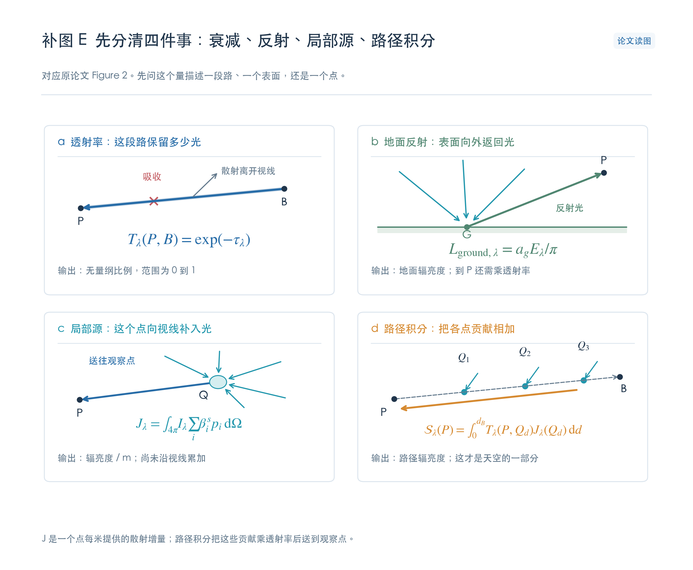

*补图 E：根据[原论文](预计算大气散射.pdf) Figure 2 的四个概念重新组织绘制，来源位置为 PDF 第 3 页、论文正文第 2 页。a 的 $T_\lambda$ 是比例；b 的 $E_\lambda$ 是地面接收的辐照度，$L_{\mathrm{ground},\lambda}$ 是反射后的边界辐亮度；c 的 $I_\lambda$ 表示来自各方向的完整入射场，$J_\lambda$ 是每米的局部增量；d 的 $\mathcal S_\lambda$ 才是沿路径积累的辐亮度。图中省略了方向参数和阶次上标，$i$ 遍历散射组分。*

按补图 E 的顺序，可以把一条观察路径读成四句话：已有的光沿路径衰减；地面把接收的光反射回来；每个大气点把别的方向的光散射进当前视线；这些点的贡献经过衰减后在观察点相加。**$J$ 回答“一个点每米产生多少贡献”，$\mathcal S$ 回答“整条路最终送来多少贡献”。** 名称中的“散射密度”在这里指光的局部源，不是空气的粒子密度 $D_i$。

首次阅读可先掌握第 3 章的透射率、第 4 章的一次散射，以及第 8.3 节的有限区间减法，再回到第 6 章理解高阶入射场如何生成局部源。原论文 Figure 1 中的地形阴影近似放到第 8.5 节阅读更合适；它说明实际地形如何接入球形 LUT，并不是球形大气积分本身的定义。

## 2. 建立可预计算的大气物理模型

一张 LUT 能够供不同相机复用，前提是模型中有足够的对称性。Bruneton 选择球形壳层与径向密度，把空间变化压缩到高度，再用散射和吸收系数描述介质。这个选择同时决定了算法能表达哪些天气与地表反馈。

### 2.1 球形壳层与近似边界

模型把大气限制在 $r_b\le r\le r_t$ 的球壳内，所有密度只依赖高度。太阳视为非常远的光源，所以同一条路径上 $\boldsymbol s$ 不变。模型忽略折射、偏振、热辐射、云和局部气象变化；气溶胶虽可吸收和散射，其分布仍是径向的。地表在预计算过程中采用均匀 Lambert 漫反射率，运行时的真实物体颜色可另外计算。

这些假设把空间和方向的自由度压缩成 $(r,\mu,\mu_s,\nu)$。绕星球中心一起旋转观察点、观察方向和太阳方向，光传输结果不变；相机经纬度不需要单独进入 LUT。地球上的不同纬度若有不同气溶胶、云层或臭氧浓度，这组 LUT 不会自动反映这种差异。

可以按顺序消掉冗余坐标：先将位置的径向天顶旋转到局部 $z$ 轴，球对称性使经纬度不再影响密度；再绕此轴旋转，使观察方向落到一个固定竖直平面。此时位置只剩半径 $r$，观察方向只剩 $\mu$，太阳还需两个方向信息。选取 $\mu_s$ 与 $\nu$ 表示太阳的天顶与相对视线关系，便得到四个参数。它们共同描述一条路径的状态，而不是四种独立的天气；第 5.6 节会说明这些余弦并不能任意组合。

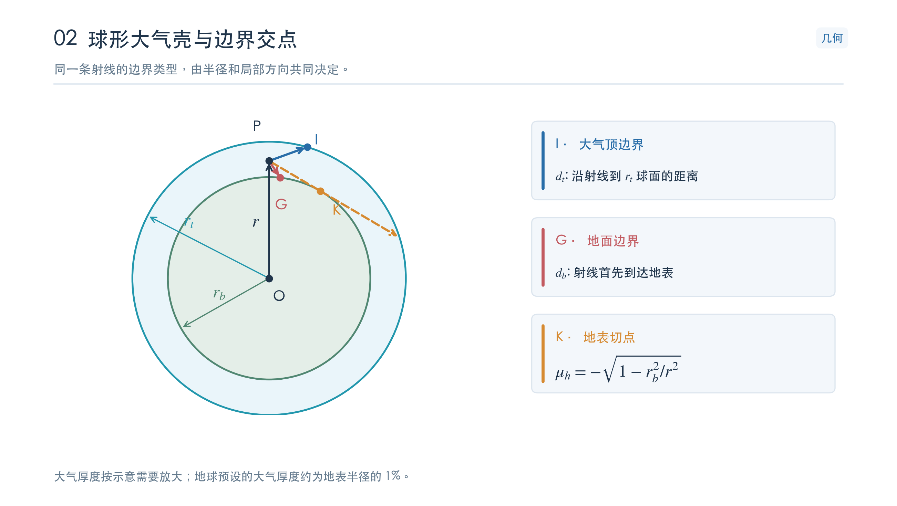

*图 2：大气顶与地表是两个边界。图中厚度被放大；GNXEngine 独立 demo 的 60 km 大气厚度约为地球半径的 0.94%。*

图 2 的地表同时承担两个角色：射线到达它后停止在介质中的积分；在多次散射递推中，它还按平均反照率提供反射光。大气顶也是积分终点，但顶外没有本模型的空气。太阳光可从这里进入，已经走到顶外的光也可逃逸。两个边界的选择会改变路径长度，这正是地平线两侧不能直接混合插值的原因。

### 2.2 从微观截面到宏观系数

若单位体积中有 $N_i$ 个散射粒子，每个粒子的散射截面为 $\sigma_i^s$，一段长度 $\mathrm d\ell$ 上被散射的比例近似为 $N_i\sigma_i^s\mathrm d\ell$。因此

$$
\beta_i^s(h,\lambda)=N_i(h)\sigma_i^s(\lambda)
=D_i(h)\beta_{i,0}^s(\lambda).
\tag{3}
$$

$N_i$ 的单位是 $\mathrm{m^{-3}}$，截面单位是 $\mathrm{m^2}$；其乘积具有 $\mathrm{m^{-1}}$ 的正确量纲。下标 0 表示密度剖面取 1 时的参考系数，并不要求每一种组分都在地面达到最大密度。

可见光波长远大于空气分子的尺寸，振荡电场使分子产生偶极辐射。对随机取向、忽略偏振的分子，Rayleigh 截面可写成

$$
\sigma_R^s(\lambda)
=\frac{24\pi^3}{N_{\rm ref}^2\lambda^4}
\left(\frac{n_{\rm air}^2-1}{n_{\rm air}^2+2}\right)^2 F_K.
\tag{4}
$$

这里 $n_{\rm air}$ 是该波长处参考空气折射率，$N_{\rm ref}$ 是与该折射率相对应的参考分子数密度，$F_K$ 是分子非球对称造成的 King 修正因子；本式中 $\lambda$ 必须用 m，结果才是 $\mathrm{m^2}$。这一微观表达式可对照 [Bucholtz 的论文](https://pubmed.ncbi.nlm.nih.gov/21052423/)及 [NWPSAF 科学文档](https://www.nwpsaf.eu/site/download/documentation/rtm/docs_rttov11/rttov11_svr.pdf)的 Rayleigh 定义。引擎不逐帧计算这条微观公式，而是采用已整理的参考散射系数。式（4）解释了主要的 $\lambda^{-4}$ 依赖：短波蓝光比长波红光更容易散射。粒径接近可见光波长的气溶胶需要更一般的 Mie 理论；实时模型通常使用经验消光谱和解析相函数，无需求解每个粒子的电磁散射。

GNXEngine 地球预设使用下面的谱形与垂直密度：

$$
\begin{aligned}
\beta_{R,0}^s(\lambda)&=1.24062\times10^{-6}
\left(\frac{\lambda}{1\,\mu\mathrm m}\right)^{-4}\,\mathrm{m^{-1}},
&D_R(h)&=e^{-h/H_R},\quad H_R=8000\,\mathrm m,\\
\beta_{M,0}^e(\lambda)&=\frac{b_M}{H_M}
\left(\frac{\lambda}{1\,\mu\mathrm m}\right)^{-\alpha},
&D_M(h)&=e^{-h/H_M},\quad H_M=1200\,\mathrm m,\\
\beta_{M,0}^s(\lambda)&=\varpi_M\beta_{M,0}^e(\lambda),
&b_M&=5.328\times10^{-3},\quad\alpha=0,\quad\varpi_M=0.9.
\end{aligned}
\tag{5}
$$

$b_M$ 是该指数剖面的参考垂直气溶胶光学厚度参数，$\alpha$ 为 Ångström 指数，$\varpi_M$ 为单次散射反照率。该预设的气溶胶参考消光系数为 $4.44\times10^{-6}\,\mathrm{m^{-1}}$，散射系数为 $3.996\times10^{-6}\,\mathrm{m^{-1}}$；两者之差表示吸收。因此太阳光的衰减必须用 `mie_extinction`，局部散射源必须用 `mie_scattering`。

式（5）中 $b_M/H_M$ 的来源也可直接检查。若沿竖直方向积分无限高的指数密度，有 $\int_0^\infty e^{-h/H_M}\mathrm dh=H_M$，于是参考消光系数乘这个长度得到 $b_M$。实际模型在大气顶截断，竖直光学厚度为 $b_M(1-e^{-(r_t-r_b)/H_M})$；当前厚度远大于 $H_M$，截断项很小。斜向路径仍要使用球面几何积分，不能把这个竖直结果直接除以一个接近零的天顶余弦来处理地平线。

臭氧在可见光中主要表现为吸收。设 $\sigma_O^a(\lambda)$ 为给定臭氧吸收截面，$N_{O,\max}$ 为参考数密度，则 $\beta_{O,0}^a=N_{O,\max}\sigma_O^a$。预设使用三角形分布：

$$
D_O(h)=\begin{cases}
0,&h<10\,\mathrm{km},\\
(h-10\,\mathrm{km})/(15\,\mathrm{km}),&10\le h/(\mathrm{km})<25,\\
(40\,\mathrm{km}-h)/(15\,\mathrm{km}),&25\le h/(\mathrm{km})<40,\\
0,&h\ge40\,\mathrm{km}.
\end{cases}
\tag{6}
$$

这个形状描述臭氧层，而非随高度单调下降的近地分子分布。GNXEngine 与官方参数结构使用至多两层的通用表达式：

$$
D_i(h)=\operatorname{clamp}\!\left(
c_{{\rm exp},i}e^{k_i h}+c_{{\rm lin},i}h+c_{{\rm const},i},\,0,1\right).
\tag{7}
$$

先依据层宽选择系数，再计算式（7）。$k_i$ 和 $c_{{\rm lin},i}$ 的单位是 $\mathrm{m^{-1}}$，其余系数无量纲。指数分布使用 $k_i=-1/H_i$；臭氧上升段使用 $c_{\rm lin}=1/15000\,\mathrm{m^{-1}}$、$c_{\rm const}=-2/3$，下降段使用相反斜率和常数 $8/3$。两层分界为 25000 m，钳位自然得到式（6）。

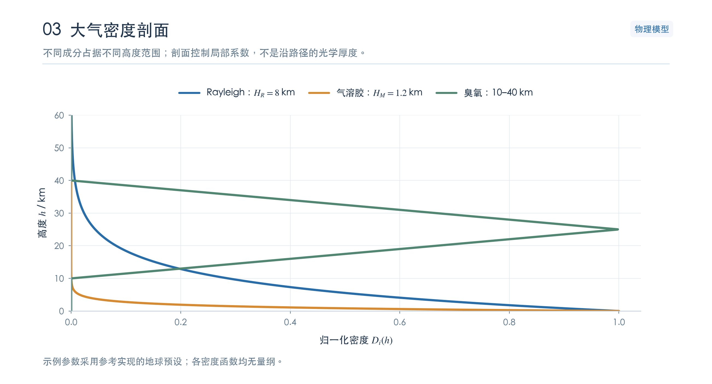

*图 3：根据式（5）、（6）计算的密度曲线。气溶胶集中在低空，臭氧在约 25 km 达到峰值；曲线横坐标是归一化密度，不是三个组分的实际粒子数量。*

图 3 展示的是密度随高度变化的形状，曲线的幅度还要与谱系数一起看。在某高度读出 0.5，表示该组分的参考系数取一半；臭氧在 25 km 取 1，则表示它达到自己的参考密度。两种组分的 1 并不对应相同的粒子数。代码先依据层宽选择系数，再把指数、线性项和钳位组合成曲线，因此调整层宽与调整系数会产生不同的密度剖面。

总消光与体积散射系数分别是

$$
\begin{aligned}
\beta^e(h,\lambda)&=D_R(h)\beta_{R,0}^s(\lambda)
+D_M(h)\beta_{M,0}^e(\lambda)+D_O(h)\beta_{O,0}^a(\lambda),\\
\beta^s(h,\lambda)&=D_R(h)\beta_{R,0}^s(\lambda)
+D_M(h)\beta_{M,0}^s(\lambda).
\end{aligned}
\tag{8}
$$

此处近似空气分子在所考虑波段不吸收，臭氧不贡献散射。吸收只移走光；散射移走当前方向的光，同时可能向另一个方向加入光。因此消光和入散射分别出现在传输方程的不同项中。

### 2.3 相函数及其归一化

相函数给出一次散射后能量在方向上的分布。它必须满足

$$
\int_{4\pi}p(\nu)\,\mathrm d\Omega
=2\pi\int_{-1}^{1}p(\nu)\,\mathrm d\nu=1.
\tag{9}
$$

相函数这里仅依赖两个方向的夹角余弦 $\nu$。未偏振 Rayleigh 散射的角形状是 $1+\nu^2$；将它在球面上积分得到 $16\pi/3$，因此

$$
p_R(\nu)=\frac{3}{16\pi}(1+\nu^2).
\tag{10}
$$

Rayleigh 对前向和后向方向对称，侧向也有非零散射。GNXEngine 的 `RayleighPhaseFunction` 使用的正是式（10）。

式（9）中的 $2\pi$ 来自对所有方位角积分；将天顶角改成余弦时，$\mathrm d\nu=-\sin\theta\,\mathrm d\theta$，原来的球面面积因子便进入积分变量。因而 $2\pi\int_{-1}^1(1+\nu^2)\mathrm d\nu=2\pi(2+2/3)=16\pi/3$，其倒数就是归一化常数。相函数是每单位立体角的分配密度：对一个小方向区域，分到的比例近似为 $p\,\Delta\Omega$。一个方向上的 $p$ 大于 $1\,\mathrm{sr^{-1}}$ 并不违反能量守恒，仍需看整个球面积分是否为 1。

气溶胶使用 Cornette–Shanks 近似：

$$
p_M(g,\nu)=\frac{3}{8\pi}
\frac{(1-g^2)(1+\nu^2)}{(2+g^2)(1+g^2-2g\nu)^{3/2}}.
\tag{11}
$$

其中 $g$ 越接近 1，前向峰越尖锐。可以从 Henyey–Greenstein 核验证归一化，而无需凭经验接受分母常数。令

$$
p_{\rm HG}(g,\nu)=\frac{1-g^2}{4\pi(1+g^2-2g\nu)^{3/2}},
\qquad
\langle\nu^2\rangle_{\rm HG}=\frac{1+2g^2}{3}.
\tag{12}
$$

HG 的球面积分为 1，第二矩可由其 Legendre 展开或直接积分得到。于是 $\int(1+\nu^2)p_{\rm HG}\mathrm d\Omega=2(2+g^2)/3$，乘上 $3/[2(2+g^2)]$ 就得到式（11）。这一推导也说明 $g=0$ 时 Cornette–Shanks 退化为 Rayleigh 形状，而不是各向同性常数。

还需注意，式（11）中的 $g$ 不严格等于平均散射余弦。其一阶矩为

$$
\langle\nu\rangle_M=\frac{3g(4+g^2)}{5(2+g^2)}.
\tag{13}
$$

例如 $g=0.8$ 时平均余弦约为 0.8436。将 HG 的“非对称因子等于一阶矩”直接套到 Cornette–Shanks 上，会混淆模型参数的语义。关于相函数和方向约定，可对照 [PBRT 的 Phase Functions](https://pbr-book.org/4ed/Volume_Scattering/Phase_Functions)。

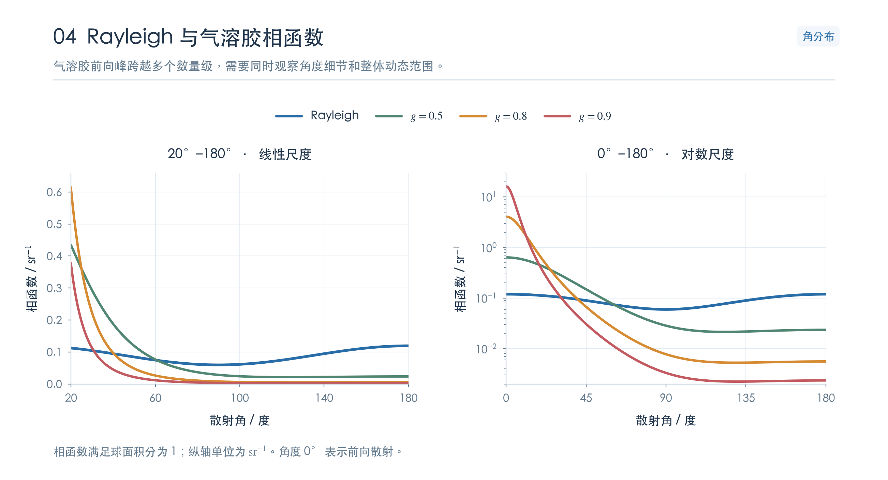

*图 4：根据式（10）、（11）计算的角分布。左图仅展示 $20^\circ$—$180^\circ$ 的线性尺度细节；右图展示完整 $0^\circ$—$180^\circ$ 范围，以对数坐标保留气溶胶前向峰。两个面板的角度范围和纵轴尺度均已明确标出。*

图 4 横轴是散射夹角，$0^\circ$ 对应 $\nu=1$，$90^\circ$ 对应 $\nu=0$。Rayleigh 在前后两个方向的值都是 $3/(8\pi)$，侧向为其一半；气溶胶则可能将大量角密度集中在太阳附近的很小区域。右侧对数纵轴保留了这个峰和远离峰的弱贡献，不能按曲线下方的平面面积判断归一化，因为真正的面积元素还含 $\sin\theta$。这种尖峰也解释了为什么单次 Mie 更适合保留解析相函数，再由 LUT 提供平滑得多的路径积分部分。

### 2.4 从微分方程得到积分解

首先沿光的实际传播方向考虑无入散射的情况。一段 $\mathrm d\ell$ 上有比例 $\beta^e\mathrm d\ell$ 的光被移走，因此 $\mathrm dL_\lambda/\mathrm d\ell=-\beta^eL_\lambda$。下面为了匹配观察射线，改用从相机向外递增的距离 $d$，其方向与光传播相反。

先区分两种量：$L_\lambda$ 是沿某一方向到达观察点的辐亮度；$J_\lambda$ 是散射点每单位路径长度向该方向提供的辐亮度增量。后者由全方向入射辐亮度乘局部散射系数和相函数后积分得到，单位为 $\mathrm{W\,m^{-3}\,sr^{-1}\,nm^{-1}}$。它尚未沿观察路径积分，式（52）会给出完整的角积分表达式。

定义 $F_\lambda(d)=L_\lambda(P+d\boldsymbol\omega,\boldsymbol\omega)$，用 $J_\lambda$ 表示上述局部源，则

$$
\frac{\mathrm dF_\lambda}{\mathrm dd}
=\beta^e(P+d\boldsymbol\omega,\lambda)F_\lambda(d)
-J_\lambda(P+d\boldsymbol\omega,\boldsymbol\omega).
\tag{14}
$$

正负号来自路径方向的选择。定义 $T_\lambda(0,d)=\exp[-\int_0^d\beta^e(P+t\boldsymbol\omega,\lambda)\mathrm dt]$，则积分因子满足

$$
\frac{\mathrm d}{\mathrm dd}\left[T_\lambda(0,d)F_\lambda(d)\right]
=-T_\lambda(0,d)J_\lambda(P+d\boldsymbol\omega,\boldsymbol\omega).
\tag{15}
$$

将式（15）从 0 积分到最近边界距离 $d_B$，得到

$$
L_\lambda(P,\boldsymbol\omega)
=T_\lambda(P,B)L_{B,\lambda}
+\int_0^{d_B}T_\lambda(P,Q_d)
J_\lambda(Q_d,\boldsymbol\omega)\,\mathrm dd,
\quad Q_d=P+d\boldsymbol\omega.
\tag{16}
$$

$B$ 是地表或大气顶，$L_{B,\lambda}$ 是该边界沿当前方向提供的辐亮度。地面反射、太阳圆盘、太空背景属于边界贡献；积分项是路径内散射。无光源的外太空方向可以令 $L_B=0$，地面边界则根据照明和 BRDF 计算。这也是“物体颜色乘透射率，再加雾颜色”的严格来源。一般参与介质传输可参照 [PBRT 的传输方程](https://pbr-book.org/4ed/Light_Transport_II_Volume_Rendering/The_Equation_of_Transfer)。

式（14）的符号可由一小段光路复核：相机侧收到的光约为 $F_\lambda(0)=(1-\beta^e\Delta d)F_\lambda(\Delta d)+J_\lambda\Delta d$。把远端值移到左边，再除以 $\Delta d$，就得到向外递增的导数为 $\beta^eF-J$；若沿光的传播方向定义坐标，两个符号会反过来。式（15）则使用 $T'=-\beta^eT$，按乘积法则得到 $(TF)'=TF'+T'F=-TJ$。积分后 $T(d_B)F(d_B)-F(0)=-\int TJ\,\mathrm dd$，移项即为式（16）。因此最后的路径源是正贡献，没有因观察射线反向而被减掉。

若一条测试路径中的消光 $\beta^e$ 和局部源 $J_\lambda$ 都是常量，式（16）变成 $L_\lambda=e^{-\beta^e d_B}L_{B,\lambda}+(J_\lambda/\beta^e)(1-e^{-\beta^e d_B})$。$J_\lambda/\beta^e$ 的单位正是辐亮度；令消光趋于零，第二项趋于 $J_\lambda d_B$。这能同时检查指数符号、路径长度和源项单位。真实大气的高度密度、太阳衰减和高阶入射场都在变化，所以后续仍须数值积分。

把式（16）看成离散求和会更直观。将射线切成许多短段，每段长度为 $\Delta d$；第 $j$ 段在 $Q_j$ 产生约 $J_\lambda(Q_j,\boldsymbol\omega)\Delta d$ 的辐亮度，再乘 $T_\lambda(P,Q_j)$，才是它到达相机的贡献。将这些贡献相加，再加上边界光 $T_\lambda(P,B)L_{B,\lambda}$，就得到整条射线。积分号只是让分段无限变细后的写法，梯形积分则是在有限个样本上近似这次求和。

这里也能区分两个极限：没有散射源时只剩衰减后的边界光；边界没有光时，仍可能看到路径中被散射进来的天空光。不能把“透射率变小”直接解释成“像素一定变黑”，因为路径源项可能同时增加。

式（16）把传输问题分成了边界光和路径内散射，但 $J_\lambda$ 又依赖全方向的入射光，其中包含此前的散射结果。为解开这个依赖，将太阳出发、未经散射或反射的直射光记为 $L^{(0)}$，把增加一次体积散射或地面反射的传输过程记为线性算子 $\mathcal K$，可形式化写成 Neumann 展开。这里暂省略波长和位置参数：

$$
L=L^{(0)}+\mathcal K L^{(0)}+\mathcal K^2 L^{(0)}+\cdots.
\tag{17}
$$

式（17）描述完整光场的展开。实际大气 LUT 只保存最后一次事件发生在大气中的路径辐亮度 $L^{(n)}$，另用 $E^{(n)}$ 保存这些光照到水平面的辐照度；地面边界返回值在查询时单独补充。零阶直射太阳以太阳透射率和直接辐照度 $E^{(0)}$ 表示，不建立一张“零阶天空散射纹理”。

本文的阶次按散射或反射事件计数：地面反射占一个事件，体积散射再占一个事件。这会在第 6 章导出地面项需要的 $E^{(n-2)}$。吸收和边界逃逸使高阶贡献通常逐渐减小，实际截断阶数仍需通过收敛检查确定。下面先求式（16）反复使用的路径几何和透射率，再以直射太阳为入射场求第一阶散射。

## 3. 球面几何、光学厚度和透射率

散射点产生的光要先穿过一段大气才能到达相机，太阳光也要穿过大气才能照到散射点。两段衰减都依赖路径几何，所以先求出射线在哪里离开大气、在哪里撞到地面，再建立透射率查询。

### 3.1 射线与两个球面的交点

观察点满足 $\lVert P\rVert=r$，观察方向为单位向量，故路径点半径为

$$
r_d^2=\lVert P+d\boldsymbol\omega\rVert^2
=r^2+2r\mu d+d^2.
\tag{18}
$$

与半径 $R$ 的球面求交，只需令右侧等于 $R^2$。求解二次方程得到

$$
d_\pm(R)=-r\mu\pm\sqrt{r^2(\mu^2-1)+R^2}.
\tag{19}
$$

对于壳层内的起点，大气顶采用正号根 $d_t=d_+(r_t)$；向下碰地的射线采用较近根 $d_b=d_-(r_b)$。最近边界距离由地面相交标志选择。求交时先检查判别式，再用 `SafeSqrt` 处理相切附近的微小负舍入误差，这样既能稳定计算切线，也能正确排除没有交点的射线。

两个根表示直线穿过一个球面的两处位置，不是两种可任意挑选的采样方法。壳层内的起点已经在大气顶球内，沿射线前方离开的交点对应正号根；向下看地面时，地表球面的近根是首次进入地球的位置，远根则在地球另一侧。以 $r_b=6360$ km、观察高度 1 km 为例，竖直向下的两个地表根为 1 km 与 12721 km，介质积分必须在第一个根停止。单独调用大气顶求交仍可能得到穿过地球后到达外球的距离，因此路径函数必须同时携带正确的地面分支。

从壳层内观察地面，需要同时满足“向下”和“存在实数根”：

$$
\mathrm{groundHit}(r,\mu)
\iff \mu<0\ \land\ r^2(\mu^2-1)+r_b^2\ge0,
\qquad
\mu_h(r)=-\sqrt{1-\frac{r_b^2}{r^2}}.
\tag{20}
$$

$\mu_h$ 是几何地平线余弦，满足相切条件。相机高度增加时地平线落到局部水平线以下，所以 $\mu_h<0$。这和以 $\mu=0$ 直接区分天空与地面不同。地平线处“贴地传播”和“被地面挡住”的边界极限不同，后面的散射 LUT 将这两侧分别存储。

判别式条件的几何意义是，视线到星球中心的最近距离 $r\sqrt{1-\mu^2}$ 不大于 $r_b$；再要求 $\mu<0$，保证最近点在射线前方。只检查最近距离会把背向地球、交点落在身后的方向也判成碰地。在 $r_b=6360$ km、1 km 高度时，$\mu_h\approx-0.017731$，相当于地平线低于局部水平约 $1.016^\circ$；略向下的视线仍可能从地球旁边掠过，最终到达大气顶。

引入两个几何长度：

$$
H=\sqrt{r_t^2-r_b^2},\qquad
\rho=\sqrt{r^2-r_b^2},\qquad
\mu_h=-\rho/r.
\tag{21}
$$

$\rho$ 是从观察点到地表切点的距离，$H$ 是从该切点到大气顶的距离。它们不表示空气密度，也不是式（5）中的密度标高。地平线方向到大气顶的距离为 $\rho+H$；从半径 $r$ 竖直向上的最短距离为 $r_t-r$。

沿路径移动以后，太阳仍在同一世界方向，但局部天顶变了。由点积直接得到

$$
\begin{aligned}
r_d&=\sqrt{r^2+2r\mu d+d^2},\\
\mu_d&=\frac{r\mu+d}{r_d},\qquad
\mu_{s,d}=\frac{r\mu_s+d\nu}{r_d},\qquad
\nu_d=\nu.
\end{aligned}
\tag{22}
$$

式（22）贯穿单次散射、多次散射和空气透视减法。$\nu$ 由两个固定世界方向点积得到，沿直线不变；$\mu$ 和 $\mu_s$ 则相对当前位置的天顶定义，随着路径推进不断更新。实现时可以复用前者，每个样本都重新计算后两者。

这三个更新式不需要额外的球面三角公式。先写出 $Q_d=P+d\boldsymbol\omega$，将它与自己点积，便得到 $r_d^2$。再与 $\boldsymbol\omega$ 点积，得到 $Q_d\cdot\boldsymbol\omega=r\mu+d$；除以 $r_d$ 就是新天顶的观察余弦。同样，$Q_d\cdot\boldsymbol s=r\mu_s+d\nu$，除以 $r_d$ 就是新的太阳天顶余弦。分子中的 $d\nu$ 来自路径位移在太阳方向上的投影，不能省略。

### 3.2 Beer–Lambert 定律与三个密度积分

从无源衰减方程积分可得

$$
\tau_\lambda(P,Q)=\int_0^d\beta^e(h(Q_t),\lambda)\,\mathrm dt,
\qquad
T_\lambda(P,Q)=e^{-\tau_\lambda(P,Q)}.
\tag{23}
$$

这里 $Q_t=P+t\boldsymbol\omega$，$h(Q_t)=\lVert Q_t\rVert-r_b$ 表示路径采样高度，积分变量 $t$ 是距离，与大气顶半径 $r_t$ 区分。由于 $\beta^e$ 的单位为 $\mathrm{m^{-1}}$，积分后的光学厚度无量纲，$0\le T\le1$。[PBRT 的 Transmittance](https://pbr-book.org/4ed/Volume_Scattering/Transmittance)给出了同类衰减与分段性质。

先把每个密度的路径积分记为 $\ell_i$，可将式（23）拆成

$$
\ell_i(r,\mu)=\int_0^{d_t}D_i(h(Q_d))\,\mathrm dd,
\quad
\tau_{t,\lambda}=\beta_{R,0}^s\ell_R
+\beta_{M,0}^e\ell_M+\beta_{O,0}^a\ell_O,
\quad T_{t,\lambda}=e^{-\tau_{t,\lambda}}.
\tag{24}
$$

$\ell_i$ 是长度，不是光学厚度；乘上对应谱系数之后才成为 $\tau$。`ComputeOpticalLengthToTopAtmosphereBoundary` 计算前者，`ComputeTransmittanceToTopAtmosphereBoundary` 计算指数结果。两段函数的名称与单位值得一起核对。

参考实现和 GNXEngine 使用 500 个区间的梯形积分。对 $f(d)=D_i(h(Q_d))$，$\Delta d=d_t/N_q$，有

$$
\ell_i\approx\Delta d\left[\frac12f(0)
+\sum_{k=1}^{N_q-1}f(k\Delta d)+\frac12f(d_t)\right],
\qquad N_q=500.
\tag{25}
$$

500 个区间对应 501 个采样点，首尾权重为一半。这个数量是实现中的质量选择：积分步长越大，越可能漏掉低空气溶胶的快速变化；地平线长路径与臭氧剖面的拐点也会改变误差。第 12.3 节会用更密的积分作对照。

式（24）先积分 $D_i$ 得到 $\ell_i$，再乘谱系数得到 $\tau_\lambda$，最后取指数得到 $T_\lambda$，三个步骤不能互换。$\ell_i$ 可以理解为把沿途稀薄空气折算成“参考密度空气的等效长度”；$\tau_\lambda$ 才描述这条路在某波长下有多难穿透。若整段密度为 0.5、长度为 1000 m，则 $\ell_i=500$ m；再乘 $2\times10^{-5}\,\mathrm{m^{-1}}$，得到该组分的光学厚度 0.01，而非长度 0.01 m。

梯形法来自把相邻样本之间的密度近似成直线。每个区间面积为 $(D_j+D_{j+1})\Delta d/2$；把区间相加，内部样本各出现两次半权重，首尾只出现一次，便得到式（25）。积分区间数与纹理分辨率是两项独立选择：500 个路径区间决定某个纹素中积分值的近似质量，$256\times64$ 决定整个参数域的插值质量。提高其中之一不会自动修复另一个产生的误差。

### 3.3 利用两个 LUT 查询得到有限线段透射率

同一介质中的相邻共线段满足

$$
\tau_\lambda(P,I)=\tau_\lambda(P,Q)+\tau_\lambda(Q,I),
\qquad
T_\lambda(P,I)=T_\lambda(P,Q)T_\lambda(Q,I),
\qquad T_\lambda(P,Q)=T_\lambda(Q,P).
\tag{26}
$$

最后一个等式是透射率互易性：反向穿过同一段无折射介质，消光积分不变。它没有将实体遮挡纳入介质透射率；穿过地球内部的射线没有可用的“大气线段”解释。

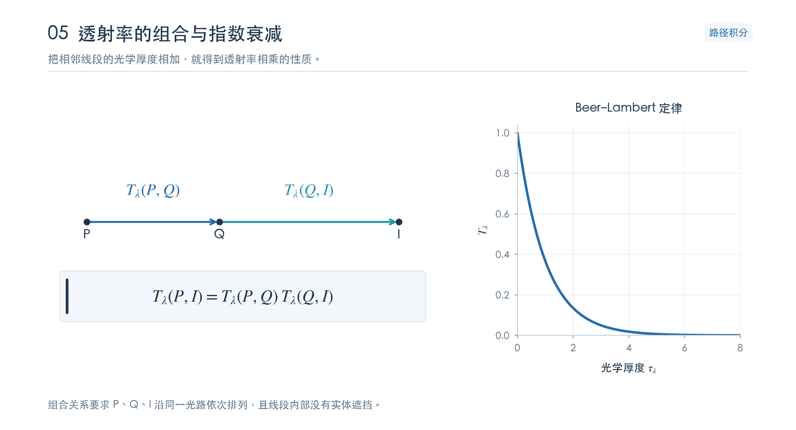

*图 5：光学厚度相加，透射率相乘。两端的 top-LUT 商是运行时省去路径积分的关键。*

若从 $P$ 沿 $\boldsymbol\omega$ 延长不碰地面，$P,Q$ 共用前方的大气顶交点 $I$，则

$$
T_\lambda(P,Q)=\frac{T_{t,\lambda}(r,\mu)}{T_{t,\lambda}(r_d,\mu_d)}.
\tag{27}
$$

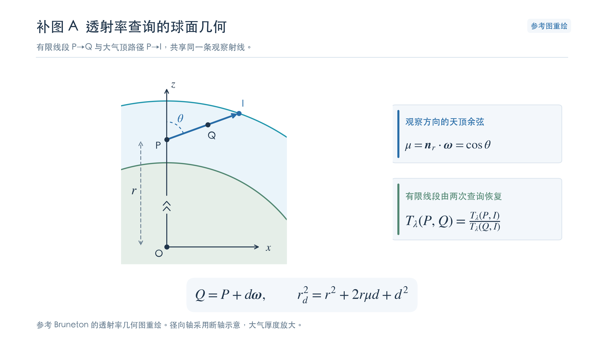

*补图 A：参考 Bruneton [Transmittance / Computation 中的第一幅几何图](https://ebruneton.github.io/precomputed_atmospheric_scattering/atmosphere/functions.glsl.html#transmittance_computation)重新绘制。$P,Q,I$ 依次位于同一条不碰地的射线上；$I$ 为共同的大气顶交点。$\theta$ 为局部天顶与观察方向的夹角，$\mu=\cos\theta$。局部 $z$ 轴沿径向，图中采用断轴显示到中心 $O$ 的长度 $r$，与引擎世界坐标的 Y-up 约定无关。*

补图 A 将式（27）的两个查询放回真实几何中：从 $P$ 和 $Q$ 看向同一个 $I$，其半径和天顶余弦分别是 $(r,\mu)$ 与 $(r_d,\mu_d)$。它们的顶边界透射率之商，留下的恰好是 $P\to Q$ 这一段。

若延长射线会撞地面，改用反方向 $-\boldsymbol\omega$ 到大气顶的同一交点，再借助互易性，得到

$$
T_\lambda(P,Q)=\frac{T_{t,\lambda}(r_d,-\mu_d)}{T_{t,\lambda}(r,-\mu)}.
\tag{28}
$$

式（28）适用于在到达地面前结束的有限线段。`ray_r_mu_intersects_ground` 描述的是延长射线的边界分支，当前 $P\to Q$ 本身仍可以完全位于空气中。GNXEngine 的 `GetTransmittance` 按这两个分支取样，并逐通道执行 `min(value,1)`，限制插值和舍入带来的小幅越界。

式（27）、（28）使用的都是顶边界透射率，但选的方向不同。不碰地时，$P,Q$ 沿 $+\boldsymbol\omega$ 指向同一个顶交点，$T(P,I)=T(P,Q)T(Q,I)$，因此用前者除以后者。向下碰地的分支中，当前有限线段仍在地表之前；改沿 $-\boldsymbol\omega$ 反向看顶边界，此时顺序是 $Q\to P\to I$，所以 $T(Q,I)=T(Q,P)T(P,I)$，商式的分子变成 $Q$ 的查询。正是透射率互易性让反向的 $T(Q,P)$ 等于需要的 $T(P,Q)$，而不是拿穿过地球的顶路径求商。

图 5 和补图 A 中，商式能消掉尾段的关键是共用顶边界交点。实现时把边界分支从起点传到终点，两次查询才会沿同一条累计光路取值；若在终点重新选了另一条路径，剩余尾段也随之改变。

商式还存在数值隐患：很长的低空路径可能使分子分母都接近零，半精度存储后甚至同时变成零，理论上的有效商也可能算成 $0/0$。第 7.4 节将结合实际格式和数值例子说明这一问题。把光学厚度存入 LUT 再做相减是一种候选方案，但会改变插值误差分布，需要单独验证。

到这里，任意有效有限线段的衰减都可以用 $T_\lambda(P,Q)$ 表示。单次散射接下来只需补上两个因素：采样点接收到多少太阳光，以及该点把多少光散射进观察方向。

## 4. 单次散射与太阳圆盘

有了透射率，就可以沿观察射线逐点回答一个具体问题：太阳送到这里多少光，这一小段空气把其中多少散射回相机？单次散射的每个乘法因子，都能在这条光路上找到位置。

### 4.1 一条路径同时经历两段衰减

散射点 $Q_d$ 接收的太阳法向辐照度是 $E_{\odot,\lambda}T_{\odot,\lambda}(Q_d)$。体积组分 $i$ 将它按 $\beta_i^s p_i$ 散射进观察方向，再沿 $Q_d\to P$ 衰减。代入式（16）得到

$$
L_\lambda^{(1)}(r,\mu,\mu_s,\nu)
=\sum_{i\in\{R,M\}}\int_0^{d_B}
T_\lambda(P,Q_d)E_{\odot,\lambda}T_{\odot,\lambda}(Q_d)
\beta_{i,0}^s(\lambda)D_i(h(Q_d))p_i(\nu)\,\mathrm dd.
\tag{29}
$$

$T_{\odot,\lambda}$ 还包含太阳被地球遮挡的近似可见度。这里没有额外 $\mu_s$ 因子：体积粒子没有选定水平接收面，它截获的是光束法向辐照度；只有计算地面辐照度时才需要法线余弦。

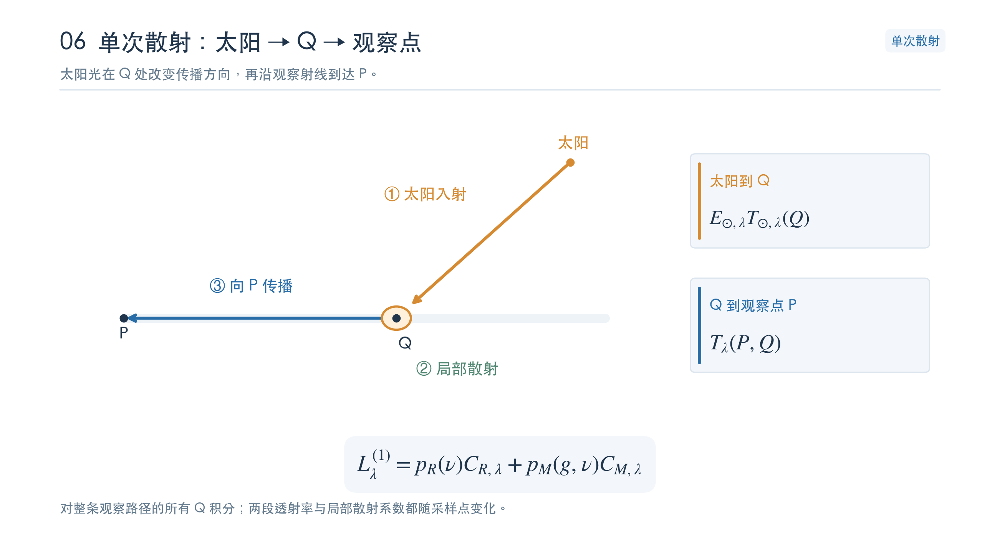

*图 6：每个路径样本都计算“太阳到散射点”和“散射点到观察者”两段透射率。只有被散射进观察方向的那部分贡献天空像素。*

式（29）中的乘法可以按真实光路逐项阅读。对一个组分、一个很短的路径样本，贡献近似为 $\Delta L_\lambda=T_\lambda(P,Q_d)E_{\odot,\lambda}T_{\odot,\lambda}(Q_d)\beta_{i,0}^sD_i p_i\Delta d$：

| 因子 | 在光路上做什么 | 为什么需要它 |
|---|---|---|
| $E_{\odot,\lambda}$ | 从大气外送来太阳光 | 决定光源强度 |
| $T_{\odot,\lambda}(Q_d)$ | 衰减太阳到当前点的光，并处理太阳可见性 | 日落时斜向太阳路径更长，当前点也可能在星球阴影中 |
| $\beta_{i,0}^sD_i(h)\Delta d$ | 计算这一小段有多少机会发生散射 | 密度越大、段长越长，局部散射量越大；短段近似要求系数变化足够小 |
| $p_i(\nu)$ | 按方向分配这次散射 | 决定有多少贡献进入观察方向，带有 $\mathrm{sr^{-1}}$ 单位 |
| $T_\lambda(P,Q_d)$ | 衰减散射点送回相机的光 | 远处产生的贡献不能未经衰减直接加入像素 |

用一个简化的单波长样本来看这次乘法：令 $E_{\odot,\lambda}=1\,\mathrm{W\,m^{-2}\,nm^{-1}}$，两个透射率为 0.6 和 0.8，参考散射系数为 $2\times10^{-5}\,\mathrm{m^{-1}}$，密度为 0.5，相函数为 $0.1\,\mathrm{sr^{-1}}$，段长为 100 m。样本贡献就是 $\Delta L_\lambda=4.8\times10^{-5}\,\mathrm{W\,m^{-2}\,sr^{-1}\,nm^{-1}}$。完整积分将每个样本的这份贡献相加，并分别计算 Rayleigh 与 Mie 两种组分。

式（22）说明 $\nu$ 沿直线保持不变，而参考相函数又与高度无关。因此可以将相函数移到积分之外：

$$
\begin{aligned}
C_{i,\lambda}&=E_{\odot,\lambda}\beta_{i,0}^s(\lambda)
\int_0^{d_B}T_\lambda(P,Q_d)T_{\odot,\lambda}(Q_d)D_i(h(Q_d))\,\mathrm dd,\\
L_\lambda^{(1)}&=p_R(\nu)C_{R,\lambda}+p_M(g,\nu)C_{M,\lambda}.
\end{aligned}
\tag{30}
$$

$C_i$ 的单位是辐照度，而不是光学厚度。虽然去掉了相函数，$C_i$ 仍依赖 $\nu$，因为路径上 $\mu_{s,d}$ 含有 $d\nu$，太阳衰减和地球遮挡会随之改变。分离相函数能够保留气溶胶前向峰的解析精度，避免用只有 8 个 $\nu$ 样本的纹理直接插值一个尖峰。

式（30）把同一条直线积分中不随 $d$ 变化的角分布移到了积分外。$C_i$ 仍保留太阳方向对路径衰减和遮挡的影响，只是把解析相函数留到查询时计算。这样，LUT 保存较平滑的路径部分，太阳附近尖锐的 Mie 前向峰由真实 $\nu$ 上的解析函数恢复。

这一步对单次散射成立，还依赖相函数不随高度变化。多次散射中，每个样本又收到不同入射方向，出现的是 $p(\boldsymbol\omega\cdot\boldsymbol\omega_i)$；这个夹角随方向积分样本而变，不能将其统一移到全方向积分外。后面“高阶结果除以 $p_R$ 存储”是可逆编码，理由与单次散射的解析分离不同。

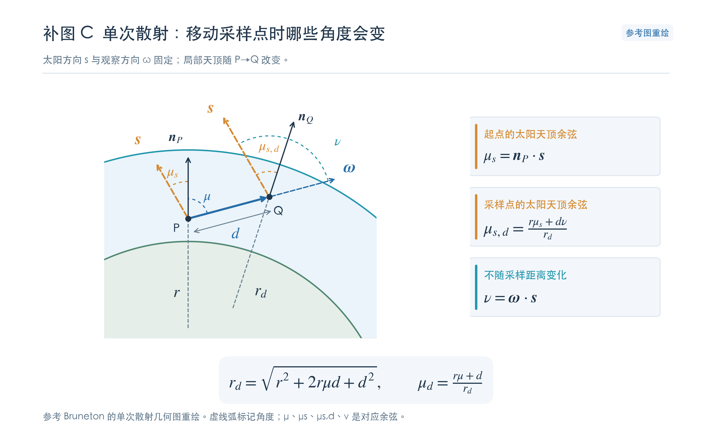

*补图 C：参考 Bruneton [Single scattering / Computation 中的几何图](https://ebruneton.github.io/precomputed_atmospheric_scattering/atmosphere/functions.glsl.html#single_scattering_computation)重新绘制。$\boldsymbol n_P=P/r$、$\boldsymbol n_Q=Q/r_d$ 表示两个位置的局部径向天顶，均对应符号表中的 $\boldsymbol n_r$。虚线弧标出有关夹角，其旁的 $\mu,\mu_s,\mu_{s,d},\nu$ 表示夹角余弦。图中太阳方向 $\boldsymbol s$ 与观察方向 $\boldsymbol\omega$ 始终固定。*

沿视线移动到 $Q$ 后，局部天顶由 $\boldsymbol n_P$ 变为 $\boldsymbol n_Q$，所以太阳的局部天顶余弦从 $\mu_s$ 变为 $\mu_{s,d}$。两个太阳箭头平行，并不意味着这两个余弦相等；反而 $\nu$ 只涉及两个固定世界方向，因此可以在整条路径中复用。这正是式（22）更新局部状态、式（30）分离解析相函数的几何依据。

### 4.2 太阳遮挡和有限角直径

点太阳在几何地平线处会突然开关，容易使预计算和日落过渡出现跳变。新版实现给太阳设置角半径 $\alpha_s$，通过可见比例近似对地平线附近进行平滑：

$$
T_{\odot,\lambda}(r,\mu_s)
\approx T_{t,\lambda}(r,\mu_s)
\operatorname{smoothstep}\!\left(
-\frac{r_b}{r}\alpha_s,\frac{r_b}{r}\alpha_s,\mu_s-\mu_h(r)\right).
\tag{31}
$$

$\operatorname{smoothstep}(a,b,x)$ 在区间内使用 $3t^2-2t^3$，其中 $t=(x-a)/(b-a)$，区间外钳位为 0 或 1。比例 $r_b/r=\sqrt{1-\mu_h^2}$ 来自天顶余弦对角度的小范围线性化。这里同时近似了圆盘遮挡和圆盘上透射率变化；太阳越接近地平线，不能越发把它看作逐方向精确积分。

令 $\theta_h=\arccos\mu_h$ 为几何地平线的天顶角，$\theta_s$ 为当前点的太阳天顶角。地平线偏移因子的来源是 $\mu_s=\cos\theta_s$ 的局部导数：$\Delta\mu_s\approx-\sin\theta_h\Delta\theta_s$。太阳中心距离几何地平线一个角半径时，余弦差约为 $\alpha_s\sin\theta_h=\alpha_s r_b/r$，正好给出式（31）的两个过渡端点。太阳中心落在地平线上时可见比例约为 1/2；中心在地平线以下一个角半径时圆盘全被遮住，以上一个角半径时全可见。这是对圆盘入射的近似，不是把太阳高度等于零的一帧强制切成黑色。

均匀圆盘被直线截断时，其精确面积比例可在小角度平面中写为

$$
f(x)=\frac{\arccos(-x)+x\sqrt{1-x^2}}{\pi},\quad -1<x<1,
\qquad x=\frac{\mu_s-\mu_h}{(r_b/r)\alpha_s}.
\tag{32}
$$

区间外分别取 0、1。式（31）的三次函数是对这一过渡的便宜近似，不等同于式（32）。GNXEngine 的 `GetTransmittanceToSun` 保留该做法；太阳角半径为 $0.004675$ rad，约 $0.268^\circ$。

`ComputeDirectIrradiance` 使用另一种专门处理水平面余弦积分的近似：

$$
E_\lambda^{(0)}(r,\mu_s)
\approx E_{\odot,\lambda}T_{t,\lambda}(r,\mu_s)\,\bar\mu_s,
\qquad
\bar\mu_s=\begin{cases}
0,&\mu_s<-\alpha_s,\\
(\mu_s+\alpha_s)^2/(4\alpha_s),&|\mu_s|\le\alpha_s,\\
\mu_s,&\mu_s>\alpha_s.
\end{cases}
\tag{33}
$$

$E^{(0)}$ 是直接太阳辐照度，后续作为地面边界源使用。式（33）近似小太阳圆盘在水平接收面上的平均余弦，地面处 $\mu_h=0$，过渡中心正好是水平线。式（31）则近似体积散射点看到的太阳可见比例；两个函数对应不同的接收方式，参考实现也分别使用它们。在高空，式（33）只保留水平面投影近似。

式（33）的中段可用一个简化平均解释：把太阳圆盘在天顶方向的角分布近似成宽度 $2\alpha_s$ 的均匀条带，平均其正的投影余弦，即 $(2\alpha_s)^{-1}\int_{-\alpha_s}^{\alpha_s}\max(\mu_s+t,0)\mathrm dt$。当圆盘跨越水平面时，从 $t=-\mu_s$ 积到 $\alpha_s$，得到 $(\mu_s+\alpha_s)^2/(4\alpha_s)$；全部在上方时得到 $\mu_s$，全部在下方时为零。这个条带平均与圆盘面积可见比例是不同近似，也说明体积散射为何用式（31），水平地面直射照明为何另用式（33）。

### 4.3 GNXEngine 中的单次散射积分

以下片段来自 `AtmosphereCommon.hlsl`，省略函数形参和采样器传递，保留路径更新与两个衰减因子：

```hlsl
float r_d = ClampRadius(atmosphere,
    sqrt(d * d + 2.0 * r * mu * d + r * r));
float mu_s_d = ClampCosine((r * mu_s + d * nu) / r_d);
float3 transmittance =
    GetTransmittance(/* textures */, r, mu, d, ray_r_mu_intersects_ground) *
    GetTransmittanceToSun(/* textures */, r_d, mu_s_d);
rayleigh = transmittance * GetProfileDensity(
    atmosphere.rayleigh_density, r_d - atmosphere.bottom_radius);
mie = transmittance * GetProfileDensity(
    atmosphere.mie_density, r_d - atmosphere.bottom_radius);
```

片段中的 `rayleigh`、`mie` 暂时只是式（30）的无量纲积分被积项。外层 `ComputeSingleScattering` 使用 50 个区间、51 个点的梯形积分，积分完成后再乘 $\Delta d$、太阳辐照度和参考散射系数。取样代码中的端点半权重与式（25）相同。`ComputeSingleScattering.shader` 一次输出去相函数的 Rayleigh、Mie、最终累计散射初值和完整单次 Mie 数据。

积分输出的 $C_R,C_M$ 尚未乘相函数。它们会在两个位置恢复完整辐亮度：运行时查询第一阶天空时，以及预计算第二阶散射、构造第一阶入射场时。两处都使用式（30），每个结果只恢复一次。

现在已有透射率和单次散射的物理积分，接下来的问题是如何让有限数量的纹素准确表示这些连续函数。先确定参数化和取样方式，后续多次散射才能反复查询上一阶结果。

## 5. LUT 参数化：把物理空间映射到纹理

预计算的核心不只是保存积分结果，还要决定在哪里采样。均匀采样高度、天顶余弦和太阳余弦，看起来简单，却会把大量样本放在变化平缓的区域，反而漏掉近地层、地平线和日落的细节。新版映射使用球面几何距离安排采样，并在有地面遮挡和无地面遮挡的方向之间显式分区。

先分清两条相反的计算路径。预计算时，GPU 已经知道自己正在写哪一个纹素，必须由其坐标**反解**出物理状态，再求这个状态的积分。运行时，相机给出的却是物理状态，需要**正向编码**成纹理坐标，读取相邻预计算值。只有二者使用相容的映射，同一纹素中写入的状态才会在查询时被正确找到。纹理横坐标本身不是观察角，纵坐标也不直接等于海拔。

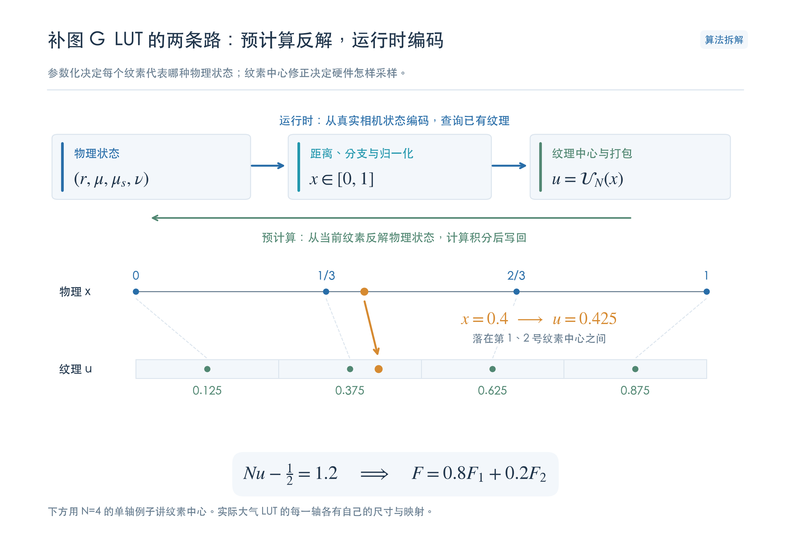

*补图 G：上方展示预计算反解与运行时编码，下方用单轴 $N=4$ 的例子解释式（34）。$x$ 表示已归一化的物理参数，$u$ 是归一化纹理坐标，$F_k$ 是第 $k$ 个纹素的函数值，编号从 0 开始。图中 $u=\mathcal U_N(x)$ 对应需要纹素中心修正的轴；散射观察方向还需半区变换，$\nu$ 则在第 5.7 节单独插值。*

### 5.1 纹素中心修正及其逆过程

长度为 $N$ 的纹理轴，首尾纹素中心位于 $1/(2N)$ 和 $1-1/(2N)$。将物理单位区间 $x\in[0,1]$ 映射到这些中心，可得

$$
\mathcal U_N(x)=\frac{1}{2N}+x\left(1-\frac1N\right),
\qquad
\mathcal X_N(u)=\frac{u-1/(2N)}{1-1/N}.
\tag{34}
$$

$u$ 是归一化纹理坐标。正向对应 `GetTextureCoordFromUnitRange`，逆向对应 `GetUnitRangeFromTextureCoord`。如果直接把 $x=0,1$ 当成纹理边缘，插值会依赖采样器寻址方式，并浪费半个纹素的有效覆盖。预计算反解和运行时正向映射都要使用同一套式（34）。

使用 $\mathcal U_N$ 后，$N$ 个物理采样点对应 $x=k/(N-1)$，而非 $k/N$。这一区别还会出现在 $\nu$ 切片插值中：纹理维数表示纹素数量，两个端点之间只有 $N-1$ 个间隔。

补图 G 中，四个纹素对应物理样本 $x=0,1/3,2/3,1$，但它们的纹理中心是 $u=0.125,0.375,0.625,0.875$。查询 $x=0.4$ 时，式（34）得到 $u=0.425$；硬件的连续纹素索引为 $Nu-0.5=1.2$，于是用第 1、2 号纹素按 0.8、0.2 插值。若直接用 $u=x=0.4$，索引变为 1.1，权重就变成 0.9、0.1，查询的是另一物理状态。中心修正因此不只是“让边界好看”，而是整个轴上样本语义的一部分。

### 5.2 二维透射率 LUT：正向映射

透射率到大气顶只依赖 $(r,\mu)$，无需太阳方向。表的半径坐标选择

$$
x_r=\rho/H,\qquad u_r=\mathcal U_{N_{T,r}}(x_r).
\tag{35}
$$

它使 $r=\sqrt{r_b^2+(Hx_r)^2}$，所以近地层采样比高度线性映射更密。采用 64 个半径样本、60 km 大气厚度时，第一个高于地面的样本约在 15.2 m，而高度线性采样的间隔约为 952.4 m；这与近地密度的快速变化相适应。

这一非线性映射可由近地近似看得更清楚。将 $\rho=Hx_r$ 代入，$h=r-r_b=\sqrt{r_b^2+H^2x_r^2}-r_b\approx H^2x_r^2/(2r_b)$，所以近地高度按纹理坐标的平方增长。小的 $x_r$ 步长只跨过很薄的一层空气，较高处才逐渐变疏。图 7 左侧应比较同样高度变化在两条纵坐标上跨过多少距离，下面的采样条则直接列出离散高度；两者说明的是采样密度，不是空气中额外产生的能量。

合法方向是不穿过地面的顶边界路径，故 $\mu\in[\mu_h(r),1]$。该范围内的边界距离从最短的 $r_t-r$ 变化到最长的 $\rho+H$。定义

$$
d_{\min}=r_t-r,\qquad d_{\max}=\rho+H,
\qquad x_\mu=\frac{d_t(r,\mu)-d_{\min}}{d_{\max}-d_{\min}},
\qquad u_\mu=\mathcal U_{N_{T,\mu}}(x_\mu).
\tag{36}
$$

纹理横轴是 $u_\mu$，纵轴是 $u_r$，GNXEngine 尺寸为 $256\times64$。$x_\mu=0$ 表示向上最短路径，$x_\mu=1$ 表示贴地最长路径。按距离采样能更直接分配光学厚度变化所需的分辨率，而不只是对角度做一个任意幂函数。

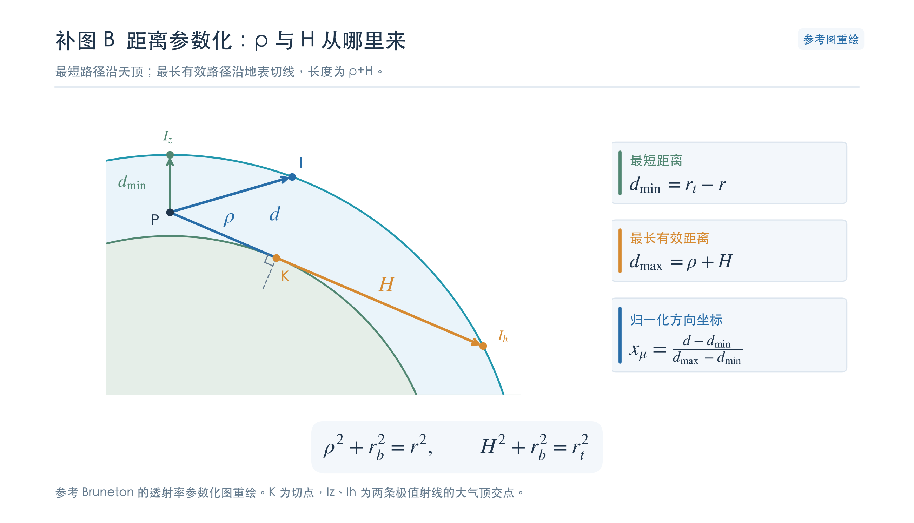

*补图 B：参考 Bruneton [Transmittance / Precomputation 中的距离参数化图](https://ebruneton.github.io/precomputed_atmospheric_scattering/atmosphere/functions.glsl.html#transmittance_precomputation)重新绘制。$I_z$ 是向上射线的大气顶交点，$I_h$ 是地表切线延伸到大气顶的交点，$K$ 是地表切点；图中只显示局部弧段。蓝色普通射线到 $I$ 的距离为 $d=d_t(r,\mu)$。*

切线 $P\!K\!I_h$ 与半径 $OK$ 垂直。因此三角形 $OPK$ 和 $OI_hK$ 的勾股关系分别给出 $\rho^2+r_b^2=r^2$ 与 $H^2+r_b^2=r_t^2$；它们共用同一个 $K$，所以最长顶边界路径是 $|PI_h|=|PK|+|KI_h|=\rho+H$。向上射线的最短路径则为 $|PI_z|=r_t-r$。这使式（36）的上下限和归一化坐标都有直接的几何意义。

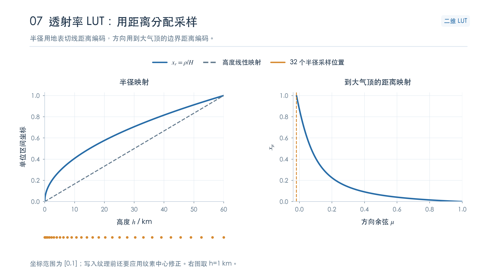

*图 7：左图比较半径映射与线性高度映射，下方独立采样条显示 32 个散射半径样本；透射率自身使用同一半径映射、64 个半径样本。右图是 1 km 高度处合法方向的距离映射。采样条与曲线共用高度范围，可以看到近地层得到更密集的样本。*

### 5.3 二维透射率 LUT：逆向映射

预计算片元给出纹素中心 $(u_\mu,u_r)$，先反解几何长度和半径，再恢复边界距离：

$$
\rho=H\mathcal X_{N_{T,r}}(u_r),\qquad
r=\sqrt{r_b^2+\rho^2},\qquad
d=d_{\min}+\mathcal X_{N_{T,\mu}}(u_\mu)(d_{\max}-d_{\min}).
\tag{37}
$$

将 $\lVert P+d\boldsymbol\omega\rVert=r_t$ 移项，得到余弦

$$
\mu=\frac{r_t^2-r^2-d^2}{2rd}
=\frac{H^2-\rho^2-d^2}{2rd}.
\tag{38}
$$

用 $H^2-\rho^2$ 能避免反复写两个巨大半径的平方。$r=r_t,d=0$ 是退化情形：很多向外方向的长度都是 0，反解不再唯一。参考实现选 $\mu=1$；其透射率都为 1，所以这个退化对积分值没有影响，但不能宣称在所有退化端点上“参数一一对应”。

式（37）、（38）的解码顺序不能倒过来：先从纵向纹素得出 $\rho$ 与 $r$，因为该半径决定当前行的 $d_{\min},d_{\max}$；再从横向位置得到 $d$，最后用球面交点关系反推出 $\mu$。同一个横向坐标在不同半径行可能代表不同的观察余弦。运行时正向映射执行相反的顺序，先以真实 $r,\mu$ 求距离，再计算当前行的归一化坐标。因此这张二维纹理存的是连续函数 $T_t(r,\mu)$ 的重参数化，不是一张所有行共用角度刻度的天空图片。

### 5.4 四维散射 LUT 的半径与观察方向

单次和多次散射依赖 $(r,\mu,\mu_s,\nu)$。散射半径仍按式（35）映射，只是 $N_r=32$。观察方向需要覆盖全部余弦，且必须处理地面遮挡造成的边界变化。

对于撞地面的分支，使用地面距离 $d_b$；其最短和最长值为 $r-r_b$、$\rho$。对于无地面交点分支，使用到大气顶的 $d_t$。映射写成

$$
u_\mu=\begin{cases}
\dfrac12-\dfrac12\mathcal U_{N_\mu/2}\!\left(
\dfrac{d_b-(r-r_b)}{\rho-(r-r_b)}\right),&\mathrm{groundHit},\\[8pt]
\dfrac12+\dfrac12\mathcal U_{N_\mu/2}\!\left(
\dfrac{d_t-(r_t-r)}{\rho+H-(r_t-r)}\right),&\mathrm{noGroundHit}.
\end{cases}
\tag{39}
$$

这里 $N_\mu=128$，每半边有 64 个纹素。分母为 0 的地表退化分支选单位坐标 0。特别要注意：$u_\mu\approx0.5$ 附近是向下竖直和向上竖直两个极限；地平线的两侧分别位于纹理接近 0 和接近 1 的位置，并非相邻存储在 $0.5$ 的两侧。分区避免硬件插值把穿地射线与擦地射线混合。

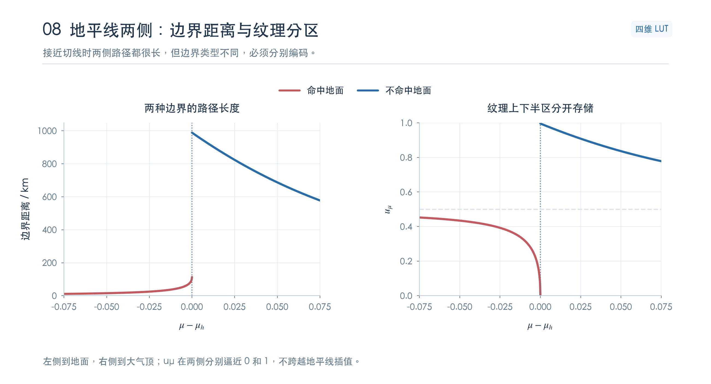

*图 8：边界距离在地平线两侧发生切换；两个方向分支占用不同的半纹理。图中的跳变来自最近边界选择，而不是空气密度突然变化。*

以 $N_\mu=128$、非退化半径为例，式（39）的四个方向极限可以直接列成表。$\varepsilon$ 表示很小的正余弦偏移：

| 方向 | 采用的距离端点 | 极限 $u_\mu$ | 放置原因 |
|---|---|---|---|
| 竖直向下 $\mu=-1$ | 地面最短距离 $r-r_b$ | $127/256=0.49609375$ | 地面半区靠中间的最后中心 |
| 地平线下方 $\mu\to\mu_h-\varepsilon$ | 地面最长距离 $\rho$ | $1/256=0.00390625$ | 贴地分支移到纹理最下端 |
| 地平线上方 $\mu\to\mu_h+\varepsilon$ | 顶边界最长距离 $\rho+H$ | $255/256=0.99609375$ | 掠过地球的长路径移到最上端 |
| 竖直向上 $\mu=1$ | 顶边界最短距离 $r_t-r$ | $129/256=0.50390625$ | 天空半区靠中间的第一个中心 |

图 8 的两个地平线极限位于纹理两端，相邻纹素不会跨越那个跳变。在中间，向下和向上的竖直方向虽然彼此接近存储，却分别停在两侧的纹素中心；合法查询不需要落入 $0.5$ 处的间隙。若把地平线误当作 $u_\mu=0.5$，或者反解后丢失分支标志，天空和地面会使用错误的路径边界。地表向下的零长度退化另按代码约定处理，不能机械套用本表的非退化极限。

逆向解码首先用 $u_\mu<0.5$ 决定分支。对地面分支，定义 $x=\mathcal X_{N_\mu/2}(1-2u_\mu)$；对大气顶分支，定义 $x=\mathcal X_{N_\mu/2}(2u_\mu-1)$。由对应区间恢复 $d$ 后分别得到

$$
\begin{aligned}
\mu_{\rm ground}&=-\frac{\rho^2+d^2}{2rd},\qquad
d=(r-r_b)+x[\rho-(r-r_b)],\\
\mu_{\rm top}&=\frac{H^2-\rho^2-d^2}{2rd},\qquad
d=(r_t-r)+x[\rho+H-(r_t-r)].
\end{aligned}
\tag{40}
$$

当 $d=0$ 时，地面分支选 $\mu=-1$，顶分支选 $\mu=1$。反解返回的地面相交标志应保留到后续积分和查询，避免在相切处重新判别时因浮点误差切换分支。

### 5.5 太阳方向的非线性映射与常数差异

日落时太阳高度变化很小，光路长度却变化很快，因此 $\mu_s$ 需要在地平线附近更密的采样。新版实现借用地表 $r_b$ 处相同太阳余弦的顶边界距离，令

$$
\begin{aligned}
d_{s,\min}&=r_t-r_b,\qquad \Delta_s=H-d_{s,\min},\\
a(\mu_s)&=\frac{d_t(r_b,\mu_s)-d_{s,\min}}{\Delta_s},\qquad
A=a(\mu_{s,\min}),\\
x_{\mu_s}&=\frac{\max(1-a/A,0)}{1+a},\qquad
u_{\mu_s}=\mathcal U_{N_{\mu_s}}(x_{\mu_s}).
\end{aligned}
\tag{41}
$$

$\mu_{s,\min}$ 是所支持最低太阳天顶余弦，当前预设为 $\cos120^\circ=-0.5$；$N_{\mu_s}=32$。$\mu_s=1$ 对应 $a=0,x=1$，$\mu_s=\mu_{s,\min}$ 对应 $a=A,x=0$。低于支持范围的太阳方向钳位到首个样本，而不是继续正确外推深夜的物理状态。

式（41）可分成两次压缩。先用地表太阳路径得到 $a$：太阳正上方时 $a=0$，水平时 $d_t=H$、$a=1$，到支持下限时 $a=A$。再用 $(1-a/A)/(1+a)$ 压入单位区间，其导数为 $-(1+1/A)/(1+a)^2$，在 $A>0$ 时单调，因而能由式（42）反解。地表在这里只是所有半径层共用的坐标标尺；各个散射样本的太阳透射率仍按自己的 $r_d,\mu_{s,d}$ 计算。

图 9 的样本条标出实际参加预计算的太阳方向，可以直接看出地平线附近如何获得更多分辨率。它描述参数域上的采样分布。修改映射常数后，这些纹素代表的物理状态也会改变，因此预计算与运行时映射需要一起更新。

反解从 $x=\mathcal X_{N_{\mu_s}}(u_{\mu_s})$ 开始。将 $x(1+a)=1-a/A$ 解出 $a$，然后恢复 $\mu_s$：

$$
a=\frac{A(1-x)}{1+Ax},\qquad
d=d_{s,\min}+\min(a,A)\Delta_s,\qquad
\mu_s=\frac{H^2-d^2}{2r_b d}.
\tag{42}
$$

正向和逆向中的 $A$ 必须一致。GNXEngine 的这两个函数都使用下面的近似值，而新版官方函数已经使用式（41）的精确端点：

$$
A_{\rm GNX}=\frac{-2\mu_{s,\min}r_b}{H-(r_t-r_b)}.
\tag{43}
$$

它相当于把最低太阳方向的距离近似成 $-2r_b\mu_{s,\min}$，没有完整保留大气壳厚度。由于正反两边都采用式（43），映射在其实际有效域内仍自洽，但 $x=0$ 反解出的太阳下限不再严格等于配置的 $\mu_{s,\min}$。令 $d_c=(r_t-r_b)-2r_b\mu_{s,\min}$，其实际端点为

$$
\mu_{s,\rm cut}=\frac{H^2-d_c^2}{2r_b d_c}.
\tag{44}
$$

60 km 厚度对应 $\mu_{s,\rm cut}\approx-0.4953271$，太阳天顶角约 $119.6913^\circ$；100 km 厚度对应 $-0.4922601$，约 $119.4892^\circ$。差别主要影响支持域低端，不能从截图看起来平滑就判断常数与新版一致。若采用非负的 $\mu_{s,\min}$，还需重新检查这条近似式是否产生有效的正 $A$。

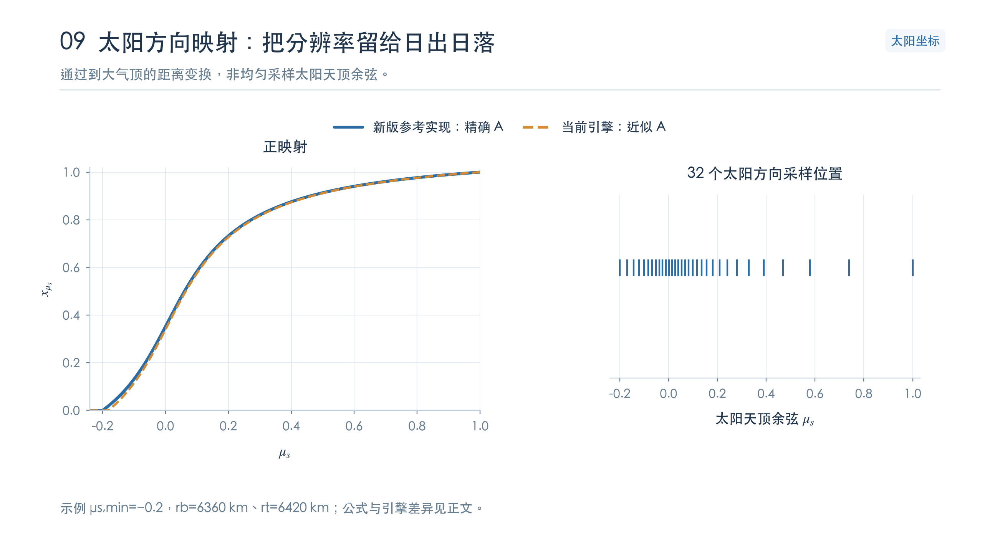

*图 9：为让曲线差别更易辨认，图中示例下限为 $-0.2$；本文截图预设实际使用 $-0.5$。右图展示精确映射的 32 个太阳方向样本。*

GNXEngine 的关键片段如下，它直接对应式（43），不应在介绍当前代码时把这一行写成新版精确形式：

```hlsl
float d = DistanceToTopAtmosphereBoundary(
    atmosphere, atmosphere.bottom_radius, mu_s);
float d_min = atmosphere.top_radius - atmosphere.bottom_radius;
float d_max = H;
float a = (d - d_min) / (d_max - d_min);
float A = -2.0 * atmosphere.mu_s_min * atmosphere.bottom_radius /
          (d_max - d_min);
float u_mu_s = GetTextureCoordFromUnitRange(
    max(1.0 - a / A, 0.0) / (1.0 + a), SCATTERING_TEXTURE_MU_S_SIZE);
```

### 5.6 四个参数不是任意组合：$\nu$ 的可实现范围

将观察方向和太阳方向分别分解成径向与切向分量，设两个切向方向的相对方位角为 $\phi$，则

$$
\nu=\mu\mu_s+\sqrt{(1-\mu^2)(1-\mu_s^2)}\cos\phi.
\tag{45}
$$

所以每一对 $(\mu,\mu_s)$ 对应的合法 $\nu$ 范围是

$$
\mu\mu_s-\sqrt{(1-\mu^2)(1-\mu_s^2)}
\le\nu\le
\mu\mu_s+\sqrt{(1-\mu^2)(1-\mu_s^2)}.
\tag{46}
$$

同一约束还可以写成三个单位向量的 Gram 行列式 $1+2\mu\mu_s\nu-\mu^2-\mu_s^2-\nu^2\ge0$。相机通过单位向量点积产生的状态满足它，规则四维纹理却包含不可实现的组合。预计算解码将这些组合的 $\nu$ 钳到式（46）的最近边界，再构造对应方向，让冗余地址仍有稳定的插值数据。

式（45）来自把两方向写成径向分量加切向分量。径向点积为 $\mu\mu_s$，切向长度分别为 $\sqrt{1-\mu^2}$ 与 $\sqrt{1-\mu_s^2}$，它们再乘相对方位的余弦；这个余弦只能在 $[-1,1]$ 中变化，便得到式（46）。例如 $\mu=0.6,\mu_s=0.8$ 时，径向积和切向长度积都为 0.48，合法 $\nu$ 只有 $[0,0.96]$，而非整个 $[-1,1]$。若观察方向就是天顶，$\mu=1$，切向长度为零，则必有 $\nu=\mu_s$。

图 10 的空白区域对应不可实现的方向组合。规则纹理仍分配这些地址，解码时用合法边界填充；相机的实际查询则位于可实现域中。到了第 6.2 节，这个约束还会保证太阳方向的切向分量可以正确重建。

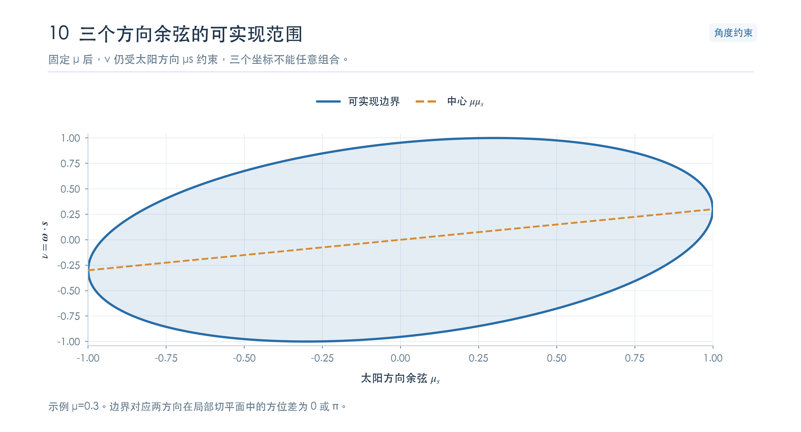

*图 10：固定 $\mu=0.3$ 时的合法区域。四维纹理采用规则网格，物理方向只占其中受约束的部分。*

### 5.7 将四维函数打包进三维纹理

GNXEngine 与参考尺寸一致：$N_\nu=8,N_{\mu_s}=32,N_\mu=128,N_r=32$。把前两维并入宽度，三维纹理尺寸为

$$
(N_\nu N_{\mu_s})\times N_\mu\times N_r
=256\times128\times32.
\tag{47}
$$

每个 $\nu$ 切片在横向占 32 个 $\mu_s$ 样本。片元中心 $(x_f,y_f,z_f)$ 的解码为

$$
i_\nu=\left\lfloor\frac{x_f}{N_{\mu_s}}\right\rfloor,\quad
u_\nu=\frac{i_\nu}{N_\nu-1},\quad
u_{\mu_s}=\frac{x_f-i_\nu N_{\mu_s}}{N_{\mu_s}},\quad
u_\mu=\frac{y_f}{N_\mu},\quad u_r=\frac{z_f}{N_r}.
\tag{48}
$$

$x_f,y_f,z_f$ 已带纹素中心的 $0.5$ 偏移；逐层绘制时 $z_f=\mathrm{layer}+0.5$。$u_\nu$ 用于反解 $\nu=2u_\nu-1$，不再进行式（34）的中心修正，因为这一维由软件插值。

运行时先算 $q=(\nu+1)(N_\nu-1)/2$，令 $i=\lfloor q\rfloor$、$f=q-i$，构造

$$
\boldsymbol u_0=\left(\frac{i+u_{\mu_s}}{N_\nu},u_\mu,u_r\right),\qquad
\boldsymbol u_1=\left(\frac{i+1+u_{\mu_s}}{N_\nu},u_\mu,u_r\right),\qquad
F=(1-f)\operatorname{tex3D}(\boldsymbol u_0)+f\operatorname{tex3D}(\boldsymbol u_1).
\tag{49}
$$

两次硬件三线性插值加一次软件线性插值，就完成四维插值。$u_{\mu_s}$ 已离切片边缘半个纹素，防止普通取样跨到另一个 $\nu$ 切片。端点 $\nu=1$ 时 $f=0$，第二个坐标会超出最后切片；当前写法依赖 clamp 采样器且其权重为 0，移植时也可显式限制相邻切片索引。

可以用一个完整地址例子读式（48）、（49）。假设一个合法状态已经编码为 $\nu=0$、$u_{\mu_s}=0.5,u_\mu=0.75,u_r=0.25$。由于 $N_\nu=8$，有 $q=3.5,i=3,f=0.5$；两次三维查询的横坐标分别是 $(3+0.5)/8=0.4375$ 与 $(4+0.5)/8=0.5625$，其他坐标相同，最后将结果各乘 1/2。它们读取的是第 3、4 个角度块内部相同的太阳位置，不是在整个宽度上任意取两个相邻纹素。

一次三线性取样已经在三个连续纹理轴上组合最多 8 个相邻纹素；两次这样的结果再跨 $\nu$ 组合，形成四维线性插值的最多 16 个邻居。shader 因而只有两次纹理调用，硬件负责每次内部的邻居取样。第四维 $\nu$ 不是 RGBA 的第四个颜色通道：RGB 保存三个波长的数值，alpha 可保存额外的 Mie 红通道，四个几何维度都体现在纹理地址中。

GNXEngine 的 `GetScattering` 把这个地址计算直接写在 shader 中。下面保留函数体的取样过程，方便将两次三维查询与式（49）的四维插值逐项对应：

```hlsl
float3 GetScattering(AtmosphereParameters atmosphere,
    Texture3D scattering_texture, SamplerState scattering_sampler,
    float r, float mu, float mu_s, float nu,
    bool ray_r_mu_intersects_ground)
{
    float4 uvwz = GetScatteringTextureUvwzFromRMuMuSNu(
        atmosphere, r, mu, mu_s, nu, ray_r_mu_intersects_ground);
    float tex_coord_x = uvwz.x * float(SCATTERING_TEXTURE_NU_SIZE - 1);
    float tex_x = floor(tex_coord_x);
    float lerp = tex_coord_x - tex_x;
    float3 uvw0 = float3(
        (tex_x + uvwz.y) / float(SCATTERING_TEXTURE_NU_SIZE),
        uvwz.z, uvwz.w);
    float3 uvw1 = float3(
        (tex_x + 1.0 + uvwz.y) / float(SCATTERING_TEXTURE_NU_SIZE),
        uvwz.z, uvwz.w);
    return float3(
        scattering_texture.Sample(scattering_sampler, uvw0).rgb * (1.0 - lerp) +
        scattering_texture.Sample(scattering_sampler, uvw1).rgb * lerp);
}
```

`uvwz.x/y/z/w` 依次是 $u_\nu,u_{\mu_s},u_\mu,u_r$，与函数名中物理参数的书写顺序不同，调用时要按返回结构解释。代码使用名为 `lerp` 的局部标量保存插值比例，最终仍显式计算两个权重；这个标量不是 HLSL 内建插值函数的一次调用。

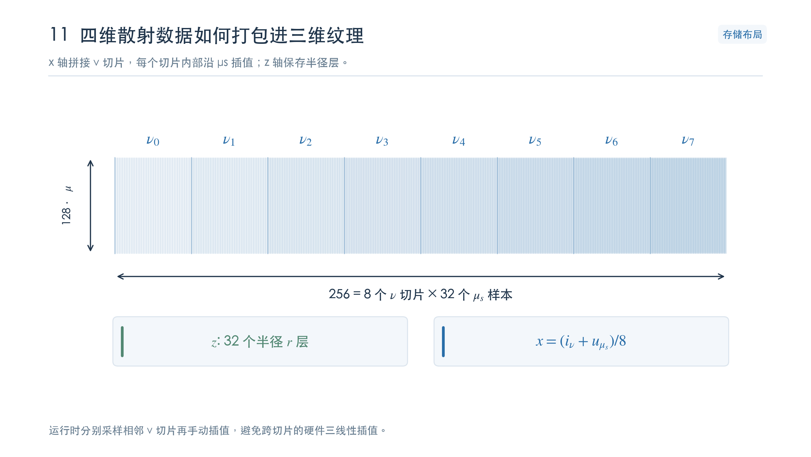

*图 11：横向的 8 个块表示 $\nu$ 切片；图中仅展示 32 个半径层中的一层。硬件不认识四维结构，跨 $\nu$ 的插值必须在函数中完成。*

图 11 仅画一个半径层，是为了看清宽度上的块结构；其余 31 层沿深度轴重复同样布局。在一个块内，横向变化对应太阳方向，纵向变化对应观察方向；跨层对应半径。横向块边界左、右的相邻像素可能属于不同 $\nu$，所以必须把块内坐标限制在首尾纹素中心。不能把整张打包纹理当普通体数据来生成 mipmap，再期待模糊后仍保留相同的物理参数对应。

### 5.8 辐照度 LUT 使用更简单的二维坐标

对水平接收面，间接辐照度只依赖 $(r,\mu_s)$。其变化通常比视线散射平缓，参考实现用线性映射：

$$
u_r=\mathcal U_{N_{E,r}}\!\left(\frac{r-r_b}{r_t-r_b}\right),\qquad
u_{\mu_s}=\mathcal U_{N_{E,\mu_s}}\!\left(\frac{\mu_s+1}{2}\right).
\tag{50}
$$

尺寸为 $64\times16$，横轴太阳余弦，纵轴半径。逆映射先用 $\mathcal X$，再线性恢复参数。它既不采用 $\rho/H$，也不采用式（41）；将所有 LUT 统一成一种坐标虽然方便，却会与现有数据和函数不兼容。

辐照度从散射表少了两维，是因为式（56）已经对观察方向积分：运行时需要的是水平面接收的总天空光，而不是从某个方向看见的天空。绕局部天顶旋转太阳不会改变水平面的总接收量，所以太阳也只剩 $\mu_s$。查询地面点 $G$ 的照明时，要用 $G$ 的局部天顶与太阳点积，不能复用相机的 $\mu_s$；式（51）和 `ground_normal` 的计算正是为此服务。

### 5.9 距离参数化为什么能改善空气透视

纹理映射的价值最终要体现在插值上。Bruneton 与 Neyret 在原论文 Figure 3 中，用同一个场景比较线性观察余弦与距离参数化：前者在空气透视中出现伪影，后者让两个累计查询更好地区分真实路径的变化。

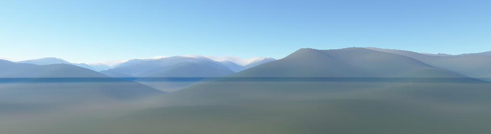

*论文 Figure 3 左图：线性 $\mu$ 参数化导致空气透视插值伪影。来源：Bruneton 与 Neyret，[Precomputed Atmospheric Scattering](预计算大气散射.pdf)，2008，PDF 第 5 页（正文第 4 页）。版权归原作者及出版方。*

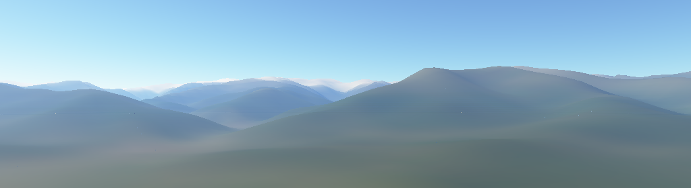

*论文 Figure 3 右图：采用距离参数化后，空气透视中的插值伪影得到改善。距离坐标把采样分辨率集中到低空长路径变化明显的区域。本文采用的具体正反映射见第 5.2—5.5 节。*

两幅图的比较说明：空气透视需要两个累计 LUT 值相减，仅保证天空本身平滑还不够。对于 100 km 水平路径，论文例子中两个点的 $\mu$ 差约 0.016，而距离坐标变化约 0.11，同样的 128 个方向样本因此能更好地区分两个累计积分。新版映射进一步明确距离上下限和纹素中心，使预计算与查询的端点处理更可控。

可以直接复算这个例子。取 $r_b=6360$ km、$r_t=6420$ km，从地表 $P$ 沿局部水平线走 100 km 到 $Q$，则 $r_Q=\sqrt{6360^2+100^2}$ km、$\mu_Q=100/r_Q$。由于球面曲率，$Q$ 的模型高度约为 786 m；“沿起点的水平线”并不等于“沿着球面保持高度”。两点指向同一个大气顶交点，因此剩余顶边界距离恰好减少 100 km。

| 物理状态或坐标 | 起点 $P$ | 端点 $Q$ | 怎样理解 |
|---|---|---|---|
| 半径 $r$ | 6360 km | 6360.786 km | 两个点的局部天顶方向不同 |
| 观察余弦 $\mu$ | 0 | 0.015721 | 看似变化很小，实际已少走 100 km |
| 到大气顶的距离 $d_t$ | 875.671 km | 775.671 km | 这是需要让 LUT 分辨出来的路径变化 |
| 新版顶边界分支坐标 $u_\mu$ | 1 | 0.890884 | 按式（39）计算，暂忽略纹素中心修正，差约 0.109116 |

最后一行采用新版距离端点映射，变化约为 0.109，与论文示例的约 0.11 接近。物理积分保持不变，改变的是纹素怎样分辨这些积分：线性余弦把这条 100 km 路径压在很小的坐标差里，距离参数化则将它展开。第 8.3 节会推导两次累计查询的减法，这里已经能看出采样分配为何影响其数值稳定性。

至此，连续的路径积分已经有了对应的纹理地址。接下来用这些坐标查询上一阶光场，在散射点计算局部源 $J^{(n)}$，沿视线积累成 $L^{(n)}$，并计算供下一轮地面反射使用的 $E^{(n-1)}$。

## 6. 多次散射、地面反射与逐阶辐照度

太阳光经过一次散射后，本身就成了照亮其他空气和地面的光源。多次散射因此可以逐阶计算：用上一阶入射场产生新的局部源，再沿视线积分，得到下一阶天空。地面反射也放在这条递推链中。

### 6.1 全方向入射场变成局部散射源

单次散射的入射场只有太阳光，多次散射的入射场则来自整个天空和地面。先设 $L_\lambda^{(n-1)}(Q,\boldsymbol\omega_i)$ 为上一阶沿方向 $\boldsymbol\omega_i$ 到达 $Q$ 的大气路径辐亮度。该量不包含最后一个地面边界的直接返回项，因此对于碰地面的入射方向，还需补上地面反射：

$$
I_\lambda^{(n-1)}(Q,\boldsymbol\omega_i)
=L_\lambda^{(n-1)}(Q,\boldsymbol\omega_i)
+\mathbf1_{\rm groundHit}\,T_\lambda(Q,G)
\frac{a_g}{\pi}E_\lambda^{(n-2)}(G),\qquad n\ge2.
\tag{51}
$$

$G$ 是沿入射方向到达的地面点，$\mathbf1$ 是分支指示量。Lambert BRDF 为 $a_g/\pi$，$E^{(n-2)}$ 已是地面接收的总辐照度，所以反射结果没有再乘一个观察方向余弦。地面反射产生 $1/\pi$ 的方向分布，但不意味着其辐照度积分中缺少式（2）的余弦。

为什么是 $n-2$？到达地面的光经历 $n-2$ 个散射或反射事件，地面反射再增加 1 个，当前 $Q$ 的体积散射再增加 1 个，总共 $n$ 个。特别是 $n=2$ 时，太阳直接照到地面形成 $E^{(0)}$，然后反射并在大气中散射；这个路径必须进入二阶结果。

可以先不看抽象的 $n$，只数第二阶和第三阶的事件：

| 当前要生成的源 | 大气入射分支 | 地面入射分支 | 要读取的地面辐照度 |
|---|---|---|---|
| $J^{(2)}$ | 太阳 → 第一次大气散射 → 当前 $Q$ 再散射 | 太阳直射地面 → 地面反射 → 当前 $Q$ 散射 | $E^{(0)}$ |
| $J^{(3)}$ | 已有二阶入射光 → 当前 $Q$ 再散射 | 一阶天空光到地面 → 地面反射 → 当前 $Q$ 散射 | $E^{(1)}$ |

表中箭头表示光的实际传播，返回相机后的衰减不增加散射阶次。式（51）只是把“从大气来的光”与“地面反射后来的光”合成完整入射场；式（52）才让它在当前点再散射一次；式（55）再把这些点的贡献沿路径送到相机。这三步分别改变入射场、局部源和路径结果，不应都笼统称为“计算天空颜色”。

将各方向的入射场乘局部散射系数和相函数，再在全空间积分，得到

$$
J_\lambda^{(n)}(Q,\boldsymbol\omega)
=\int_{4\pi} I_\lambda^{(n-1)}(Q,\boldsymbol\omega_i)
\left[\beta_R^s(h,\lambda)p_R(\boldsymbol\omega\cdot\boldsymbol\omega_i)
+\beta_M^s(h,\lambda)p_M(g,\boldsymbol\omega\cdot\boldsymbol\omega_i)\right]
\,\mathrm d\Omega_i.
\tag{52}
$$

将式（52）方括号内的局部散射核记为 $\mathcal B_\lambda(Q,\boldsymbol\omega,\boldsymbol\omega_i)$，单位为 $\mathrm{m^{-1}\,sr^{-1}}$；于是 $J^{(n)}$ 的单位为辐亮度除以长度。`ComputeScatteringDensity` 的输出就是这个局部源。当 $n-1=1$ 时，读取 $C_R,C_M$ 后先用式（30）恢复完整入射辐亮度；当 $n-1\ge2$ 时，delta multiple scattering 已存完整辐亮度，可直接使用。

这次角积分中的两个夹角承担不同工作。`nu1 = dot(omega_s, omega_i)` 是太阳与当前来光方向的夹角，用来查询上一阶天空在该方向有多亮；`nu2 = dot(omega, omega_i)` 是来光转向当前观察方向的夹角，用来计算本次散射的相函数。太阳方向只帮助定位上一阶光场，不能代替当前点真正接收到的全方向来光。特别在暮光时，某个点虽看不见直射太阳，也可能从受光的大气部分收到上一阶光。这里的来光沿 $-\boldsymbol\omega_i$ 到达当前点，再沿 $-\boldsymbol\omega$ 返回观察者，实际散射夹角的余弦是 $(-\boldsymbol\omega_i)\cdot(-\boldsymbol\omega)=\boldsymbol\omega_i\cdot\boldsymbol\omega$，与第 1.1 节保持同一方向约定。

| 一次方向循环中的量 | 计算位置与方向 | 对应公式或代码 |
|---|---|---|
| 上一阶大气入射光 | 固定 $Q$，向 $\boldsymbol\omega_i$ 查询；使用 $\mu_i=\boldsymbol n_r\cdot\boldsymbol\omega_i$ 与 $\nu_i=\boldsymbol s\cdot\boldsymbol\omega_i$ | 式（51）、`GetScattering(..., scattering_order - 1)` |
| 地面返回光 | 沿同一 $\boldsymbol\omega_i$ 找地面 $G$，求其照明，再衰减回 $Q$ | 式（51）、`GetIrradiance` 与 `transmittance_to_ground` |
| 当前点散射核 | 固定 $Q$ 与当前观察方向 $\boldsymbol\omega$，根据 $\boldsymbol\omega\cdot\boldsymbol\omega_i$ 分配方向 | 式（52）、`RayleighPhaseFunction(nu2)` / `MiePhaseFunction(...,nu2)` |
| 当前方向占据的面积 | 同一球面角格的 $\Delta\Omega_i$ | 式（54）、`domega_i` |

这里没有额外的 $\max(\boldsymbol n_r\cdot\boldsymbol\omega_i,0)$：散射粒子没有指定一个水平接收面，从天顶、侧面和地面来的光都可能进入局部源。局部系数与相函数负责体积散射，而表面投影余弦只在计算辐照度时出现。

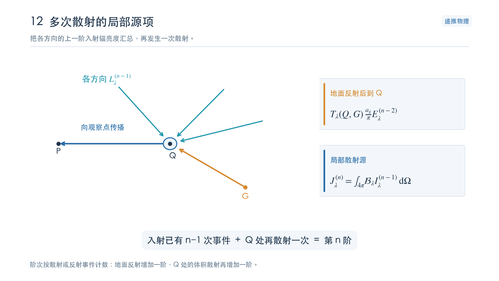

*图 12：本阶源由全方向大气光与地面边界反射共同产生。$I^{(n-1)}$ 表示式（51）的完整入射场，$\mathcal B_\lambda$ 表示式（52）的散射核。地面反射和 Q 处的体积散射各增加一个事件，所以地面输入为 $E^{(n-2)}$。*

### 6.2 全方向积分的局部坐标构造

计算时可以令局部天顶为 $\boldsymbol e_z$，把观察方向放在 $xz$ 平面：

$$
\boldsymbol\omega=(\sqrt{1-\mu^2},0,\mu),\qquad
s_z=\mu_s,\qquad
s_x=\frac{\nu-\mu\mu_s}{\sqrt{1-\mu^2}},\qquad
s_y=\sqrt{\max(1-s_x^2-s_z^2,0)}.
\tag{53}
$$

太阳的 $y$ 分量取非负，是利用旋转和镜像对称性，不影响标量散射结果。$|\mu|=1$ 时分母退化，代码选取相容的切向分量；合法 $\nu$ 已由式（46）保证。采样方向为 $\boldsymbol\omega_i=(\sin\theta_i\cos\phi_i,\sin\theta_i\sin\phi_i,\cos\theta_i)$。

GNXEngine 使用 $N_\theta=16,N_\phi=32$ 的中点积分，方向样本数为 512：

$$
J_\lambda^{(n)}\approx\sum_{j=0}^{N_\theta-1}\sum_{k=0}^{N_\phi-1}
I_\lambda^{(n-1)}(\theta_j,\phi_k)\,\mathcal B_\lambda(\theta_j,\phi_k)
\sin\theta_j\,\Delta\theta\Delta\phi,
\quad \Delta\theta=\pi/N_\theta,\ \Delta\phi=2\pi/N_\phi.
\tag{54}
$$

式（54）省略了固定散射点 $Q$ 和当前观察方向 $\boldsymbol\omega$，$\theta_j=(j+1/2)\Delta\theta$、$\phi_k=(k+1/2)\Delta\phi$。$\mathcal B_\lambda$ 沿用式（52）的定义，与式（16）的边界点 $B$ 区分。漏掉 $\sin\theta$ 会把极区过度计权。前向气溶胶峰越尖，固定角网格越可能漏采；解析相函数分离改善了单次散射查询，多次散射的角积分仍受方向采样分辨率限制。

球面面积因子可从一个小环带看出来：单位球在天顶角 $\theta$ 处的纬圈半径是 $\sin\theta$，方位跨度 $\Delta\phi$ 对应弧长约 $\sin\theta\Delta\phi$，再乘南北方向弧长 $\Delta\theta$，得到小面积 $\Delta\Omega\approx\sin\theta\Delta\theta\Delta\phi$。同样大小的角度矩形在极区会收缩，在赤道附近最大。若角格的天顶角边界为 $\theta_a,\theta_b$，其精确立体角为 $(\cos\theta_a-\cos\theta_b)\Delta\phi$；引擎采用中点的正弦近似，因此有限网格的权重和也只近似 $4\pi$。

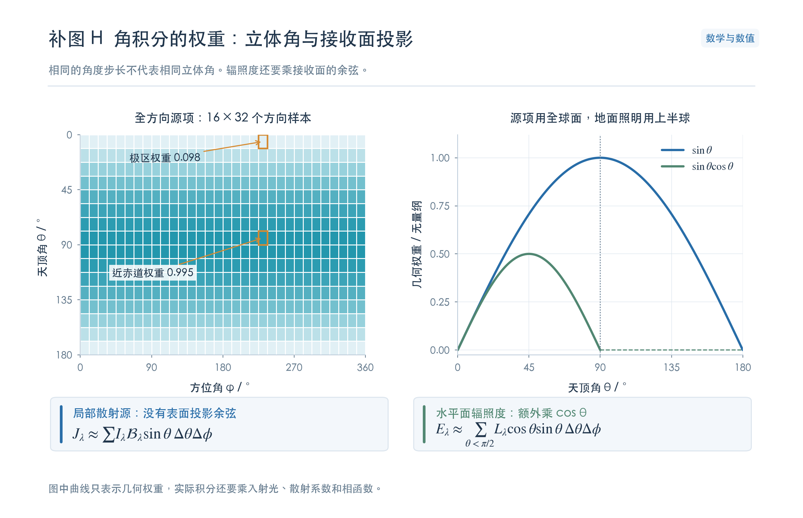

*补图 H：左侧按密度 Pass 的 $16\times32$ 网格着色，颜色表示几何权重中的 $\sin\theta$；最靠极点的中点为 $5.625^\circ$，权重约 0.098，靠赤道的中点为 $84.375^\circ$，权重约 0.995。右侧比较局部源的立体角权重与水平面辐照度额外含有 $\cos\theta$ 的权重。辐照度 Pass 自己采用第 6.4 节的半球网格；右图不是复用左图全部方向样本。*

读补图 H 时，先看极区和赤道的两格：其 $\Delta\theta,\Delta\phi$ 相同，但近赤道一格的立体角约为极区的十倍，不能等权相加。再看右图：水平来光的立体角环带很大，然而对水平面的投影趋于零，所以绿色辐照度权重在 $90^\circ$ 降为零；对散射粒子的局部源，蓝色权重仍最大。两条曲线都只是几何权重，实际 $J$ 和 $E$ 还受来光分布、组分与相函数影响，不能从峰值位置直接推断天空哪里最亮。

对同一个天顶角，是否碰地、到地面距离、透射率以及当地组分密度可复用。代码把这些值移到方位角内循环之外，减少重复计算。地面点法线取 $\operatorname{normalize}(r\boldsymbol e_z+d_G\boldsymbol\omega_i)$，然后用它与太阳方向的点积查询地面辐照度。

### 6.3 将局部源沿视线积分成第 $n$ 阶辐亮度

完成 $J^{(n)}$ 后，沿观察路径应用同一个积分解：

$$
L_\lambda^{(n)}(P,\boldsymbol\omega)
=\int_0^{d_B}T_\lambda(P,Q_d)J_\lambda^{(n)}(Q_d,\boldsymbol\omega)\,\mathrm dd.
\tag{55}
$$

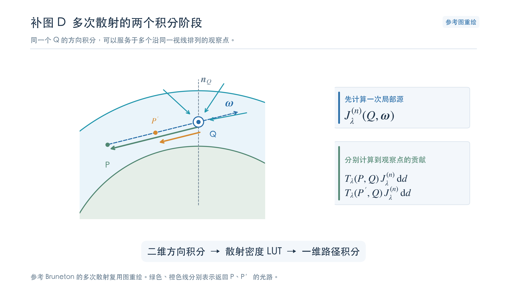

*补图 D：参考 Bruneton [Multiple scattering / Computation 中的源项复用图](https://ebruneton.github.io/precomputed_atmospheric_scattering/atmosphere/functions.glsl.html#multiple_scattering_computation)重新绘制。$P$ 与 $P'$ 是同一观察射线上的两个不同起点；对于固定的 $Q$ 和 $\boldsymbol\omega$，全方向积分得到的 $J^{(n)}_\lambda(Q,\boldsymbol\omega)$ 相同。青色箭头示意各方向入射光。绿色、橙色返回箭头做了平行错位以便区分，实际光路都沿 $P,P',Q$ 所在直线。*

如果为每个观察点直接嵌套计算方向与路径积分，$P$ 和 $P'$ 会重复计算同一个 $Q$ 的全方向源项。先把这部分二维方向积分存入散射密度纹理，两个观察点便可分别乘自己的透射率，再进行一维路径积分。补图 D 的两个积分阶段对应散射密度与多次散射 Pass；间接辐照度另有自己的半球积分和 Pass，仍按图 13 的三步顺序执行。

路径采样点使用式（22）更新 $(r_d,\mu_d,\mu_{s,d},\nu)$，取四维密度 LUT，再乘透射率。GNXEngine `ComputeMultipleScattering` 采用 50 区间梯形积分，与单次散射相同。到这里该阶所有相函数已经在 $J^{(n)}$ 的角积分中考虑，输出是完整的辐亮度。

式（55）与单次散射的路径积分形式相同，改变的是源的来源。单次源可由太阳方向直接计算，高阶源已经包含全方向积分及地面返回光，存放在 density LUT 中。每走到一个新的 $Q_d$，仍须更新它的局部半径、观察余弦和太阳余弦，查询那个点的 $J^{(n)}$，乘 $Q_d\to P$ 透射率，再乘段长。若把 density LUT 误当成完整天空辐亮度直接相加，会遗漏段长并使结果单位变成每米；若再乘一次散射系数或相函数，则把当前点的事件重复计算。

### 6.4 间接辐照度的阶次与半球积分

从某阶天空辐亮度得到水平面的该阶辐照度：

$$
E_\lambda^{(k)}(r,\mu_s)
=\int_{\mu_i>0}L_\lambda^{(k)}(r,\mu_i,\mu_s,\nu_i)
\mu_i\,\mathrm d\Omega_i,
\qquad k\ge1.
\tag{56}
$$

这里 $\mu_i=\cos\theta_i$，$\nu_i=\boldsymbol\omega_i\cdot\boldsymbol s$。GNXEngine 的 `ComputeIndirectIrradiance` 使用 16 个半球天顶区间、64 个方位区间，即 1024 个中点样本。代码中的 `SAMPLE_COUNT=32` 并不表示只有 32 个方向；天顶循环为 `SAMPLE_COUNT / 2`，方位循环为 `2 * SAMPLE_COUNT`。

式（56）读取的 $L^{(k)}$ 已经是光沿相应来光路径到达当前位置后的辐亮度，内部的路径透射率在生成该阶散射时已考虑；辐照度阶段只对它做方向和接收面投影积分，不应再任意乘一次远端透射率。其积分域是 $\mu_i>0$ 的上半球，因为模型的水平地面从上方接收天空光。该阶段没有新增体积散射或地面反射事件，所以输入 $L^{(k)}$ 与输出 $E^{(k)}$ 上标相同；下一次地面反射与体积散射才各增加一个事件。

第 $n$ 轮开始时，旧 delta scattering 是 $L^{(n-1)}$，旧 delta irradiance 是 $E^{(n-2)}$。先求 $J^{(n)}$，再用旧散射求 $E^{(n-1)}$，最后求新的 $L^{(n)}$。这样地面输入在被覆盖之前已经读取完成。

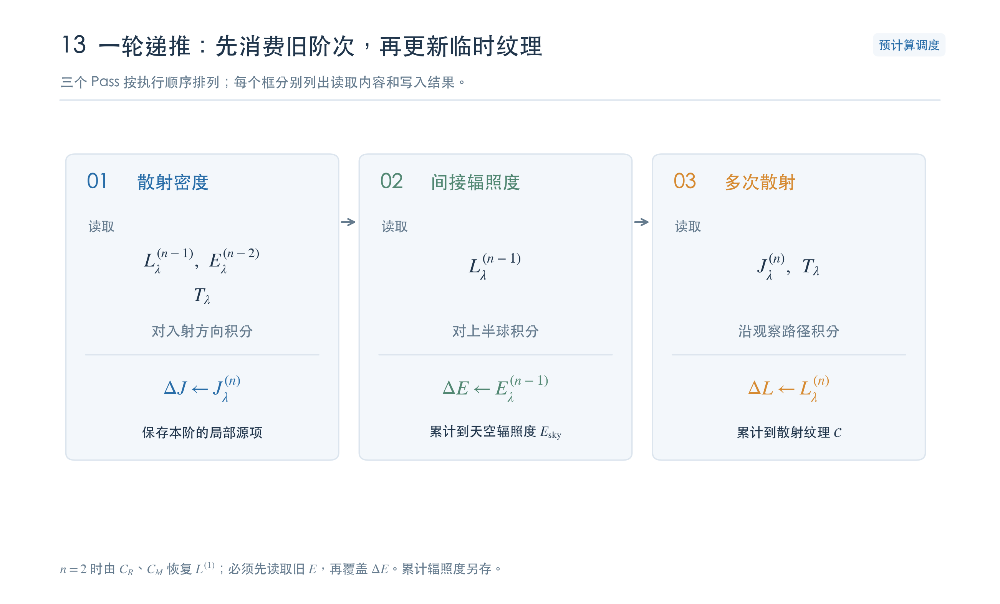

*图 13：一轮标准递推的三个 Pass，按执行顺序从左到右排列。框内给出各自读取的阶次和写入结果；框间箭头仅表示执行先后。$\Delta E$ 是某一阶的临时结果，$E_{\rm sky}$ 是累计间接辐照度，两者分别保存。*

最终天空散射包含 $L^{(1)}$ 到 $L^{(N)}$，而运行时天空辐照度纹理累计 $E^{(1)}$ 到 $E^{(N-1)}$。两者上限相差一阶，因为地面把入射天空再反射一次才形成返回光路径；这一截断与预计算循环一致。直接太阳 $E^{(0)}$ 没有累计到天空纹理，运行时单独计算。

### 6.5 一个容易混淆的输入：单阶与累计辐照度

公式到了渲染图里，阶次就由纹理的内容决定了。这个位置尤其容易混淆：函数参数虽然叫 `irradiance_texture`，本轮需要的却是旧的单阶辐照度。GNXEngine 当前版本的密度 Pass 绑定如下：

```cpp
enc->SetFragmentTextureAndSampler("multiple_scattering_texture",
    mDeltaRayleighTexture, mLinearSampler);
enc->SetFragmentTextureAndSampler("irradiance_texture",
    mIrradianceTexture, mLinearSampler);
```

`mIrradianceTexture` 是最终累计的间接辐照度；标准式（51）所需的是 `mDeltaIrradianceTexture`。直接辐照度 Pass 把 $E^{(0)}$ 写入 delta 纹理，并把最终天空纹理初始化成 0，因此实际输入关系如下：

| 散射轮次 | 标准密度 Pass 所需 | 当前累计纹理提供 | 后果 |
|---|---|---|---|
| $n=2$ | $E^{(0)}$ | 0 | 遗漏“太阳→地面→大气→观察者”的二阶地面贡献 |
| $n=3$ | $E^{(1)}$ | $E^{(1)}$ | 此轮地面辐照度阶次恰好相符，但上一阶散射已受前轮影响 |
| $n=4$ | $E^{(2)}$ | $E^{(1)}+E^{(2)}$ | 重复混入较低阶地面照明 |
| $n=5$ | $E^{(3)}$ | $E^{(1)}+E^{(2)}+E^{(3)}$ | 继续混入低阶项 |

表中的 $E$ 均指当前运行路径生成的量。二阶地面项缺失会影响后续散射，因此第三轮即使输入阶次碰巧吻合，也已经沿着不同的递推结果继续计算。地面反照率为零时可以隔离这个差异，作为调试大气入射分支的起点。

对齐式（51）时，应让密度 Pass 的采样绑定和读状态屏障共同指向 `mDeltaIrradianceTexture`。这里的关键是让 GPU 读到 $E^{(n-2)}$：纹理名称、调度顺序与其中保存的阶次需要一致。下一章按这一标准依赖写出伪代码，后面的效果图则展示当前版本的输出。

标准递推的数学依赖已经确定：旧散射与旧辐照度先用于计算新源项，再更新辐照度，最后更新散射。第 7 章将把这个依赖落实为纹理生命周期、Pass 顺序和混合累加方式；式（51）的单阶输入始终是判断调度是否正确的基准。

## 7. 把递推变成 GPU 上的预计算

数学递推只规定“用哪一阶生成哪一阶”，GPU 还要解决结果写在哪里、旧数据什么时候可以覆盖，以及怎样把新贡献加到最终纹理。纹理复用、MRT 混合和逐层调度，都是这组依赖关系的具体实现。

### 7.1 临时纹理如何复用，最终纹理如何累加

为减少纹理数量，单次 Rayleigh 临时纹理在第一轮之后会复用为 delta multiple scattering。它刚开始存 $C_R$，后续存 $L^{(n)}$，两种语义和单位不同；读取函数用阶次参数区分它们。

| 纹理角色 | 初始化内容 | 后续用途 | 生命周期 |
|---|---|---|---|
| transmittance | $T_t$ | 所有积分与运行时查询 | 常驻 |
| delta irradiance | $E^{(0)}$ | 逐轮覆盖成 $E^{(n-1)}$ | 预计算 |
| irradiance | 0 | 累计间接天空辐照度 | 常驻 |
| delta Rayleigh / multiple | $C_R$ | 逐轮覆盖成 $L^{(n)}$ | 预计算 |
| delta Mie | $C_M$ | 第一阶角积分读取 | 预计算 |
| delta scattering density | 无 | 每轮 $J^{(n)}$ | 预计算 |
| scattering | $C_R$ 及打包 alpha | 累计去 Rayleigh 相函数的结果 | 常驻 |
| single Mie | $C_M$ | 恢复单次 Mie 前向峰 | 常驻，当前开启独立存储 |

最终 scattering RGB 存储的是

$$
\mathcal C_\lambda=C_{R,\lambda}
+\sum_{n=2}^{N}\frac{L_\lambda^{(n)}}{p_R(\nu)},
\qquad
\mathcal S_\lambda=p_R(\nu)\mathcal C_\lambda+p_M(g,\nu)C_{M,\lambda}.
\tag{57}
$$

$\mathcal S$ 表示到最近边界的累计大气路径辐亮度。多次散射除以 $p_R$ 是存储变换，不表示多次散射实际具有 Rayleigh 的角分布。$p_R$ 处处为正，所以这个除法没有相函数为零的奇点；运行时乘回它，就恢复对应的完整结果。

可以将式（57）直接展开来检查：$p_R\mathcal C=p_RC_R+\sum_{n=2}^NL^{(n)}$，再加 $p_MC_M$，便是一阶 Rayleigh、一阶 Mie 与所有高阶结果各出现一次。假设某状态这三部分的辐亮度分别为 2、1、3，最终应为 6；累计 RGB 保存的是 $(2+3)/p_R$，独立 Mie 保存的是 $1/p_M$，查询时乘回两个相函数后仍得到 6。这个例子只验证编码与解码的代数关系，数值单位保持一致。

$C_R$ 与 $E$ 的单位相同，物理角色却不同。前者仍描述一条视线，只是把 $\mathrm{sr^{-1}}$ 的相函数因子移到了查询端；后者已经对半球来光做了投影积分。在 HLSL 中它们都可能是 `float3`，所以纹理调试时最好同时标出量的含义、阶次和相函数状态，才能解释某个通道的数值。

`ComputeMultipleScattering.shader` 的两个 MRT 输出分别承担“本阶 delta”与“累计纹理增量”；后者除以 `RayleighPhaseFunction(nu)`，由颜色附件的加法混合累积。单次 Mie 不包含在式（57）的多阶累加中，它单独保留完整三通道并在运行时恢复相函数。

### 7.2 标准预计算伪代码

下面的伪代码明确每个变量的阶次。`+=` 表示渲染目标的逐像素加法混合；`=` 表示覆盖。逐层 draw 和 GPU 屏障省略在数学层之外。

```text
T = ComputeTransmittance()
deltaE = ComputeDirectIrradiance(T)                    // E^(0)
Esky = 0
deltaR, deltaM = ComputeSingleScattering(T)            // C_R, C_M
C.rgb = deltaR
C.a = deltaM.r
M = deltaM                                            // 独立单次 Mie

for n = 2 ... N:
    J = ComputeScatteringDensity(
        T, deltaR, deltaM, deltaMultiple=deltaR,
        irradiance=deltaE, scatteringOrder=n)          // E^(n-2)
    deltaE = ComputeIndirectIrradiance(
        deltaR, deltaM, deltaMultiple=deltaR,
        scatteringOrder=n-1)                          // E^(n-1)
    Esky += deltaE
    deltaR = ComputeMultipleScattering(T, J)           // L^(n)
    C.rgb += deltaR / p_R(nu)
```

当 `scatteringOrder=1` 时，取 deltaR 与 deltaM 并乘各自相函数；更高阶只取复用后的 deltaR。密度阶段先完成所有半径层，再写新的辐照度，最后才覆写旧散射纹理；不能交错成“某一层旧散射被覆盖后，再用它计算其他层的密度”。

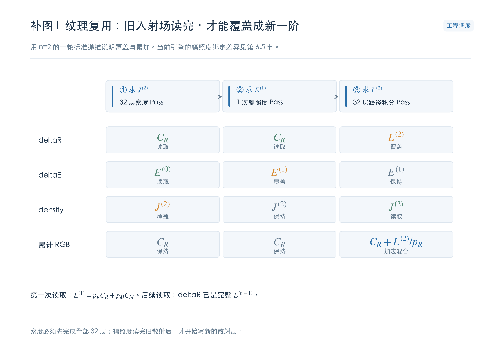

*补图 I：以标准 $n=2$ 递推具体展开图 13。每一列表示一个完整阶段结束前后的状态，绿色表示读取、橙色表示覆盖，蓝色表示累计附件的加法混合，灰色表示保留。`deltaR` 对应复用的 Rayleigh / multiple 对象，`deltaE` 是单阶辐照度，`density` 保存局部源；为保持图面清晰，省略了稳定的透射率与独立 `deltaM`。这是标准数据依赖，当前 GNXEngine 的 density 辐照度绑定仍有第 6.5 节所述差异。*

补图 I 应从左向右按整列读取：第一列用旧 $C_R,C_M,E^{(0)}$ 生成 $J^{(2)}$；第二列仍用旧单次散射产生 $E^{(1)}$，这时覆盖旧辐照度已安全，因为密度不再需要它；第三列再用新 $J^{(2)}$ 得到 $L^{(2)}$，此时才可覆盖 $C_R$。进入第三阶时，`deltaR` 的内容已经是完整 $L^{(2)}$，所以读取分支必须改变，不能继续将它按 $p_RC_R$ 解码。

按层绘制时，完整阶段也包括全部层。尤其新路径积分沿观察射线查询多种半径处的 density，不能在还只生成几个 density 层时就开始消费新表。间接辐照度也必须在旧散射被覆盖前完成。先完成整张源表，再更新辐照度，再生成新散射，是通过阶段顺序保护数据；若另分配新旧两套纹理，可以采用其他调度，但仍需保持同样的数学输入阶次。

这里 `irradiance=deltaE` 保留了单阶地面输入；`Esky` 专门负责运行时的累计间接照明。它们分开保存，既满足递推，也让纹理复用的时机更清楚。GNXEngine 当前绑定的具体差异见第 6.5 节。

### 7.3 GNXEngine 的逐层调度与每帧预算

`BuildPrecomputeSteps` 把工作展开成 draw 步骤。透射率与直接辐照度各一步，单次散射占 32 层；每个后续阶次为 32 层密度、1 次间接辐照度、32 层多次散射。因此

$$
N_{\rm step}=2+N_r+(N-1)(2N_r+1).
\tag{58}
$$

四阶为 229 步，五阶为 294 步。`Precompute` 中 `kMaxStepsPerFrame=24`，五阶至少需要 $\lceil294/24\rceil=13$ 个录制帧，四阶至少 10 帧。这个预算限制的是每帧录制的步骤数量，不保证 GPU 耗时相同：一个带 512 个方向积分的密度层通常远比一个二维辐照度 draw 昂贵。

若每帧调用一次 `Precompute`，零起始步骤编号下，前几帧可具体分解如下：

| 录制帧 | 执行的步骤 | 本帧结束时仍未完成的工作 |
|---|---|---|
| 第 1 帧 | 透射率、直接辐照度、单次散射层 0—21 | 单次散射还有层 22—31 |
| 第 2 帧 | 单次散射层 22—31、二阶密度层 0—13 | 二阶密度表仍是部分完成 |
| 第 3 帧 | 二阶密度层 14—31、一次间接辐照度、二阶路径积分层 0—4 | 二阶路径积分还有层 5—31 |

游标可以在一个阶段中间暂停，下一帧从同一位置继续；整张最终 LUT 应在全部步骤完成后投入使用。调度成本也取决于每个步骤内部做了多少计算：$256\times128\times32$ 的密度表有 1,048,576 个纹素，每个纹素计算 512 个方向，一次完整 density 阶段约有 5.37 亿次方向样本循环，虽然只录制了 32 个 draw。因此每帧 24 步是工作量拆分策略，后续还可以按 GPU 时间调整预算。

每步使用一个全屏三角形，将三维纹理某个层切片作为颜色附件。片元由横纵坐标和 UBO 中的 `layer` 恢复 $(r,\mu,\mu_s,\nu)$；不依赖所有后端都支持几何着色器或一次覆盖 32 层。对应地，调度器显式管理附件层和每个 Pass 的分辨率。

资源状态要与真实读写一致：被采样纹理切到 `ShaderRead`，输出切到 `ColorAttachment`，Pass 结束后再在后续消费者之前转换。最终累计附件使用 load 并启用加法混合，delta 附件覆盖。屏障不能补救错误纹理绑定，它只解决资源访问顺序和可见性。

覆盖与累加还需要附件配置共同实现。新阶次 delta 的输出是 shader 计算的完整本阶值，应覆盖旧内容；累计附件则要加载此前内容，并让混合器执行“目标旧值 + shader 增量”。只设置 load 而关闭加法混合，仍会被新片元覆盖；启用加法混合却在开始时清空目标，也保不住旧阶次。当前 C++ 对多次散射和间接辐照度都只给第 1 号累计附件启用加法混合，第 0 号 delta 附件保持覆盖，两种语义可以在同一次 MRT draw 中完成。

排查资源问题时，可以沿着一个消费者的输入追踪四件事：绑定对象、对象当前保存的量、访问状态，以及写入附件的 load 和混合方式。屏障保证数据可见，阶次和量的含义由绑定与生命周期保证。这两条线一起检查，才能解释“资源访问正常，数值却不对”的情况。

各步的 `ScatteringCB` 包含层与阶次。命令录制以后 GPU 可能尚未读取 UBO，如果立即修改同一个小缓冲区，前面命令可能读到后面的层或阶次。当前实现按层和阶次缓存独立 UBO，并保留其生命周期；统一的大气参数 UBO 则在整次预计算中保持稳定。

例如，CPU 连续录制 layer 0 和 layer 1 的命令，命令通常引用缓冲区地址，并不保证立即保存其内容的私有副本。若两步都引用同一缓冲区，随后将 `layer` 改为 1，GPU 延迟执行第一步时也可能读到 1，结果写入 layer 0 附件的却是 layer 1 对应半径。按层、阶次保存独立 UBO，使每条命令读取稳定状态；这些缓冲区还要活到消费者执行完成。层附件决定写入地址，UBO 层号决定反解的物理状态，两者必须同时一致。

下面是 `BuildPrecomputeSteps` 中的实际高阶展开，它保证所有 density 层在辐照度覆盖之前完成，也保证间接辐照度读取旧散射后再开始覆盖散射层：

```cpp
for (unsigned int order = 2; order <= mNumScatteringOrders; ++order) {
    for (int layer = 0; layer < kScatteringD; ++layer) {
        mPrecomputeSteps.push_back({
            PrecomputeStepType::ScatteringDensity, layer, (int)order });
    }
    mPrecomputeSteps.push_back({
        PrecomputeStepType::IndirectIrradiance, 0, (int)order });
    for (int layer = 0; layer < kScatteringD; ++layer) {
        mPrecomputeSteps.push_back({
            PrecomputeStepType::MultipleScattering, layer, (int)order });
    }
}
```

间接辐照度分支将 UBO 阶次设为 `step.order - 1`。例如列表处于二阶轮次时，该 Pass 要从一阶天空生成一次间接辐照度；列表中的轮次编号与积分函数的输入阶次由此对应起来。

`mPrecomputed` 在最后一步和状态转换录制完成后置位。同一队列上的后续渲染依靠提交顺序消费结果；跨队列使用和 CPU 纹理回读则需要相应的完成同步。录制完成与 GPU 执行完成分别对应这两个时刻。

### 7.4 显存开销与透射率精度

当前 GNXEngine 的纹理统一使用 `RGBA16Float`，一个纹素占 8 字节，不生成 mipmap。以下按 $1\,\mathrm{MiB}=2^{20}$ 字节计算，仅统计纹理数据，不计驱动对齐、视图对象、UBO、管线和其他场景资源。

| 纹理 | 尺寸 | 单张容量 | 数量 |
|---|---|---:|---:|
| 透射率 | $256\times64$ | 128 KiB | 1 |
| 最终 / delta 辐照度 | $64\times16$ | 8 KiB | 2 |
| 最终散射 | $256\times128\times32$ | 8 MiB | 1 |
| 独立单次 Mie | 同上 | 8 MiB | 1 |
| delta Rayleigh / multiple | 同上 | 8 MiB | 1 |
| delta Mie | 同上 | 8 MiB | 1 |
| delta 密度 | 同上 | 8 MiB | 1 |

常驻运行时数据为 $16\,\mathrm{MiB}+136\,\mathrm{KiB}=16.1328125\,\mathrm{MiB}$，预计算纹理峰值为 $40\,\mathrm{MiB}+144\,\mathrm{KiB}=40.140625\,\mathrm{MiB}$。如果所有临时纹理对象在预计算结束后仍由渲染器持有，实际长期占用不会自动降到前一个数字；常驻逻辑数据与对象释放策略应分别判断。

新版参考实现即使选择半精度散射纹理，透射率也使用 `RGBA32F`。GNXEngine 的 `RGBA16Float` 透射率是明确差异。FP16 最小正非正规数为 $2^{-24}\approx5.96\times10^{-8}$；若保留非正规数，$e^{-18}\approx1.52\times10^{-8}$ 在最近舍入时已经变成 0。某些后端还可能清零非正规数，限制会更早出现。

用 CPU 量化观察 FP16 格式：$\tau=10$ 时透射率的相对误差约为 0.0414%，$\tau=15$ 时约为 2.576%，$\tau=18$、20 时舍入成零。长路径越接近下溢，商式越难保留有效比例。将透射率改为 FP32 只增加约 128 KiB 纹理数据，是一个成本很小、值得优先比较的精度选择；具体 GPU 后端的非正规数行为还需要回读验证。

透射率商式的风险在于绝对值很小、相对比例却仍有意义。假设共用尾段的光学厚度为 20，待求有限段为 1，那么两条顶路径的精确透射率分别为 $e^{-21}$ 和 $e^{-20}$，商仍为 $e^{-1}\approx0.367879$。若两者在存储时都舍入成零，运行时只能看到 $0/0$，无法从零恢复原来的比例。将结果钳到 $[0,1]$ 可以限制越界，但无法补回已经丢失的动态范围。这个例子说明为何应先审查透射率格式，再判断空气透视公式本身是否有错。

### 7.5 单次 Mie 独立存储与红通道重建

为了少存一张三维纹理，参考实现支持将 $C_M$ 的红通道放进最终散射 alpha，再近似重建其余通道：

$$
\widehat{\boldsymbol C}_M
=\boldsymbol{\mathcal C}\frac{C_{M,r}}{\mathcal C_r}
\frac{\beta_{R,0,r}^s}{\beta_{M,0,r}^s}
\frac{\boldsymbol\beta_{M,0}^s}{\boldsymbol\beta_{R,0}^s}.
\tag{59}
$$

粗体表示三个谱通道，末项逐通道相除。$\mathcal C_r=0$ 时返回零，避免除零。若太阳谱和衰减对 Rayleigh 与 Mie 的有效路径近似相似，那么除去谱系数后两个积分的谱形也近似相似，因而可以用红通道比例估计另外两通道。

式（59）依次做三件事：从累计谱形 $\boldsymbol{\mathcal C}$ 出发；用 $C_{M,r}/\mathcal C_r$ 将红通道幅度校准到已存的 Mie 红值；再除去 Rayleigh 谱系数、补入 Mie 谱系数，估计其他通道的比例。红通道恰好重建为原值，因为最后两组系数在那里相消；其他通道是否准确，取决于两种组分的有效密度与衰减积分是否具有相似谱形。因而“红通道准确”只验证校准锚点，不能证明绿、蓝通道或日落颜色同样准确。

但它并非式（30）的代数恒等式。两种密度分布不同，臭氧会造成有色吸收，且用于重建的 $\mathcal C$ 还包含多次散射。日落、深空气透视和高气溶胶场景可能放大这些差别。节省一张纹理换来了颜色近似，应明确作取舍。

GNXEngine 保留了 `COMBINED_SCATTERING_TEXTURES` 与 `GetExtrapolatedSingleMieScattering` 分支，当前这条路径使用独立单次 Mie 纹理，直接读取完整三通道。最终 alpha 虽然也写入 Mie 红值，运行时是否重建仍由编译宏和绑定决定。独立存储多占 8 MiB，换来更直接的谱通道数据。

预计算结束后，局部源和 delta 纹理完成了递推职责。运行时保留透射率、累计散射、单次 Mie 与累计天空辐照度四类最终资源，用它们恢复式（16）的边界项和路径项。

## 8. 运行时：天空、太阳、地面与空气透视

预计算完成后，运行时不再重做全方向积分。天空查询取出到边界的累计大气光；地面和物体则只需要相机到表面的有限一段。把这两种查询接到同一个传输解上，就能同时处理天空、太阳和空气透视。

### 8.1 看向天空时查询什么

运行时先由相机位置和归一化视线方向构造 $(r,\mu,\mu_s,\nu)$，判断延长射线是否碰地，然后查询式（57）的 $\mathcal C$ 和 $C_M$，乘回两个相函数即可得到 $\mathcal S$。这里的天空函数只返回大气路径辐亮度，不替调用方画地面，也不会自动包含太阳圆盘的直接辐亮度。

对不碰地的天空方向，输出透射率是到大气顶的 $T_t$；对碰地的方向，天空函数可将对外背景的透射率返回为零。后者表达外太空背景被星球遮住，不能拿这个零去代替相机到地面的介质透射率；地面合成要调用有限线段函数得到式（27）或（28）。

若太阳圆盘近似为均匀辐亮度，面积投影积分给出

$$
E_{\odot,\lambda}=\int_{\Omega_\odot}L_{\odot,\lambda}\cos\theta\,\mathrm d\Omega
=\pi\sin^2\alpha_s\,L_{\odot,\lambda},
\qquad L_{\odot,\lambda}\approx\frac{E_{\odot,\lambda}}{\pi\alpha_s^2}.
\tag{60}
$$

$\theta$ 是太阳圆盘内相对圆盘中心的角度，均匀圆盘和圆盘正对接收面的假设用于第一式。第二式使用小角度 $\sin\alpha_s\approx\alpha_s$。GNXEngine `GetSolarRadiance` 使用这一近似；以 $\boldsymbol\omega\cdot\boldsymbol s>\cos\alpha_s$ 判定像素是否位于圆盘内，然后加上 $T_tL_\odot$。

式（60）的积分可沿圆盘中心轴逐圈计算：每圈立体角为 $2\pi\sin\theta\,\mathrm d\theta$，与接收面相乘的投影为 $\cos\theta$，故从 0 到 $\alpha_s$ 积分得到 $2\pi L_\odot\int\sin\theta\cos\theta\,\mathrm d\theta=\pi L_\odot\sin^2\alpha_s$。在固定太阳辐照度下，增大圆盘角半径应降低其均匀辐亮度，才能保持总能量不变。直接将同一亮度的圆盘放大，会同时增加光源能量；调整可见太阳大小时，应确定改变的是光源参数还是纯显示效果。

这一步必须和天空散射分开。天空散射的前向峰在太阳附近形成光晕，却不是太阳本身；若只画光晕不画圆盘，太阳会成为一个柔和的亮斑。圆盘角尺寸小，需要抗锯齿或足够的屏幕分辨率，不能靠 LUT 的 $\nu$ 分辨率决定其形状。

### 8.2 空间相机进入大气的处理

相机位于 $r>r_t$ 时没有可查询的本地大气状态。先将射线与大气顶球面求交；若判别式小于 0，或射线朝离开大气的方向且无前方交点，则路径内散射为零，背景透射率为 1。若存在最近的正交点，定义

$$
d_{\rm entry}=-r\mu-\sqrt{r^2(\mu^2-1)+r_t^2},
\qquad P'=P+d_{\rm entry}\boldsymbol\omega.
\tag{61}
$$

把起点移动到 $P'$，以 $r=r_t$ 重新计算局部参数，再查询 LUT。真空段没有消光，故不需要额外乘衰减。轨道边缘处射线只穿过薄薄的斜向壳层，但长度可能很大，这正是球形几何比平面天空模型重要的场景。

这一移动改变的是积分起点，不是相机视角。沿同一条射线跳过真空段后，$\boldsymbol\omega$ 和太阳世界方向都不变，但新的径向天顶改变，所以必须重新求 $r,\mu,\mu_s$，不能只将旧半径钳到 $r_t$。地球整体视图中的许多像素根本没有进入壳层，应返回原背景；掠过边缘的像素可能有入壳和出壳两点，真正产生散射的是其间的空气段。这些几何情况先于 LUT 查询，纹理采样本身不会替调用方自动找到大气。

`GetSkyRadianceToPoint` 也做了空间相机入壳检查。不过它主要面向目标位于有效大气路径中的情况，不能直接把任意太空中的两个端点传进去就期待完整的壳层裁剪。若目标在入壳点之前，或相机与目标重合，调用方应先处理空线段、有效区间和向量归一化；外部背景则用天空透射率合成。

### 8.3 有限线段散射为什么可以相减

设 $\mathcal S(P,\boldsymbol\omega)$ 是从 $P$ 到边界 $B$ 的累计路径积分；$Q$ 位于同一观察射线上，在 $B$ 之前。将积分区间分成 $P\to Q$ 和 $Q\to B$，利用式（26），后半段为

$$
\int_d^{d_B}T(P,Q_t)J(Q_t)\,\mathrm dt
=T(P,Q)\int_0^{d_B-d}T(Q,Q_u)J(Q_u)\,\mathrm du
=T(P,Q)\mathcal S(Q,\boldsymbol\omega).
\tag{62}
$$

因此有限线段内散射为

$$
L_{PQ,\lambda}^{\rm ins}
=\mathcal S_\lambda(P,\boldsymbol\omega)
-T_\lambda(P,Q)\mathcal S_\lambda(Q,\boldsymbol\omega).
\tag{63}
$$

两次查询须沿同一物理射线、指向同一终止边界，地面分支也须一致。$Q$ 处参数用式（22）更新；相函数沿射线不变，所以可以先对去相函数的两个纹理量分别相减，最后再恢复相函数。

第二次查询为什么必须乘透射率？因为 $\mathcal S(Q)$ 描述的是尾段送到 $Q$ 的光，$\mathcal S(P)$ 描述的是整条路送到 $P$ 的光，两者的接收位置不同。只有再把前者沿 $Q\to P$ 衰减，才能从同一接收位置的总量中减去尾段。比如在同一波长下，若 $\mathcal S(P)=10$、$\mathcal S(Q)=6$、$T(P,Q)=0.5$，则有限段贡献是 $10-0.5\times6=7$，而不是 4；这里两个散射数值采用相同的辐亮度单位。

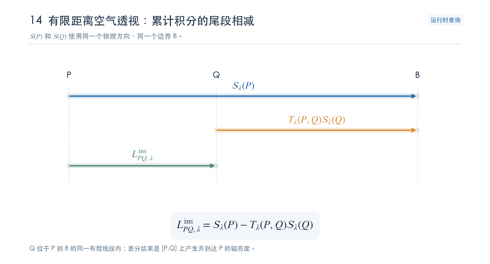

*图 14：横向箭头标出累计积分的区间。第二个累计积分乘以 $P\to Q$ 透射率后，恰好对应第一个积分的尾段；相减得到有限距离的路径内散射 $L_{PQ,\lambda}^{\rm ins}$。*

图 14 的两个累计量各自都从查询点走到同一个边界，但权重的原点不同。设尾段中的点为 $X$，则 $T(P,X)=T(P,Q)T(Q,X)$；将共同前缀 $T(P,Q)$ 从尾段积分中提出，就是式（62）的第二项。相减后的结果只包含 $P\to Q$ 中产生的光，并不包含表面自身的返回光；后者在式（64）单独乘整段透射率加入。

实际存储下，可先求 $\mathcal C_{PQ}=\mathcal C(P)-T(P,Q)\mathcal C(Q)$ 与 $C_{M,PQ}=C_M(P)-T(P,Q)C_M(Q)$，再用 $p_R\mathcal C_{PQ}+p_MC_{M,PQ}$ 恢复路径辐亮度。两个组分使用相同的总介质透射率，因为它们回到相机的光沿同一条路传播，都会受到所有组分的消光；不能让 Rayleigh 光只被分子衰减、Mie 光只被气溶胶衰减。

若目标自身沿视线返回辐亮度 $L_{{\rm surf},\lambda}$，最终观察结果为

$$
L_{{\rm obs},\lambda}
=T_\lambda(P,Q)L_{{\rm surf},\lambda}+L_{PQ,\lambda}^{\rm ins}.
\tag{64}
$$

距离增大时物体自身光被衰减，路径散射逐渐累积，远处物体的颜色趋向该方向的大气颜色。这里透射率是有色的，路径颜色也会随高度、太阳和方向变化；用一个灰色指数雾能描述局部近似，却不能复现所有这些行为。

式（63）对连续积分是恒等式，对低分辨率、半精度 LUT 查询则不是无误差操作。很短的线段需要用两个相近的较大累计值相减，容易出现消减误差。因此“查询次数少”并不意味着近距离路径绝对精确；可通过增加分辨率、使用更高精度或为极短线段采用局部近似改善。

有限段很短时，物理极限是 $L_{PQ}^{\rm ins}\approx J(P,\boldsymbol\omega)d$、$T(P,Q)\approx1-\beta^e(P)d$，两者都随距离连续接近零和一。累计量却可能远大于这段贡献，近似数值相减时若得到轻微负值，可能是插值和消减误差，而非真实大气产生负光。把负值截为零是显示保护；更好的诊断是比较短段直接积分或上述局部极限，定位其数值来源。

GNXEngine `GetSkyRadianceToPoint` 在完成差分后，还对单次 Mie 乘 `smoothstep(0.0,0.01,mu_s)`。这是参考函数中为避免地平线以下重建失真而保留的平滑措施，当前独立 Mie 分支也执行它。它使近地太阳余弦为负时该函数的单次 Mie 被淡出；所以式（63）是算法基础，而实际返回值还受这一工程近似影响，不能将两者逐位等同。

### 8.4 地表直接与间接照明

对水平地面，直接和天空辐照度组合为

$$
L_{{\rm ground},\lambda}
=\frac{a_g}{\pi}\left(E_{{\rm direct},\lambda}+E_{{\rm sky},\lambda}\right).
\tag{65}
$$

这里 $a_g$ 是当前被画表面的漫反射率，可以不同于预计算的平均地表反照率，但这种变化不会反过来精确更新整个大气多次散射场。一个红色山坡可以在运行时正确改变其自身表面颜色，整片大气却仍依据预计算平均地面颜色形成间接源。

式（65）没有再乘观察方向与法线的余弦，因为 Lambert 表面向各出射方向返回的辐亮度相同。入射光对表面的倾斜已在辐照度的余弦积分中考虑，表面在画面里投影面积的变化则由场景几何与像素覆盖处理。重复乘一个出射余弦会让斜看地面的空气透视源颜色错误变暗。运行时真实材质可以改变边界返回值，预计算用的平均地面反照率却决定此前所有高阶地面反馈，二者属于光传输的不同位置。

天空辐照度 LUT 只存局部径向水平面的结果。GNXEngine 和参考实现对任意法线 $\boldsymbol n$ 使用

$$
E_{{\rm sky},\lambda}(\boldsymbol n)
\approx E_{{\rm sky},\lambda}(\boldsymbol n_r)
\frac{1+\boldsymbol n\cdot\boldsymbol n_r}{2},
\quad
E_{{\rm direct},\lambda}(\boldsymbol n)
\approx E_{\odot,\lambda}T_{\odot,\lambda}
\max(\boldsymbol n\cdot\boldsymbol s,0).
\tag{66}
$$

前者不是非均匀天空的精确半球积分；太阳附近的亮天空和地平线分布并不能由一个法线因子完整表达。后者对足够高的太阳是合理的光束近似，太阳圆盘跨过表面切平面时也有近似。真正要求方向性天空照明时，可以由天空函数生成 cubemap、球谐或专门的环境照明表示。

独立 demo 的地面和球体使用各自反照率，再将表面光按式（64）传回相机。demo 还包含球体对直接太阳的可见度以及对天空照明的简化可见度，因此可以同时展示实体阴影与空气透视；这两类可见度不应混为 LUT 的全局地面遮挡。

### 8.5 阴影长度能表示什么

预计算的大气只有星球遮挡太阳，没有为每棵树、每座山保存独立阴影。运行时函数提供一个 `shadow_length` 参数，用连续的一段“无入散射区间”近似体积阴影。

原论文 Figure 1 将两种场景并排放在一张很小的图里：左侧是有真实山体的光传输，右侧是能够预计算的球形参考场景。论文的 $x_o$ 是当前视线与真实地形的终点，$\bar x_o$ 是与参考球面的终点，二者一般不同；$x_s$ 则是把受光与阴影路径分开的点。下图依次记为 $B,\bar B,Q_s$。

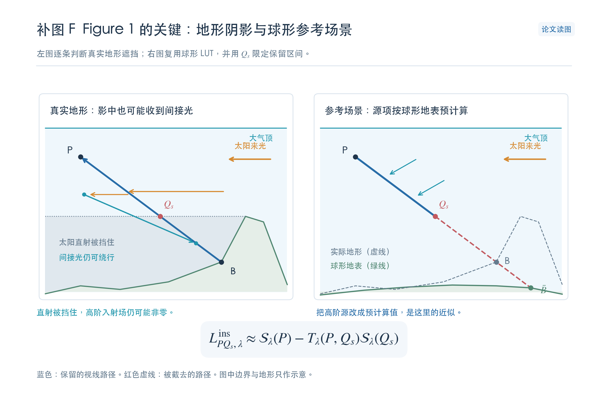

*补图 F：根据[原论文](预计算大气散射.pdf) Figure 1 和第 3 节的论述重新绘制，来源位置为 PDF 第 3—4 页。箭头表示光的实际传播。左侧直射太阳无法到达阴影段，但先在别处散射的光仍可能进入该段；右侧保留同一视线的 $P\to Q_s$，并采用球形 LUT 的预计算源。灰色虚线是实际地形轮廓，绿色是参考球面局部轮廓；几何尺寸仅作示意。图中 $\mathcal S_\lambda$ 为参考场景的累计路径辐亮度。*

读这张图时，可按下面四步理解论文式（13）与式（16）：

1. **先限定直射太阳能照到哪里。** 如果当前例子的阴影是视线末端的一段，单次太阳散射只在 $P\to Q_s$ 中发生。它在阴影段为零，是因为太阳入射被挡住，并非该处空气消失。
2. **用两个参考累计积分取出受光段。** $\mathcal S(P)-T(P,Q_s)\mathcal S(Q_s)$ 对给定参考源场精确截出这段；它只改变积分范围，不会重新求解山体周围的光场。
3. **区分单次与多次散射。** 在本图所假设的连续阴影区间内、给定相同介质且正确处理太阳遮挡时，单次散射可以由受光段恢复。高阶光却可能先绕到山体另一侧再进入阴影，真实高阶源也会受地形影响；把整段都裁去、把保留段的源换成球形源，会产生近似。
4. **再判断接口能否表达当前阴影。** 若有多个受光、阴影区间，就需要每段的位置；只保存总阴影长度无法保留这些信息。原论文 Figure 5 将多个阴影区间合成一个长度，是进一步的运行时近似，第 8.5 节的 `shadow_length` 也有这一边界。

因此，这个阴影处理由两个部分组成：场景几何提供太阳可见区间，参考积分提供区间内的散射贡献。连续单段阴影可以套用这里的减法；多段阴影需要保存各段的位置，高阶地形反馈则需要更丰富的源场表示。

看向地面时，它把末端长度 $\ell_{\rm sh}$ 从路径贡献中截去。令 $Q=P+\max(d-\ell_{\rm sh},0)\boldsymbol\omega$，有效路径内散射近似为 $\mathcal S(P)-T(P,Q)\mathcal S(Q)$，但表面自身光仍沿整个 $P\to B$ 距离衰减。看向天空时，它跳过起点处长度 $\ell_{\rm sh}$，保留 $T(P,Q)\mathcal S(Q)$。

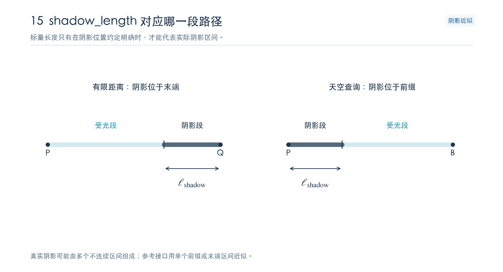

*图 15：同一个长度参数在有限地面路径和无限天空路径中的约定不同。它没有编码任意位置的多段阴影分布。*

若实际阴影区间是 $[d_a,d_b]$，可利用相同的区间减法构造需要去掉的贡献：

$$
L_{{\rm sh},\lambda}^{\rm ins}
=T_\lambda(P,Q_a)\mathcal S_\lambda(Q_a)
-T_\lambda(P,Q_b)\mathcal S_\lambda(Q_b).
\tag{67}
$$

这个等式针对已经给定的源场成立；遮挡出现后真实多次散射源场也会变化，因此直接减去整段累计散射仍是阴影近似。天空的多次散射不一定因为太阳直射被挡住就归零，这在浓雾和深阴影中尤其明显。

GNXEngine demo 用 `GetSphereShadowInOut` 求球体太阳阴影锥的进出距离，将区间压缩为 `shadow_length`，并在太阳接近地平线时淡出光柱。这沿用了前缀或后缀阴影的近似。地球合成当前传入 0，地形体积阴影可以作为后续单独接入的一层。

前面的查询输出仍是物理光谱量。把天空、太阳、地表照明和空气透视合到一张 HDR 图之前，还要确定它们如何转换到一致的线性颜色空间。颜色转换和曝光的顺序会直接影响前面推导的合成关系。

## 9. 从光谱积分到屏幕颜色

物理积分算出的光谱量还需要变成屏幕颜色。这一步会影响蓝天和日落的色调，也决定大气与已有 HDR 场景能否正确相加。先做一致的线性颜色转换，再统一曝光和显示，是合成公式继续成立的条件。

### 9.1 三个光谱样本如何转换成显示颜色

散射和吸收都依赖波长。三个结果 $L_{680\,\rm nm},L_{550\,\rm nm},L_{440\,\rm nm}$ 代表长、中、短波处的光谱采样；线性 sRGB 的每个通道则是宽光谱经过颜色匹配函数积分后的坐标。两者虽然都能装进 `float3`，中间仍需要颜色转换。XYZ 到 RGB 的矩阵甚至带有负系数，反映的是颜色基底的变化。

若使用 CIE 1931 颜色匹配函数 $\bar x(\lambda),\bar y(\lambda),\bar z(\lambda)$，一个采用光度学标度的 XYZ 三刺激向量可写为

$$
\begin{pmatrix}X\\Y\\Z\end{pmatrix}
=K_m\int_{\lambda_{\min}}^{\lambda_{\max}}
L_\lambda
\begin{pmatrix}\bar x(\lambda)\\\bar y(\lambda)\\\bar z(\lambda)\end{pmatrix}
\,\mathrm d\lambda,\qquad K_m=683\,\mathrm{lm\,W^{-1}}.
\tag{68}
$$

此处 $L_\lambda$ 按每 nm 定义，积分增量也用 nm；不能又乘一次 $10^{-9}$。$Y$ 对应 $\mathrm{cd\,m^{-2}}$ 的亮度，$X,Z$ 使用相同标度。若目标只是相对显示颜色，也可统一移除 $K_m$ 并让曝光吸收全局尺度，但整个场景必须遵循同一种单位约定。

对标准线性 sRGB/D65 坐标，转换矩阵近似为

$$
\boldsymbol L_{\rm rgb}=
\begin{pmatrix}
3.2406&-1.5372&-0.4986\\
-0.9689&1.8758&0.0415\\
0.0557&-0.2040&1.0570
\end{pmatrix}
\begin{pmatrix}X\\Y\\Z\end{pmatrix}.
\tag{69}
$$

矩阵转换是线性的，曝光前仍可大于 1；负值可能来自色域之外，显示阶段需要有意识地处理，不能在光谱积分途中随意将每个负矩阵贡献截成零。颜色匹配积分与传输积分都为线性操作，但波长相关的透射率不能用一个固定 RGB 矩阵从三个通道精确重建。

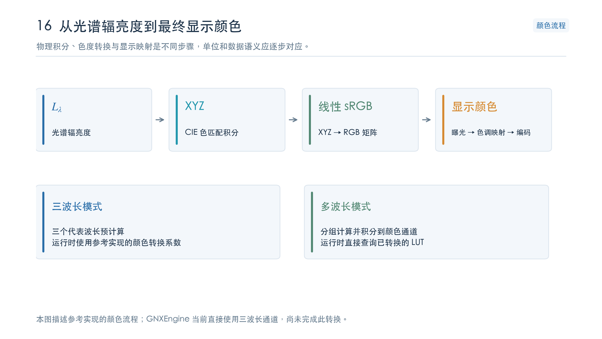

*图 16：完整颜色链路。曝光和色调映射发生在物理量转为统一线性颜色之后；三波长传输模式与多波长预积分模式的转换时机不同。*

图 16 应先按物理量的表示来分段：在某个波长上，透射率与辐亮度可以按式（64）逐通道相乘、相加；将谱积分成宽波段 RGB 后，一个通道中混入许多不同透射率的波长，通常无法再由一个固定 RGB 透射率精确表示所有表面谱。因此三波长结果加固定颜色因子、以及 RGB 场景的有色透射，都是有边界的近似。XYZ 到 RGB 的负矩阵系数只是颜色基底变换的一部分，不表示介质产生负能量；在谱积分阶段提前截掉负贡献，会改变最终颜色。

### 9.2 新版参考实现的两条颜色路径

官方 [model.h 文档](https://ebruneton.github.io/precomputed_atmospheric_scattering/atmosphere/model.h.html)区分返回光谱辐亮度与返回 RGB 光度学颜色的接口；两者名称相近，单位却不同。默认三波长预计算可以保留光谱结果，并在运行时使用预先计算的谱到颜色转换因子。

为说明这一近似，令 $\bar c(\lambda)$ 是 XYZ 匹配函数经式（69）矩阵第 $c$ 行组合后的 RGB 匹配函数。用参考波长 $\lambda_c$ 的结果代表对应通道，转换因子可以写成

$$
k_c=K_m\int\bar c(\lambda)
\frac{E_{\odot,\lambda}}{E_{\odot,\lambda_c}}
\left(\frac{\lambda}{\lambda_c}\right)^q\,\mathrm d\lambda,
\qquad L_{{\rm rgb},c}\approx k_cL_{\lambda_c}.
\tag{70}
$$

$q$ 是用于拟合谱形的经验指数，官方天空转换使用 $q=-3$，直接太阳转换使用 $q=0$。它不是将式（4）的 $-4$ 指数机械复制到每个天空像素；实际天空包含透射、吸收、气溶胶和多阶路径，谱形随场景改变，固定因子属于近似。因子单位含 nm，以抵消光谱辐亮度的每 nm 标度。

式（70）实际假设了一个参考谱形：$L_\lambda/L_{\lambda_c}\approx(E_{\odot,\lambda}/E_{\odot,\lambda_c})(\lambda/\lambda_c)^q$，再把这个近似代入式（68）、（69），将与当前像素无关的积分收进 $k_c$。所以它能用低运行成本得到颜色，却不能反映每条日落长路径上精细变化的谱吸收。式（71）则直接用更多波长近似颜色积分，减少对这一固定谱形的依赖；每个波长组的临时递推仍须使用该组一致的散射、吸收、太阳谱和透射率。

更完整的路径是在多组波长上重复预计算，用颜色匹配权重把每组结果累计到最终颜色纹理：

$$
\boldsymbol L_{\rm rgb}\approx
\sum_j K_m\Delta\lambda\,L_{\lambda_j}
\mathbf M_{\rm XYZ\to RGB}
\begin{pmatrix}\bar x(\lambda_j)\\\bar y(\lambda_j)\\\bar z(\lambda_j)\end{pmatrix}.
\tag{71}
$$

每次 GPU 计算三个波长，最终累计纹理仍是三个颜色通道，运行时存储量没有随波长数线性增长。临时 delta 量继续保留本组波长的光谱语义，最后写入累计附件时才乘转换矩阵；不能让不同波长组在递推中相互混合。

参考 `model.cc` 在半精度颜色纹理中暂不乘 683，以减少溢出风险，运行时再恢复尺度。多波长预计算完成后，它还重新计算 680、550、440 nm 的透射率纹理，避免该纹理残留最后一组波长的数据。即使散射已经做了多波长颜色积分，运行时对表面 RGB 的有色透射仍使用三个代表通道近似，不能因此声称整条表面合成是完整光谱渲染。

### 9.3 GNXEngine 的颜色处理与后续接入

`AtmosphereModel.cpp` 将预设光谱表线性插值到 680、550、440 nm，填入 `solar_irradiance`、各组分系数和地面反照率。预计算 Pass 保存三个采样波长的结果。当前 `AtmosphereShader.shader`、独立 demo shader 和地球合成 shader 直接将返回的三个量用于颜色输出，没有官方的 $k_c$ 转换或多波长 CIE 预积分。

当前画面将三波长结果直接送入引擎显示链路，这一选择简化了接入，也留下了与完整光谱颜色之间的差异。曝光负责亮度尺度，白点负责颜色平衡，而式（68）的积分负责光谱到显示颜色的转换。日落长路径尤其适合比较这些处理各自带来的变化。

当前 Legacy 天空、demo 与 planet 输出尚未使用 UBO 中的 `white_point_pad`。后续接入参考颜色转换时，应同时处理太阳直射、天空入散射和材质光照，使它们进入同一颜色空间和尺度，再统一应用白点与曝光。

### 9.4 曝光、色调映射与编码只做一次

设线性场景颜色为 $\boldsymbol L_{\rm rgb}$，曝光乘数为 $e$，色调映射为 $\mathcal F$，显示编码为 $\mathcal G$，则

$$
\boldsymbol C_{\rm display}=\mathcal G\!\left(\mathcal F(e\boldsymbol L_{\rm rgb})\right).
\tag{72}
$$

曝光需要线性乘法；透射与入散射合成也应在线性域进行。先对天空单独做色调映射再与 HDR 地面相加，会改变能量关系；先把地面编码成 sRGB 再乘透射率，也会改变式（64）的意义。

这个顺序可用标量例子检查。为便于计算，取演示曲线 $\mathcal F(x)=1-\exp(-x)$，暂不做显示编码；它不是下面 GNXEngine 实际采用的 ACESFilm 曲线。令曝光为 1、$T=0.5$、表面线性值为 2、路径散射为 1，先合成得到 2，再按式（72）的顺序映射，得到 $1-\exp(-2)\approx0.8647$。若先将两部分分别映射，再做 $0.5[1-\exp(-2)]+[1-\exp(-1)]$，会得到约 1.0645，已经不是同一物理合成的显示结果。非线性显示运算不能穿过透射率乘法与散射加法；整幅 HDR 场景应先在一致尺度中组合，再统一映射。

GNXEngine demo 返回 `float4(radiance * exposure, 1.0)`，把结果送入引擎后处理。当前 `PostProcessShader.shader` 的 alpha 为 1 路径使用 ACESFilm 拟合，再调用 `LinearToGammaSpace`；未照明影像的另一分支可直接编码。地球大气合成输出 alpha 为 1，因此合成结果进入前一个显示路径。这里的 ACESFilm 是显示曲线拟合，不等于完整 ACES 颜色管理流程。

严格 sRGB 编码是低值线性、高值幂函数的分段映射：

$$
\mathcal G(c)=\begin{cases}
12.92c,&0\le c\le0.0031308,\\
1.055c^{1/2.4}-0.055,&c>0.0031308.
\end{cases}
\tag{73}
$$

该式适用于显示归一化线性值，负值和超显示范围需要先处理。引擎的 `LinearToGammaSpace` 是否采用这一精确形式，要看对应公共函数；不能把“gamma”函数名称自动当成严格 sRGB。截图比较应固定后处理与曝光，不能为了让一阶和五阶都好看分别调整曲线。

至此，球形参考模型已具备完整的“预计算—查询—颜色—合成”流程。三维地球接入还要解决真实场景的坐标精度、深度重建和椭球地表；下面逐项区分真实几何与查询球形 LUT 所需的代理几何。

## 10. 从独立天空到三维地球：坐标、深度与椭球

独立 demo 可以把地表当作一个球，三维地球却有真实椭球、地形深度和百万米量级的坐标。接入时需要把两件事分开：场景几何负责决定看见哪个表面，球形 LUT 负责估计这条视线上的大气传输。下面按一个像素进入合成管线的顺序展开。

### 10.1 组件初始化与每帧流程

`AtmosphereComponent` 中已有 `LegacyPrecomputed` 和 `SkyAtmosphere` 两条路径。下面的初始化、预计算和合成都围绕前者展开，独立 demo 与三维地球也使用同一算法选择。

现有接口的调用顺序可概括为下列代码。`params` 来自调用方米制预设，`up` 和 `altitude` 由地球相机的双精度地理计算提供；省略了实体和渲染图管理：

```cpp
atmosphere.SetAlgorithm(AtmosphereAlgorithm::LegacyPrecomputed);
atmosphere.SetPlanetCenter(planetCenterMeters);
atmosphere.SetExposure(5.0f);
atmosphere.SetSunDirection(normalizedWorldSunDirection);
atmosphere.SetPlanetEllipsoidRadii(ellipsoidRadiiMeters); // 地球合成使用
atmosphere.Initialize(params, 5);

// 每帧，在同一资源依赖关系中执行：
atmosphere.Precompute(commandBuffer);
atmosphere.UpdateViewParams(camera, cameraWorldMeters, planetCenterMeters,
    normalizedWorldSunDirection, exposure, whitePoint);
atmosphere.UpdatePlanetParams(geodeticUp, geodeticAltitudeMeters);
if (atmosphere.IsReadyForRendering()) {
    // 独立天空使用 RenderSky；地球使用下面的 scene color/depth 合成。
    atmosphere.RenderPlanetAtmosphere(encoder, sceneColorHDR, sceneDepth);
}
// 随后由引擎统一后处理和显示输出。
```

预计算参数变化需要重新初始化或重新请求预计算；相机、太阳方向、曝光变化只更新查询参数，不应每帧重建整个四维散射表。太阳谱、密度剖面、半径、散射系数、平均反照率、阶数和太阳角半径都影响 LUT；太阳在天空中的朝向则属于已预计算的 $\mu_s,\nu$ 维度。

从应用层看，可以把状态更新分成“改变积分问题”和“查询已有积分”两类。改变气溶胶密度会影响所有路径和每一阶反馈，应重新预计算；相机升高只是在已有半径轴上换查询位置；太阳旋转只改变 $\mu_s,\nu$；曝光只改变最终显示标度。若将视角变化也触发整套预计算，就失去四维 LUT 能服务所有观察状态的主要意义。若大气尚在跨帧生成，view UBO 可以继续更新，用于预计算的介质参数 UBO 则应保持一致，避免生成一半旧参数、一半新参数的表。

`SetCameraWorldPosition` 可提供双精度世界相机覆盖位置，`SetCameraSurfaceFrame` 可保存大地法线和椭球高。自动场景组件更新与手工调用应采用一种明确的数据来源，避免同一帧先写正确地理高度，再被局部单精度 camera position 覆盖。

### 10.2 米制参数与 Y-up 坐标

独立 demo 的世界以 Y-up 为约定，星球中心设为 $(0,-r_b,0)$，所以世界原点附近的地面高度近似为 0。大气函数内部使用相对星球中心的位置：

$$
\boldsymbol P=\boldsymbol x_{\rm world}-\boldsymbol O_{\rm world}.
\tag{74}
$$

世界坐标的 $y=905$ m 并不直接等于 $r-r_b$，还包含地表曲率与水平位移。大气核心数学不要求地球必须沿世界 Y 轴摆放，径向天顶始终是 $P/r$；只有 demo 的额外几何、天空可见度等代码需要按世界轴约定调整。

如果把长度改成千米，半径和路径距离都要除以 1000，系数的数值要乘以 1000，密度层斜率也要相应改变，使 $\beta d$ 和 $kh$ 保持无量纲。只把相机坐标除以 1000，却保留米制消光系数，会把大气衰减缩小 1000 倍。当前 GNXEngine 统一用米，可避免多个边界之间的隐式单位换算。

### 10.3 大尺度坐标中的精度问题

CPU 使用 `Vector3d` 计算相机减星球中心，然后才转为 UBO 浮点值。这保护了两者相减之前的高精度，特别适合世界原点偏移；但星球中心为零时，GPU 相机仍在约 $6.4\times10^6$ m 的数量级，单精度间距已经约为 0.5 m。不能说“用了 double”就解决所有低空精度问题。

视线重建使用去掉平移的 view rotation 与 projection 的逆矩阵，因此得到的是相机到场景点的偏移，而非包含巨大平移的绝对世界坐标。相机大地法线和高度由 CPU 双精度计算后单独提供，进一步减少“两个地球半径相减得几米”的损失。

shader 中仍会出现 $r^2-r_b^2$、椭球交点和端点高度计算。使用 $r^2-r_b^2=(r-r_b)(r+r_b)$、端点半径差的乘积形式，以及局部坐标或高低位拆分，是后续可评估的精度改进。Reverse-Z 改善深度量化分布，但不能自动改善 shader 中所有几何算术。

### 10.4 深度重建为什么先去除相机平移

记 $\mathbf M_{\rm inv}$ 为 shader 中 `inv_view_proj` 的矩阵，它将裁剪空间齐次位置反变换为去掉相机平移的世界方向偏移。HLSL 使用 `mul(clip, inv_view_proj)`，因此按该表达式的行向量形式写成

$$
(\widetilde{\boldsymbol v},w)
=(x_{\rm ndc},y_{\rm ndc},z_{\rm ndc},1)\mathbf M_{\rm inv},
\qquad
\boldsymbol v=\widetilde{\boldsymbol v}/w,
\quad d=\lVert\boldsymbol v\rVert,\quad\boldsymbol\omega=\boldsymbol v/d.
\tag{75}
$$

CPU 在清除 view 平移后，实际用 `(camera->GetProjectionMatrix() * viewRotation).Inverse()` 填充这个矩阵。该 CPU 表达式、矩阵内存布局和 shader 的 `mul` 要作为一套约定理解；移植到另一个矩阵库时，应先确定其行列向量与上传转置规则。有实体深度时，$z_{\rm ndc}$ 取深度纹理值；无实体时选 0.5 构造有限点再归一化。无限远 Reverse-Z 的远端深度 0 可能反投影得到 $w=0$，导致无穷值，因此重建天空方向不应盲目选远平面。

当前 shader 中 Reverse-Z 以 `depth > 0.0` 判断存在表面，普通深度以 `depth < 1.0` 判断。UV 翻转通过 `TEXCOORD_FLIP` 处理。这里使用 [0,1] 深度约定；其他图形 API 的 [-1,1] NDC 深度或纹理坐标规则需要相应适配。

重建出的 $\boldsymbol v$ 是从相机到表面的世界朝向偏移，长度才是查询空气透视所需的真实线段距离。深度缓冲值只是投影后的坐标，不能直接当作米制 $d$；齐次除法恢复透视投影的尺度。去掉 view 平移让反投影不经过巨大的星球绝对位置，随后按需要将双精度计算的相机相对位置与偏移组合。天空没有一个实体终点，选中间深度只为得到同方向的有限向量，最终归一化后其任意长度不会被当成真实空气路径长度。

### 10.5 真实地面使用椭球交点

地球不是球。设实际椭球半轴为 $(a_x,a_y,a_z)$，方程为 $\sum_iX_i^2/a_i^2=1$。把射线坐标按半轴缩放，令 $\boldsymbol o=\boldsymbol P/\boldsymbol a$、$\boldsymbol v=\boldsymbol\omega/\boldsymbol a$，得到

$$
A_e=\boldsymbol v\cdot\boldsymbol v,\quad
B_e=\boldsymbol o\cdot\boldsymbol v,\quad
C_e=\boldsymbol o\cdot\boldsymbol o-1,\quad
A_ed^2+2B_ed+C_e=0,
\quad d_\pm=\frac{-B_e\pm\sqrt{B_e^2-A_eC_e}}{A_e}.
\tag{76}
$$

缩放后的方向不再是单位向量，所以 $A_e$ 不能省略。近根为正时采用近根，否则检查远根；根都在后方则不相交。`IntersectEllipsoid` 对实际地面用真实半轴，对大气外包围面用各半轴加大气高度的椭球。

式（76）把椭球缩放成单位球，但保留原来的距离参数 $d$：$\boldsymbol o+d\boldsymbol v=(\boldsymbol P+d\boldsymbol\omega)/\boldsymbol a$。所以求出的根仍是米制真实射线距离，不能先把 $\boldsymbol v$ 再归一化，否则参数的长度尺度已经改变。$A_e$ 的单位为 $\mathrm{m^{-2}}$、$B_e$ 为 $\mathrm{m^{-1}}$、$C_e$ 无量纲，二次方程各项都无量纲；这个量纲检查可以发现很多从球面公式移植时漏掉 $A_e$ 的错误。

后一个外表面只是均匀大地高度面的近似：椭球沿各轴加同一个值，不严格等于原椭球处处沿法线平移同一高度。它用于判定是否需要大气合成，而 LUT 的传输仍基于球壳；椭球遮挡与球形传输代理是两个相互配合但不完全相同的模型。

### 10.6 从端点位置求大地高度

对有场景深度的像素，真实端点是 $\boldsymbol X=\boldsymbol P+\boldsymbol v$，需要估计它距离椭球表面的法线高度。可以用最近点问题推导 shader 的 Newton 公式。

设椭球表面最近点为 $\boldsymbol q$，记 $A_i=a_i^2$。最小化 $\tfrac12\sum_i(q_i-X_i)^2$，约束 $\sum_iq_i^2/A_i=1$；用适当标度的 Lagrange 乘子 $\ell$，一阶条件得到

$$
q_i=\frac{X_iA_i}{A_i+\ell},\qquad
f(\ell)=\sum_i\frac{X_i^2A_i}{(A_i+\ell)^2}-1=0,
\qquad
f'(\ell)=-2\sum_i\frac{X_i^2A_i}{(A_i+\ell)^3}.
\tag{77}
$$

$\ell$ 的单位为 $\mathrm{m^2}$，与半轴平方相同。Newton 更新为 $\ell\leftarrow\ell-f/f'$。`GeodeticHeight` 从 $(\lVert X\rVert-a_{\min})a_{\min}$ 初始化，迭代 6 次，并对分母作实用钳位。

式（77）可从约束目标的梯度直接复核：取 $\tfrac12\lVert q-X\rVert^2+\tfrac\ell2(\sum_iq_i^2/A_i-1)$，对 $q_i$ 求导得到 $q_i-X_i+\ell q_i/A_i=0$，移项即为 $q_i=X_iA_i/(A_i+\ell)$。再代回椭球方程，只剩一个标量未知数 $\ell$；其导数来自 $(A_i+\ell)^{-2}$，因而带有 $-2$ 和三次分母。对外部点，正确根把试探表面点朝中心收回到椭球上，得到离端点最近的外表面位置。这里是在求几何高度，不是在积分大气，也没有产生新的散射事件。

求出最近表面点后，用椭球法线投影两点之间的偏移：

$$
\boldsymbol n_e=\operatorname{normalize}(\boldsymbol q/\boldsymbol A),
\qquad h_e=(\boldsymbol X-\boldsymbol q)\cdot\boldsymbol n_e
\tag{78}
$$

式（78）得到沿法线的高度。上述方法针对接近真实外表面的端点较合理；固定 6 次和保护钳位不构成对任意深埋内部点或病态输入的普遍收敛证明。运行时再将高度下限钳到 0，用于球形代理半径。

椭球法线来自表面方程的梯度：$\nabla(\sum_iq_i^2/A_i-1)=2\boldsymbol q/\boldsymbol A$，归一化后便是式（78）的 $\boldsymbol n_e$。球面情况下所有 $A_i$ 相等，法线才与中心到表面的径向方向平行；椭球中一般不同。因此直接用 $\lVert X\rVert$ 减某个固定半径，会把纬度差异当成海拔变化。先求大地高度，再将高度映射为球形 LUT 的 $r_b+h$，是下一节代理构造的基础。

### 10.7 球面 LUT 代理射线的构造

直接把真实椭球相机位置传给半径固定的球形 LUT，可能让低空观察者落在球内，或让远处地形的高度与球形路径不符。GNXEngine 使用相机大地法线 $\boldsymbol u$ 和大地高度 $h_c$ 构造代理相机：

$$
r_c=r_b+\max(h_c,0),\qquad
\boldsymbol P_{\rm proxy}=r_c\boldsymbol u,
\qquad r_q=r_b+\max(h_e,0).
\tag{79}
$$

保留真实视线距离 $d$，要求代理端点半径恰好为 $r_q$。由式（18）反解其观察余弦：

$$
\mu_{\rm fit}=\frac{r_q^2-r_c^2-d^2}{2r_cd}
=\frac{(r_q-r_c)(r_q+r_c)-d^2}{2r_cd}.
\tag{80}
$$

乘积形式减轻两个半径平方直接相减的精度损失。补图 J 把这一高度匹配构造放回两组几何中。

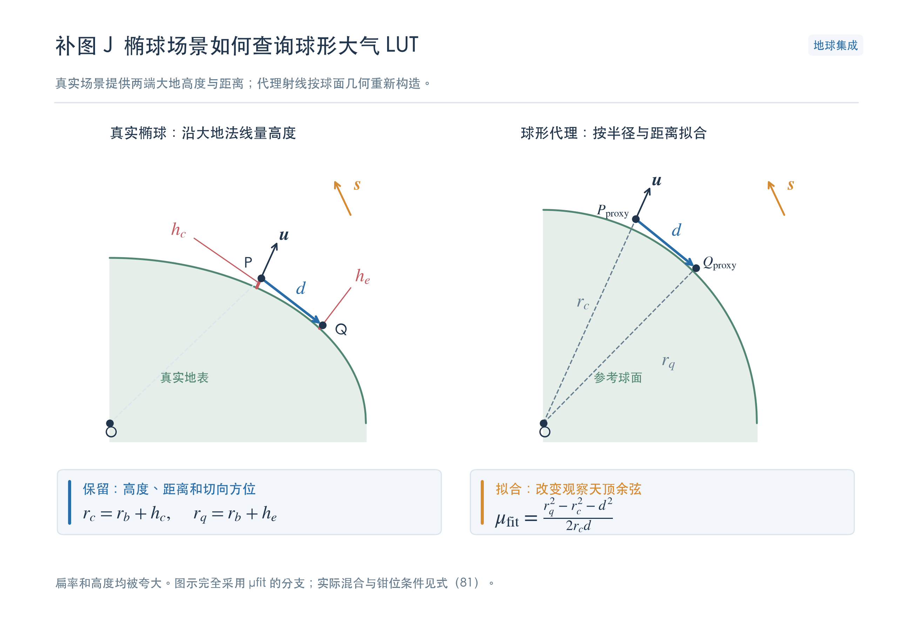

*补图 J：左侧是真实椭球的截面，$h_c,h_e$ 分别沿相机与端点的大地法线定义；右侧把这两个高度加到统一 $r_b$ 上，并以同一距离 $d$ 构造代理射线。$\boldsymbol u$ 是相机的大地天顶，两图的太阳世界方向 $\boldsymbol s$ 相同。扁率和高度为便于看清而夸大；图中只展示纯 $\mu_{\rm fit}$ 的几何分支，不代表式（81）混合区间或真实地球误差的定量图。*

右图中的 $O,P_{\rm proxy},Q_{\rm proxy}$ 构成三角形，三条边长是 $r_c,r_q,d$；式（80）就是式（18）对这个三角形反求观察余弦。它要求 $|r_c-r_q|\le d\le r_c+r_q$，否则不存在同时满足两端半径和距离的球面代理。钳位 $\mu_{\rm fit}$ 只是返回最近的合法方向，不能让不相容的三边长度突然变成精确几何。$d=0$ 则是空线段，应直接处理，不需要通过除以 $d$ 反解方向。

读补图 J 时，先看左侧红色高度段：高度是沿法线量到真实地表的距离，并非相机的径向长度。再看右侧两条虚线半径：它们将两端高度转换为 LUT 支持的半径。两图的蓝色段保持相同长度，但它的倾斜允许改变，这正是“优先匹配端点高度”付出的方向近似。该图解释几何约束；介质密度和太阳路径仍在代理球壳上求值，真实椭球形状没有被完整写入四维散射表。

当前代码对小于 1 km 的路径保留真实视线与大地法线的点积 $\mu_{\rm dir}=\boldsymbol\omega\cdot\boldsymbol u$；1–20 km 之间逐渐混合，20 km 以后主要采用高度匹配值：

$$
w_d=\operatorname{smoothstep}(1000\,\mathrm m,20000\,\mathrm m,d),
\qquad
\mu_{\rm proxy}=(1-w_d)\mu_{\rm dir}
+w_d\operatorname{clamp}(\mu_{\rm fit},-1,1).
\tag{81}
$$

这个过渡是工程选择，不是椭球传输的解析变换。近距离优先保持真实方向，减少端点高度估计噪声；远距离优先匹配地表高度，防止代理路径错误穿入地球。混合区的端点半径不一定严格等于 $r_q$，钳位也表示无法用该距离和两端半径构造原本期望的球面射线。

令切向方向 $\boldsymbol t=\operatorname{normalize}(\boldsymbol\omega-\mu_{\rm dir}\boldsymbol u)$，重建代理射线：

$$
\boldsymbol\omega_{\rm proxy}
=\sqrt{1-\mu_{\rm proxy}^2}\,\boldsymbol t+\mu_{\rm proxy}\boldsymbol u,
\qquad
\boldsymbol Q_{\rm proxy}=\boldsymbol P_{\rm proxy}+d\boldsymbol\omega_{\rm proxy}.
\tag{82}
$$

它保持切向方位角，但改变天顶角，也可能改变 $\nu=\boldsymbol\omega\cdot\boldsymbol s$。太阳方向仍使用世界方向；并不是对相机、视线、太阳做同一个刚性旋转。因此这一适配是视觉与几何一致性的近似，不能称为“对椭球大气的精确预计算”。近地远山、低空地平线和轨道外缘都应分别检查，不能只用一个全球视图判断适配质量。

式（82）把方向拆成两个互相垂直的单位基：局部天顶 $\boldsymbol u$ 与切向方位 $\boldsymbol t$。两个系数的平方和为 1，所以重建方向长度为 1；与 $\boldsymbol u$ 点积恰好为 $\mu_{\rm proxy}$。真实射线恰好竖直时切向分量为零，代码 `ProxyRay` 会用一个不平行的世界轴与 $\boldsymbol u$ 叉乘，选出稳定切向方向，避免归一化零向量。若天顶余弦仍为 $\pm1$，其切向系数为零，任意合法切向选择都不影响最终竖直方向。

对于真实椭球不碰地的天空射线，代码又把代理余弦提高到球形切线 $\mu_h+10^{-5}$ 以上，避免球形代理误判成穿地。这个小偏移对应另一项可识别的近似，适合在地平线连贯性验证中单独观察。

### 10.8 将空气透视合成到地球 HDR 场景

可以按一个像素实际经过的步骤串起本章：先由场景深度重建真实偏移与距离；再求真实端点的大地高度；以相机大地天顶和两端高度构造球面代理；由代理相机、端点、太阳方向得到 $r,\mu,\mu_s,\nu$；查询有限段透射率与入散射；最后与已有 HDR 表面颜色组合。真实深度决定可见端点，代理几何只服务大气查询，不应改写场景的遮挡或把地形移动到参考球面上。

有场景深度时，shader 从 HDR scene color 取已经渲染好的地表颜色，用代理路径查询空气透视。其关键输出是

```hlsl
float3 inScatter = SegmentRadiance(proxyCamera, proxyPoint, sun, transmittance);
return float4(groundColor * transmittance + inScatter * exposure, 1.0);
```

它假定 `groundColor` 已在场景统一尺度中，曝光只显式作用于新增的大气光。无场景深度但真实射线撞地时，用 Lambert `GroundIrradiance` 构造球面代理地面颜色作为缺失表面的回退；当前该回退颜色没有在这段输出中额外乘 exposure，接入时还需要让它与已渲染地表的亮度尺度一致。

天空方向把大气和太阳光加入源图像。若源图像包含星空或其他远处背景，物理合成应是 $T_tL_{\rm background}+\mathcal S$；当前 planet 天空分支直接相加 `source.rgb + sky * exposure`，对非黑色背景没有显式衰减。黑色背景下两种合成方式看起来相同，加入星空后，则需要透射率让低空长路径上的星光正确衰减。

此外，scene color 是线性显示颜色，而当前大气返回的是三波长量；严格式（64）要求一致的颜色表示。椭球代理、曝光标度、光谱转换和背景透射属于不同层次的问题，需要分别验证。合成阶段不应再次画一次天空或重复对场景叠雾，也不应采样尚在同一附件中被写入的颜色纹理，渲染图应通过独立输入、输出保证读写关系明确。

## 11. 在 GNXEngine 中观察天空与空气透视

下面从两个场景观察前面推导的结果。独立 demo 固定相机，改变太阳高度和散射阶数；三维地球固定太阳，改变观察高度。前者突出光路变化，后者检验空间相机、地表遮挡和有限距离合成能否连贯工作。

### 11.1 效果展示的统一条件

下面统一使用 `LegacyPrecomputed` 和曝光 5，等待 LUT 完成后截图。独立 demo 保持相机和材质一致，便于比较太阳高度与散射阶数；地球视图则选取整体、轨道和低空三个观察尺度。相机和太阳条件写在图注中。

代码对应 GNXMapEngine 主仓库 `a16cf56`、GNXEngine 子模块 `0583671`，画面来自 macOS Metal 后端。这组效果展示当前实现；有关地面递推输入和颜色转换的改进点，分别在第 6.5、9.3 节说明。

### 11.2 独立 demo：日间与日落

独立 demo 使用 $r_b=6360$ km、$r_t=6420$ km、5 阶散射、$g=0.8$。世界相机位置为 $(8910,905,893)$ m，目标为世界原点，垂直视场角为 $50^\circ$；星球中心为 $(0,-r_b,0)$ m，球体中心为 $(0,1000,0)$ m、半径 1000 m。球体反照率为 $(0.8,0.8,0.8)$，可见地面使用深蓝色反照率 $(0,0,0.04)$，预计算平均地表反照率仍为 0.1。

太阳方位角固定为 $\phi_s=2.9$ rad。Y-up 下的方向由

$$
\boldsymbol s=(\sin\theta_s\cos\phi_s,\ \cos\theta_s,\ -\sin\theta_s\sin\phi_s)
\tag{83}
$$

构造；这里 $\theta_s$ 是相对世界 Y 轴的太阳天顶角，与每个位置的局部径向天顶角只有在局部天顶接近 Y 轴时近似相同。截图使用的是同一相机，所以可以观察太阳变化而不混入构图变化。

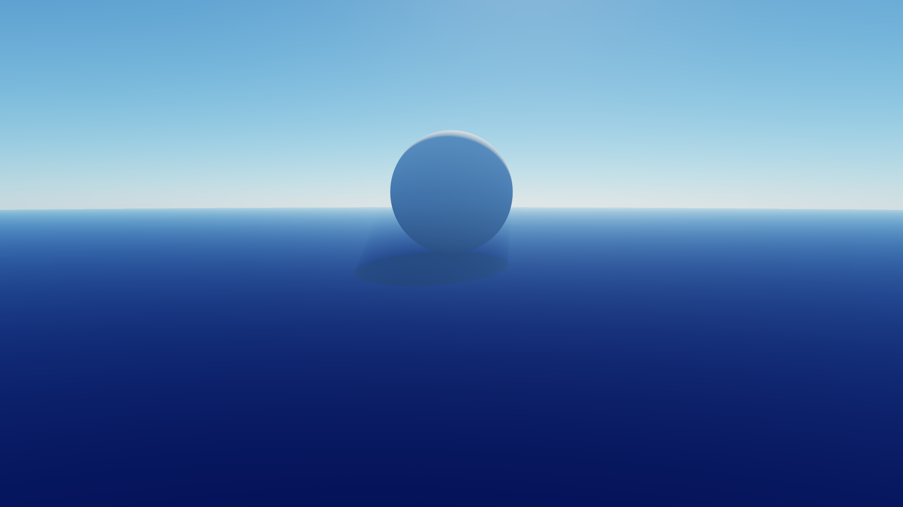

*图 17：GNXEngine 独立 demo 的日间效果。LegacyPrecomputed，5 阶，$\theta_s=1.0$ rad（约 $57.3^\circ$），$\phi_s=2.9$ rad，曝光 5。相机与球体状态见上文，画面包含球体、蓝色地面、直接阴影和远处空气透视。*

先看日间图中的近景球体：它接收太阳直射和天空照明，表面反射再经过相机到球体的空气路径。再看远处地面：蓝色材质逐渐失去对比，向该方向的路径散射颜色靠拢。天空从天顶深蓝过渡到地平线浅色，则反映了密度、路径长度和散射角共同变化。

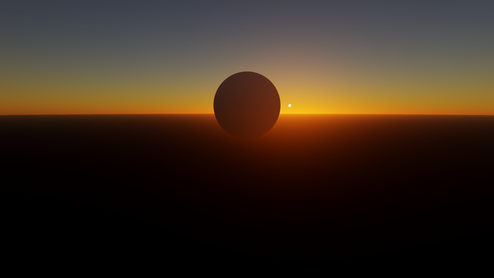

*图 18：同一 demo 和相机的日落效果。LegacyPrecomputed，5 阶，$\theta_s=1.56$ rad（约 $89.4^\circ$），$\phi_s=2.9$ rad，曝光 5。太阳圆盘接近地平线，球体和地面亮度降低。*

太阳靠近地平线时，直射光斜穿低空大气，较短波长被更强地移走，太阳和受它照亮的表面逐渐偏暖。与此同时，天空仍对整条视线上的采样点求和：不同高度的太阳衰减、观察路径衰减和气溶胶角分布共同塑造地平线色带。第 4 章的“两段光路”在这里可以直接对应到画面变化。

### 11.3 暮光：相同条件下的一阶与五阶

当太阳沉到地平线以下，地面可能已经没有直射，但高层大气仍被照亮，并可通过更长的散射路径把光送到观察者。下面固定相机和后处理，只改变预计算的散射阶数。点击图片可查看原始帧。

| 单次散射 · 1 阶 | 多次散射 · 5 阶 |
|---|---|
| [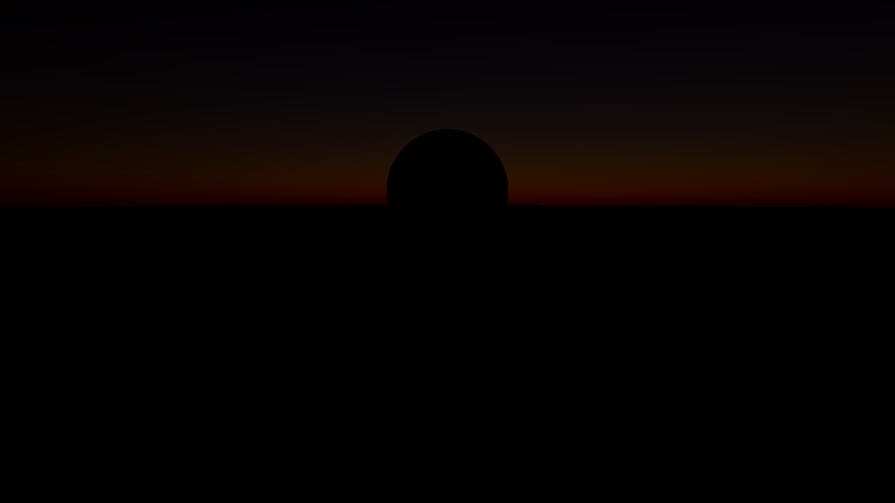](atmosphere_scattering_images/demo_twilight_1.png) | [](atmosphere_scattering_images/demo_twilight_5.png) |

*图 19（左）与图 20（右）：GNXEngine 独立 demo 的暮光对照。均使用 LegacyPrecomputed，$\theta_s=1.64$ rad（约 $94.0^\circ$）、$\phi_s=2.9$ rad、曝光 5。相机、球体、材质和显示链路保持一致；左图为 1 阶，右图为 5 阶。图片保留实际暗部，没有分别提亮。*

一阶结果只包含直接太阳经过一次体积散射的路径，最终天空辐照度纹理没有累计间接项；五阶加入更长的光路，并改变地面、球体的间接照明。当前曝光下暮光整体较暗，球体接近剪影，两者差别主要可观察地平线附近的亮度与色带。

这组图适合观察暮光亮度与色带的变化。若要测量各阶的贡献，可以沿同一组视线读取色调映射前的 HDR 值，按第 12.4 节比较最后一阶占累计光的比例；当前地面输入差异则按第 6.5 节先行处理。

### 11.4 三维地球：整体、轨道边缘与低空地平线

[GNXMapEngine](https://github.com/zhouxuguang/GNXMapEngine) 是三维地球项目的独立仓库，接入 GNXEngine 的大气组件完成地表与天空合成。地球场景使用 `EarthAtmospherePreset.cpp`：底半径仍为 6360 km，顶半径为 6460 km，对应 100 km 大气壳。独立 demo 使用 60 km 壳层，两组图展示的是同一算法在不同边界参数与场景中的应用。

地图太阳方向固定为 $\operatorname{normalize}(0.5,0.3,0.8)\approx(0.505076,0.303046,0.808122)$，它是地图世界坐标方向。以下三张图均为五阶、曝光 5、LegacyPrecomputed，图注中的高度是相机到真实椭球表面的高度。

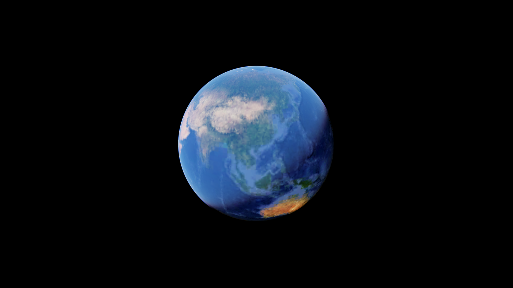

*图 21：地球整体。相机位于 $110^\circ$E、$23^\circ$N，椭球高约 15,000 km，朝向地球；目标为 $110^\circ$E、$23^\circ$N。LegacyPrecomputed，5 阶，曝光 5。*

全球视角把真实椭球遮挡与球形大气查询放在同一画面中。地图瓦片提供地表影像，场景几何决定哪些像素被地球挡住，大气合成负责边缘和地表前方的路径贡献。太空背景、地球轮廓和大气薄层在这里需要保持一致，正好对应第 10 章的接入流程。


*图 22：轨道斜视。相机位于约 $110^\circ$E、$15.37^\circ$N，椭球高约 483 km，朝向 $110^\circ$E、$23^\circ$N。LegacyPrecomputed，5 阶，曝光 5。*

轨道斜视时，靠近边缘的射线沿大气壳走过很长距离，形成可见的蓝色薄层；完全避开大气的方向则保留太空背景。地表颜色还包含瓦片影像和统一后处理，因此观察边缘时，重点看它与地表轮廓的衔接，以及相机升高后的连续变化。

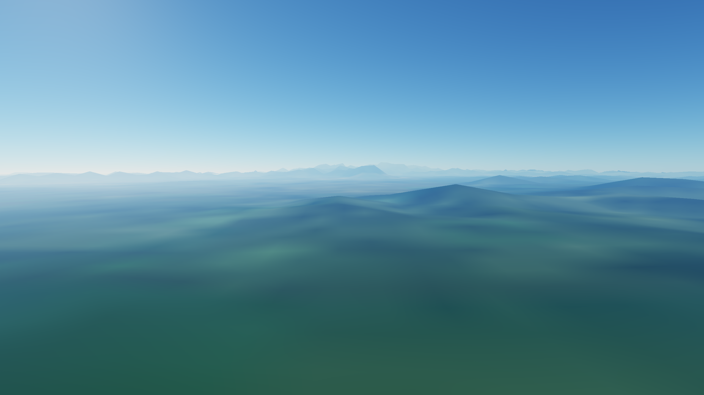

*图 23：低空斜视。相机位于约 $110^\circ$E、$22.82^\circ$N，椭球高约 1.77 km，朝向 $110^\circ$E、$23^\circ$N。LegacyPrecomputed，5 阶，曝光 5。*

低空视角把注意力拉回有限距离空气透视：近处地形保留对比，远处逐渐融入大气颜色，轮廓自然接入天空。这里的每个地形像素都先由深度确定真实终点，再用大地高度和距离构造代理路径。地平线色带或随相机移动的跳变，可以沿第 10.7 节的端点高度、代理余弦和边界分支逐项定位。

## 12. 把结果调对：从数值到画面

调试这套算法时，最有用的是把误差定位到某一个运算：先确认单位与极限，再确认纹理映射，随后比较路径积分和散射阶次，最后观察颜色与画面。这样遇到地平线色带或暮光偏暗时，就有明确的排查顺序。

### 12.1 从量纲与简单极限开始

排查时，先让每个中间量带着单位走一遍。式（23）的 $\beta d$ 无量纲，式（29）的被积项是每米的辐亮度增量，式（56）经过方向积分后是辐照度。只要某一步单位接不上，就可以在复杂天空颜色出现之前定位遗漏的系数、段长或相函数。

关闭所有消光和散射时，应有 $T=1$、路径内散射为 0；相机与目标距离趋于 0 时，应有 $T\to1$、$L^{\rm ins}\to0$。只关闭吸收，散射仍会从当前方向移走光，因此 $T$ 不会自动等于 1。设置地面反照率为 0，应消除密度源中的地面反射项，却保留来自天空的体积多次散射。

相函数归一化可以用一个常量各向同性入射场检查：$\int pL\,\mathrm d\Omega=L$。无论峰值集中在前向还是均匀分布，总方向权重都应为 1；多出来的 $4\pi$ 通常意味着归一化常数或立体角权重使用错误。

### 12.2 用双精度参考计算验证数学关系

我用双精度参考计算检查正反映射与积分恒等式，随机样本固定种子，便于重复比较。下表关注的是公式和代数实现；它为 GPU 纹素回读提供基准。

| 数学关系 | 计算方法 | 参考结果 |
|---|---|---|
| Rayleigh / Cornette–Shanks 归一化 | 512 点 Gauss–Legendre，$g=0,0.5,0.8,0.9$ | 最大偏差约 $4.5\times10^{-13}$ |
| Cornette–Shanks 一阶矩 | 同上，与式（13）比较 | 与解析值一致到约 $5\times10^{-13}$ |
| 透射率正反映射 | 有效域内 20,000 个随机点 | 最大 $\mu$ 偏差 $3.36\times10^{-11}$ |
| 散射 $\mu$ 两分支映射 | 每分支 20,000 个随机点 | 最大偏差 $4.48\times10^{-11}$ |
| 精确太阳映射 | 20,000 个随机点，$\mu_{s,\min}=-0.5$ | 最大偏差 $2.06\times10^{-14}$ |
| 角度约束 | 20,000 组实际单位方向 | Gram 行列式均非负 |
| 透射率互易性 | 选定球壳线段，两端反向积分 | 光学厚度差为 0（该双精度样本） |
| 透射率乘法性质 | 同一路径分段密度积分 | 绝对差约 $3.23\times10^{-10}$ |
| 有限散射减法 | 常量消光、平滑变化源，与直接积分比较 | 相对差约 $1.74\times10^{-11}$ |
| 太阳圆盘可见度近似 | 10,001 个归一化高度点 | smoothstep 与面积比例最大绝对差约 0.0394 |
| 纹理与 draw 数量 | 按实际尺寸、格式、调度列表计算 | 峰值 40.140625 MiB，五阶 294 步 |

正反映射的误差接近双精度舍入尺度，说明几何编码与解码相容。接着移到 GPU，还要分别评估 FP32 算术、FP16 存储、纹理插值和积分步长。有限散射测试在已知源场上验证式（63）；实际 `GetSkyRadianceToPoint` 的 Mie 地平线淡出则属于查询端的另一层处理。

### 12.3 积分收敛和地平线边界

在 $h=1$ km 处，将 500 区间与 20,000 区间的密度积分比较，天顶方向的 Rayleigh 相对差约为 $1.81\times10^{-5}$，Mie 约为 $8.05\times10^{-4}$。水平和切线方向的误差分布又不同，臭氧剖面的拐点也会影响梯形积分。这说明收敛检查应选择不同高度与方向，而不是只增加一个全局步数后观察画面是否更亮。

可进一步针对最敏感的区域做加密采样：$h=0,1,10,100$ m，$\mu=\mu_h\pm\varepsilon$，太阳余弦在 $-\alpha_s,0,+\alpha_s$ 周围，以及最低支持太阳方向附近。对相切端点，分支应在两侧分别评估，不要求两边结果错误地相等。对纹理边缘，检查首尾中心位置和 clamp 行为，尤其是最后一个 $\nu$ 切片的相邻查询。

地表的向下射线在起点立即终止，是零长度路径；向上的射线则进入大气，两者不是同一个光传输边界。$r=r_t$ 的向外方向也是零长度，逆映射可退化到约定余弦。测试应区分这种合法退化与 NaN，而不是对所有参数要求严格双射。

### 12.4 怎样判断散射阶数已经足够

固定太阳和观察条件，若读取每阶浮点辐亮度，可定义后续阶次变化指标

$$
\epsilon_N=\frac{\lVert L^{(N)}\rVert}
{\max(\lVert\sum_{n=1}^{N}L^{(n)}\rVert,\varepsilon_L)}.
\tag{84}
$$

$\varepsilon_L$ 是与辐亮度同单位的小阈值，避免几乎完全黑暗的像素除零。这个比值可以帮助判断截断是否足够，但不自动给出剩余无穷阶总误差；如果每阶未呈稳定衰减，或地面递推输入错误，就不能用最后一阶很小来证明结果正确。

可以先设平均地面反照率为零，观察纯大气分支的 1—5 阶变化；再加入地面反射，单独检查 $n=2$ 的直接地面路径。对白天、日落和暮光选择固定视线，这样每次变化都能对应到明确的路径来源。GNXEngine 当前版本需要先对齐第 6.5 节的输入，再与标准递推做定量比较。

### 12.5 从 GPU 纹素回读到场景对比

对 HLSL 移植，除了函数表达式还应核对 UBO 字段偏移、纹理维数、采样器 clamp、颜色混合、三维附件层号以及 API 间坐标规则。`AtmosphereDefine.hlsl` 的显式 offset 和 C++ 对应布局需要相容；若一个字段错位，整张 LUT 仍可能产生“有颜色”的图，而不是立即报错。

GPU 对照可以从少量确定纹素开始：先回读没有太阳方向和递推依赖的透射率，再比较单次 Rayleigh/Mie、密度源、间接辐照度和逐阶辐亮度，最后进入颜色转换与显示。每完成一层再进入下一层，能把差异留在最小的计算范围内。

最后回到画面，沿着白天到日落、低空到轨道两条变化线观察天空连续性、实体遮挡、太阳位置、地表空气透视与边缘接缝。固定曝光、相机、太阳和瓦片状态，再比较前后结果，画面中的差异才容易与某个实现改动对应起来。

## 13. 实现后的取舍与下一步

接到两个场景之后，后续工作可以分成三层：先让每个纹理值代表正确的物理量，再评估几何和视觉近似，最后按运行成本选择质量。这个顺序也决定了哪些改进最值得先做。

### 13.1 先保证递推和颜色语义一致

当前版本优先要处理的是第 6.5 节的单阶辐照度输入。它影响的是光路事件本身，增加纹理尺寸或散射阶数都会继续放大原有递推，而不会补回缺失的二阶地面贡献。太阳方向映射也应让正反函数共享精确端点 $A$，在修改后重建 LUT，保持纹素与物理方向的对应。

精度方面，透射率 FP32 是一个成本很小的选择：它改善长路径商式的动态范围，额外数据只有约 128 KiB。颜色方面，可以先接入参考三波长转换因子，再比较多波长 CIE 预积分。太阳、天空、材质照明和已有 scene color 需要落到一致的线性空间与尺度，最后统一处理曝光、白点和显示。

已有场景颜色也带来一个实际合成问题：有深度表面、缺失地面回退和太空背景，使用的是不同来源的边界光。分别按式（64）确认透射率与曝光位置，才能让星空经过大气时衰减，让地表回退与实际地形保持相同亮度尺度。

### 13.2 让几何近似与目标场景相匹配

球形 LUT 很适合复用，但三维地球的椭球代理仍是近似。低空远山和轨道边缘应分别观察，并回读真实大地高度、代理端点高度和视线距离。如果目标需要严格的椭球密度场，就需要扩展参数化或使用局部积分；端点拟合更适合在现有球形模型上保持视觉与几何的连续性。

阴影也是类似的取舍。单一 `shadow_length` 接口成本低，能表达约定位置的连续阴影段；地形光柱需要区间位置或沿视线的可见度采样。直射太阳阴影与间接多次散射的遮挡应分别处理，才能保留阴影中来自其他方向的光。

### 13.3 将质量提升放在可控的成本内

增加纹理分辨率和积分样本数，应针对已定位的误差。更高的 $N_\nu$ 可以改善高阶散射角分布的插值；单次 Mie 尖峰已有解析相函数恢复，扩大全部四维数据的成本未必划算。先比较敏感方向的积分收敛和纹素回读，再决定增加哪个轴的分辨率。

预计算调度还可以从每帧 24 步发展为按 GPU 时间控制预算。若要运行时修改气溶胶或平均地面颜色，可以双缓冲最终 LUT：后台完整生成新表，完成同步后一次切换。缓存键应包含密度与光谱参数、半径、阶数、纹理尺寸、映射版本、格式和颜色模式，这样同一算法的不同配置也能安全复用。

这套方法给引擎留下了一个很有用的划分：介质参数决定预计算积分，相机和太阳决定查询位置，真实几何决定光路终点，颜色管线决定怎样显示结果。把这几层连起来，同一个传输模型就能贯穿近景球体、低空远山和轨道上的大气边缘；后续的精度与效果改进，也都有各自明确的位置。

## 附录 A：论文、新版 GLSL 与 GNXEngine 的函数对照

| 算法部分 | 新版 `functions.glsl` | GNXEngine 位置或函数 | 本文公式 |
|---|---|---|---|
| 密度剖面 | `GetLayerDensity` / `GetProfileDensity` | `AtmosphereCommon.hlsl` 同名函数 | （6）、（7） |
| 球面交点 | `DistanceToTopAtmosphereBoundary` / `DistanceToBottomAtmosphereBoundary` | 同名 HLSL | （18）—（21） |
| 地面相交 | `RayIntersectsGround` | 同名 HLSL | （20） |
| 密度路径积分 | `ComputeOpticalLengthToTopAtmosphereBoundary` | 同名 HLSL，500 区间 | （24）、（25） |
| 顶边界透射率 | `ComputeTransmittanceToTopAtmosphereBoundary` | 同名 HLSL；当前 FP16 输出 | （23）、（24） |
| T-LUT 正反映射 | `GetTransmittanceTextureUvFromRMu` / `GetRMuFromTransmittanceTextureUv` | 同名 HLSL | （34）—（38） |
| 有限透射率 | `GetTransmittance` | 同名 HLSL，两个商式分支 | （27）、（28） |
| 太阳可见度 | `GetTransmittanceToSun` | 同名 HLSL | （31） |
| 单次散射 | `ComputeSingleScatteringIntegrand` / `ComputeSingleScattering` | 同名 HLSL，50 区间 | （29）、（30） |
| 相函数 | `RayleighPhaseFunction` / `MiePhaseFunction` | `VolumetricCommon.hlsl` | （10）、（11） |
| 散射坐标 | `GetScatteringTextureUvwzFromRMuMuSNu` / `GetRMuMuSNuFromScatteringTextureUvwz` | 同名 HLSL，太阳常数仍采用近似 | （39）—（46） |
| 四维打包 | `GetRMuMuSNuFromScatteringTextureFragCoord` / `GetScattering` | 同名 HLSL | （47）—（49） |
| 阶次散射源 | `ComputeScatteringDensity` | 同名 HLSL；C++ 辐照度绑定存在差异 | （51）—（54） |
| 多次路径积分 | `ComputeMultipleScattering` | 同名 HLSL与 shader wrapper | （55）、（57） |
| 直接 / 间接辐照度 | `ComputeDirectIrradiance` / `ComputeIndirectIrradiance` | 同名 HLSL及对应 Pass | （33）、（56） |
| 辐照度映射与查询 | `GetIrradianceTextureUvFromRMuS` / `GetIrradiance` | 同名 HLSL | （50） |
| 红通道 Mie 重建 | `GetExtrapolatedSingleMieScattering` | 条件宏分支，本文路径使用独立纹理 | （59） |
| 天空运行时 | `GetSkyRadiance` | 同名 HLSL，天空和 demo 封装 | （57）、（60）、（61） |
| 有限空气透视 | `GetSkyRadianceToPoint` | 同名 HLSL，planet 使用代理路径 | （62）—（64） |
| 地表照明 | `GetSunAndSkyIrradiance` | 同名 HLSL | （65）、（66） |
| Pass 调度 | 官方 `model.cc::Precompute` | `AtmosphereRenderer.cpp::BuildPrecomputeSteps/RunPrecomputeStep/Precompute` | （58） |
| 颜色转换 | 官方 `model.cc` / 模型 API | 当前三波长路径尚未完整接入 | （68）—（71） |
| 椭球接入 | 球形参考模型无此适配 | `AtmospherePlanetComposite.shader` | （76）—（82） |

函数名相同只说明移植入口对应，仍需检查数据语义、绑定、格式、坐标与调用约束。建议阅读顺序是先 `AtmosphereCommon.hlsl` 的几何和透射率，再单次散射和坐标映射，随后看 C++ Pass 调度，最后看 runtime 和 planet 合成。这样每个查询函数的纹理输入都已有明确来源。

## 附录 B：原论文逐图、逐式阅读对照

这里的 Figure 编号和“论文式”编号属于[原始 PDF](预计算大气散射.pdf)，与本文编号分开使用。此 PDF 第 1 页是 HAL 封面，因而 PDF 页码比论文正文页码大 1。阅读时先确定一个图在说明物理模型、数值方法，还是效果验证，避免把这三类信息混在一起。

### B.1 每幅原图想回答什么

| 原论文图 | PDF 页码 | 要回答的问题 | 阅读时先看什么 | 本文解释位置 |
|---|---|---|---|---|
| Figure 1 | 3 | 真实地形怎样与可预计算的球形场景结合 | $x$ 是观察点，$x_o$ 是真实终点，$x_s$ 是阴影分界；上横线表示参考球形场景 | 补图 F、第 8.5 节 |
| Figure 2 | 3 | 透射率、地面反射、局部散射和路径积分有何区别 | a 看一段路，b 看一个表面，c 看一个点，d 看整条路；蓝箭头是返回观察点的光 | 补图 E、第 1.3、2.4、6.1 节 |
| Figure 3 | 5 | 直接按观察余弦取样为什么会产生空气透视伪影 | 两次查询在同一视线上，但局部天顶变了；路径长度变化很大，余弦变化很小 | 第 5.9 节数值例子、图 7、图 14 |
| Figure 4 | 5 | 怎样将纹理样本集中到敏感区域 | 红线用上方半径横轴；蓝、绿线用下方余弦横轴；蓝线在地平线处有分支 | 第 5.2—5.5 节；新版具体映射见图 7—9 |
| Figure 5 | 6 | 阴影体生成的边界如何压缩成总阴影长度 | 真实明暗分界与额外生成的面不同；只有一个长度，不能保留所有区间的位置 | 第 8.5 节、图 15；本引擎未实现论文的整套阴影体 Pass |
| Figure 6 | 6 | 模拟的全天空亮度分布与 CIE 模型是否接近 | 上排是显示颜色，后两排是相对天顶亮度的伪彩色；每列对应不同太阳天顶角 | 第 9 章、第 12.4—12.5 节的颜色与验证边界 |
| Figure 7 | 8 | 固定太阳方向后，某个截面的亮度曲线是否接近参考模型 | 每张图先用自己的天顶亮度归一化；不同子图纵轴范围不同 | 第 12 章；不能当作天空绝对辐亮度的误差图 |
| Figure 8 | 8 | 缺少方向参数或多次散射，会漏掉什么现象 | a 从上到下是另一方法、单次散射、多次散射、照片；先比较地球阴影与暮光亮度 | 第 5.6、11.3 节；GNXEngine 一阶、五阶对照 |
| Figure 9 | 9 | 算法能否覆盖地面到太空的多种视觉场景 | 红框是外部照片，其余是论文模拟；曝光、色调映射和照片条件会影响颜色 | 第 11 章的实际帧展示、第 12 章的定量验证 |

Figure 4 尤其容易误读，因为作者把三种输入的映射叠在同一张图中，横轴不是一个共同的物理量。红线的输入是半径 $r$，必须读上方的 6360—6420 km；蓝线的输入是观察余弦 $\mu$，绿线的输入是太阳余弦 $\mu_s$，二者读下方的 $[-1,1]$。纵轴只是归一化纹理坐标，不是辐亮度。红线较陡的位置意味着同样一段高度变化跨过更多纹素；蓝线分开地平线两侧，是为了不跨不同终止边界插值；绿线在太阳接近地平线时分配更多样本。论文绿线采用旧指数映射，本文与新版代码采用第 5.5 节的距离映射，曲线目的相近，公式并不相同。

Figure 7 的负观看角表示在太阳所在截面的另一侧看天空，不表示负辐亮度；纵轴是当前方向亮度除以天顶亮度。若天顶本身变暗，相对比值也可能增大，所以不能把两张不同太阳角的归一化曲线直接当作绝对亮度比较。Figure 6 的亮度色标也用于相对分布，不能把伪彩色看作真实天空颜色。

### B.2 原论文公式怎样落到本文算法

| 论文式 | 用一句话读出物理含义 | 本文对应与差异 |
|---|---|---|
| （1） | 海平面 Rayleigh 系数乘随高度衰减的分子密度 | 式（3）—（5）；本文微观截面采用更完整的折射率与 King 修正表达，不把两种前因子混为同一精度 |
| （2） | 将一次分子散射按夹角分配到各方向 | 式（10）；论文这里的 $\mu$ 对应本文 $\nu$ |
| （3） | 海平面气溶胶散射系数乘指数密度 | 式（3）、（5）；吸收系数另列，不能用散射代替全部消光 |
| （4） | 气溶胶的 Cornette–Shanks 角分布 | 式（11）—（13）；先核对方向和归一化，再解释前向峰 |
| （5） | 沿路径累积消光，再取负指数得到透射率 | 式（23）—（25）；新版模型另含臭氧吸收 |
| （6） | 地面先对上半球来光做余弦积分，再乘 Lambert 反射系数 | 式（2）、（51）、（65）；$\mathcal I[L]$ 是地面边界辐亮度，不是辐照度本身 |
| （7） | 在一个点，把所有来光散射进指定观察方向 | 式（52）、（54）；这是 $J$，输出还差一次路径积分 |
| （8） | 总光等于直射边界光、反射边界光和路径散射 | 式（16）的边界项与路径项；太阳和地面是按方向选择的边界贡献 |
| （9） | 能直接看到太阳时，返回衰减后的太阳圆盘光 | 第 8.1 节、式（60）；参考新实现显式使用有限太阳角半径 |
| （10） | 地面反射光沿地面到观察点的路径衰减 | 式（64）—（66）的表面项；它不是再次沿路径积分 |
| （11） | 将每个点的 $J$ 乘回程透射率后沿路径相加 | 式（16）的积分项、式（55）；补图 E 的 c 变成 d |
| （12） | 按新增反射或散射事件展开完整光场 | 式（17）、第 6 章；原论文 $L_i$ 包含地面与体积事件，不能直接等同于一张仅存大气路径量的 delta scattering 纹理 |
| （13） | 用两个累计积分的差，取出单次散射的受光段 | 式（62）、（63）；对给定源场是区间恒等式，实际阴影可见性仍须正确构造 |
| （14） | 给地面间接照明乘一个基于法线的近似可见比例，再沿路径衰减 | 式（64）—（66）；法线因子不等于任意非均匀天空的精确积分 |
| （15） | 将球形参考场景的间接来光积成水平面辐照度 | 式（56）；方向积分的余弦来自接收面投影 |
| （16） | 把可计算的边界光与截取后的大气光合成最终结果 | 第 8 章；本文分别推导表面项、太阳项和路径项，避免把同一贡献加两次 |
| （17）、（18） | 看地面、看天空时，分别把总阴影长度放到路径末端、起点 | 第 8.5 节、图 15；这些是阴影近似，不是任意地形高阶传输的精确解 |

原论文式（7）中的方括号应读作“将光场作为输入”。例如 $\mathcal J[L_0]$ 是直射太阳经过**当前点的一次散射**后形成的局部源；$\mathcal S[L_0]$ 才把这个源沿路径送到观察点。看见输入叫 $L_0$，不意味着输出仍为零阶光。这个“输入阶次与输出阶次差一次事件”的关系，也是 Algorithm 4.1 读起来容易错位的原因。

### B.3 Algorithm 4.1 的 delta 到底是哪一阶

用本文的轮次 $n$ 读算法，比记住临时变量的名字更可靠。初始化得到 $\Delta E=E^{(0)}$、$\Delta S=L^{(1)}$；这里的 $\Delta S$ 已由直射光产生了一次大气散射。随后开始二阶递推：

| 时刻 | $\Delta S$ 的含义 | $\Delta E$ 的含义 | 当前操作 |
|---|---|---|---|
| 第 $n$ 轮开始 | $L^{(n-1)}$ | $E^{(n-2)}$ | 两个都是旧结果，先交给散射密度 Pass |
| 散射密度完成 | 仍为 $L^{(n-1)}$ | 仍为 $E^{(n-2)}$ | 新 $J^{(n)}$ 已保存，还没有覆盖旧入射场 |
| 间接辐照度完成 | 仍为 $L^{(n-1)}$ | 更新为 $E^{(n-1)}$ | 由旧散射进行水平面半球积分 |
| 多次散射完成 | 更新为 $L^{(n)}$ | $E^{(n-1)}$ | 沿路径积分新源，再累计本阶结果 |

论文循环下标 $i$ 从 1 开始时，对应本文 $n=i+1$。算法中 $T\bar\alpha\Delta E/\pi+\Delta S$ 是完整入射场的紧凑写法：地面方向用到地面的透射率、地面位置的辐照度和地面反射系数，再加大气路径入射光。它并非拿当前纹素的三个任意数相乘；这些位置和方向依赖在论文记号中被省略，在式（51）和 shader 查询中必须恢复。

还要区分两种 $\Delta$：Algorithm 4.1 的 $\Delta E,\Delta S,\Delta J$ 是临时单阶量；参数化公式中的裸 $\Delta=r^2\mu^2-\rho^2$ 则是几何判别式，等于本文式（19）在 $R=r_b$ 时的根号项。二者只是作者用了同一个希腊字母，没有共同的物理含义。

按照这张表回看第 6.5 节的实际纹理绑定，可以直接判断传入的是本轮所需的旧单阶量，还是已经加过多轮的累计量。数学公式、调度顺序和真实绑定需要同时成立，单靠变量名称相似无法保证递推正确。

## 参考资料与出处

1. Eric Bruneton、Fabrice Neyret，**Precomputed Atmospheric Scattering**，Eurographics Symposium on Rendering，2008。[论文 PDF（Eurographics 数字图书馆）](https://diglib.eg.org/bitstreams/8526ee8e-15ba-4779-b7ba-2f8334772eb2/download)。旧论文的几何、路径分解、逐阶递推、相函数分离和参数化动机是本文基础。
2. Eric Bruneton，**Precomputed Atmospheric Scattering — New Implementation**，[项目主页](https://ebruneton.github.io/precomputed_atmospheric_scattering/)。查看新版功能、验证思路以及原论文与新实现的关系。
3. Bruneton，[核心函数文档 `functions.glsl`](https://ebruneton.github.io/precomputed_atmospheric_scattering/atmosphere/functions.glsl.html)。新版公式与函数结构的主要参考；本文采用独立推导并与 GNXEngine 实际代码核对。
4. Bruneton，[`model.cc` 文档](https://ebruneton.github.io/precomputed_atmospheric_scattering/atmosphere/model.cc.html)、[`model.h` API 文档](https://ebruneton.github.io/precomputed_atmospheric_scattering/atmosphere/model.h.html)。预计算 orchestration、颜色模式和运行时单位。
5. Bruneton，[GitHub 源码仓库](https://github.com/ebruneton/precomputed_atmospheric_scattering)及[BSD-3-Clause 许可证](https://github.com/ebruneton/precomputed_atmospheric_scattering/blob/master/LICENSE)。参考源码版权为 Copyright (c) 2017 Eric Bruneton，使用与分发应遵循其 BSD-3-Clause 许可证。GNXEngine 代码片段用于说明本文的引擎实现。
6. Matt Pharr、Wenzel Jakob、Greg Humphreys，**Physically Based Rendering: From Theory to Implementation**，第 4 版：[Transmittance](https://pbr-book.org/4ed/Volume_Scattering/Transmittance)、[Phase Functions](https://pbr-book.org/4ed/Volume_Scattering/Phase_Functions)、[The Equation of Transfer](https://pbr-book.org/4ed/Light_Transport_II_Volume_Rendering/The_Equation_of_Transfer)。一般介质传输、相函数与方向约定。
7. Sean O'Neil，**Accurate Atmospheric Scattering**，GPU Gems 2，第 16 章，[NVIDIA 官方章节](https://developer.nvidia.com/gpugems/gpugems2/part-ii-shading-lighting-and-shadows/chapter-16-accurate-atmospheric-scattering)。介绍实时大气路径积分，可与本文的预计算与多阶方法对照阅读。
8. Anthony Bucholtz，**Rayleigh-scattering calculations for the terrestrial atmosphere**，Applied Optics 34(15)，1995，[论文记录](https://pubmed.ncbi.nlm.nih.gov/21052423/)；另可参照 [NWPSAF RTTOV 科学验证文档](https://www.nwpsaf.eu/site/download/documentation/rtm/docs_rttov11/rttov11_svr.pdf)中的分子截面与 King 修正定义，支持式（4）的微观背景。
9. Eric Bruneton，**A Qualitative and Quantitative Evaluation of 8 Clear Sky Models**，[作者论文](https://arxiv.org/abs/1612.04336)。讨论天空模型的定性与定量比较，也是理解三波长颜色转换近似的重要资料。
10. [GNXEngine 源码仓库](https://github.com/zhouxuguang/GNXEngine)。本文 HLSL/C++ 实现对照的源码入口，用于结合大气核心 shader、预计算调度和组件接口阅读工程实现。
11. [GNXMapEngine 源码仓库](https://github.com/zhouxuguang/GNXMapEngine)。本文三维地球接入与效果展示的项目仓库，与 GNXEngine 分别维护。
